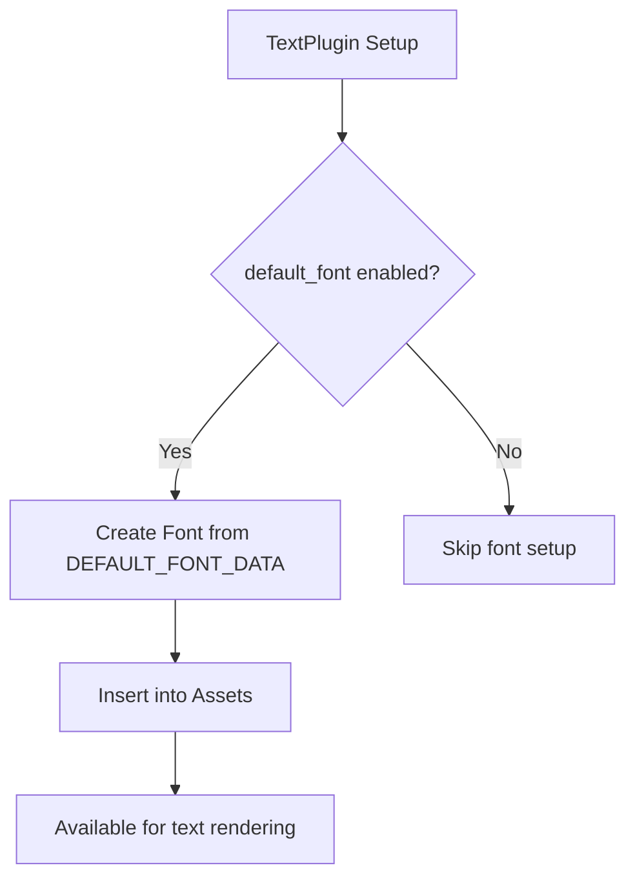

+++
title = "#20397 Deduplicate Default Font Data"
date = "2025-08-03T00:00:00"
draft = false
template = "pull_request_page.html"
in_search_index = true

[taxonomies]
list_display = ["show"]

[extra]
current_language = "en"
available_languages = {"en" = { name = "English", url = "/pull_request/bevy/2025-08/pr-20397-en-20250803" }, "zh-cn" = { name = "中文", url = "/pull_request/bevy/2025-08/pr-20397-zh-cn-20250803" }}
labels = ["D-Trivial", "C-Code-Quality", "A-Text"]
+++

## Deduplicate Default Font Data

## Basic Information
- **Title**: Deduplicate Default Font Data
- **PR Link**: https://github.com/bevyengine/bevy/pull/20397
- **Author**: tim-blackbird
- **Status**: MERGED
- **Labels**: D-Trivial, C-Code-Quality, S-Ready-For-Final-Review, A-Text
- **Created**: 2025-08-03T17:01:27Z
- **Merged**: 2025-08-03T19:48:34Z
- **Merged By**: mockersf

## Description Translation
# Objective

The data for the default font is included twice with `include_bytes!`. This is not a big problem as the data gets deduplicated at some point during optimization, so this PR only saves 50 bytes~ instead of 20kb, but we're still wasting time during compilation copying this file around twice.

# Solution

Use the `DEFAULT_FONT_DATA` constant introduced in #14406 for setting the default font instead of including the bytes a second time via `load_internal_binary_asset`.

## The Story of This Pull Request

### The Problem and Context
The text rendering system in Bevy includes a default font for text rendering when the `default_font` feature is enabled. Before this change, the font data was being loaded through two separate mechanisms: 
1. The `DEFAULT_FONT_DATA` constant (introduced in PR #14406)
2. The `load_internal_binary_asset!` macro which included the same font file again using `include_bytes!`

This duplication meant the compiler was processing and embedding the same 20KB font data twice during compilation. While link-time optimization would eventually deduplicate the data in the final binary, this still resulted in:
- Longer compile times due to processing redundant data
- Unnecessary disk I/O during compilation
- Slightly larger intermediate build artifacts (though final binary size was unaffected)

The problem was discovered during routine code review and classified as trivial technical debt worth cleaning up.

### The Solution Approach
The solution was straightforward: replace the duplicate asset loading mechanism with direct usage of the existing `DEFAULT_FONT_DATA` constant. This required:
1. Removing the `load_internal_binary_asset!` macro call
2. Adding imperative code to create the font asset directly
3. Inserting the created asset into the asset system

This approach leverages existing infrastructure while eliminating redundant processing. No alternatives were considered since this was a direct replacement of duplicate functionality.

### The Implementation
The implementation modified the `TextPlugin` setup logic when the `default_font` feature is enabled. Instead of using the asset loading macro, it now directly constructs the font from the pre-existing constant:

```rust
#[cfg(feature = "default_font")]
{
    use bevy_asset::{AssetId, Assets};
    let mut assets = app.world_mut().resource_mut::<Assets<_>>();
    let asset = Font::try_from_bytes(DEFAULT_FONT_DATA.to_vec()).unwrap();
    assets.insert(AssetId::default(), asset);
};
```

Key changes:
1. Removed the `load_internal_binary_asset!` macro and its associated asset loading pipeline
2. Added explicit resource access to the `Assets<Font>` collection
3. Created the font directly from `DEFAULT_FONT_DATA`
4. Inserted the font using the default asset ID

This approach maintains the same functional behavior while eliminating the duplicate data inclusion.

### Technical Insights
The solution demonstrates:
1. **Asset System Flexibility**: Shows how assets can be created imperatively without going through the standard loading pipeline
2. **Resource Management**: Proper use of ECS resource access patterns to modify asset collections
3. **Error Handling**: Uses `unwrap()` since the font data is known to be valid at compile time
4. **Feature Gating**: Maintains clean conditional compilation with `#[cfg(feature = "default_font")]`

The `AssetId::default()` usage is appropriate here since this is the system's default font that should be globally accessible.

### The Impact
The changes provide concrete benefits:
1. **Compilation Efficiency**: Reduces compile-time work by eliminating redundant file processing
2. **Code Simplicity**: Removes macro indirection in favor of direct asset creation
3. **Maintainability**: Centralizes font data handling in one location
4. **Resource Usage**: Saves ~20KB of memory during compilation (before optimization)

While the runtime impact is negligible, this exemplifies good code hygiene by removing unnecessary duplication. The change also documents the proper way to handle built-in binary assets in Bevy.

## Visual Representation



## Key Files Changed

### `crates/bevy_text/src/lib.rs`
**Changes**: Replaced the asset macro with direct font creation using existing constant  
**Why**: To eliminate duplicate font data processing during compilation  

Before:
```rust
#[cfg(feature = "default_font")]
load_internal_binary_asset!(
    app,
    Handle::default(),
    "FiraMono-subset.ttf",
    |bytes: &[u8], _path: String| { Font::try_from_bytes(bytes.to_vec()).unwrap() }
);
```

After:
```rust
#[cfg(feature = "default_font")]
{
    use bevy_asset::{AssetId, Assets};
    let mut assets = app.world_mut().resource_mut::<Assets<_>>();
    let asset = Font::try_from_bytes(DEFAULT_FONT_DATA.to_vec()).unwrap();
    assets.insert(AssetId::default(), asset);
};
```

## Further Reading
1. [Bevy Asset System Documentation](https://bevyengine.org/learn/book/assets/)
2. [PR #14406: Introduce DEFAULT_FONT_DATA](https://github.com/bevyengine/bevy/pull/14406)
3. [Rust include_bytes! Macro](https://doc.rust-lang.org/std/macro.include_bytes.html)