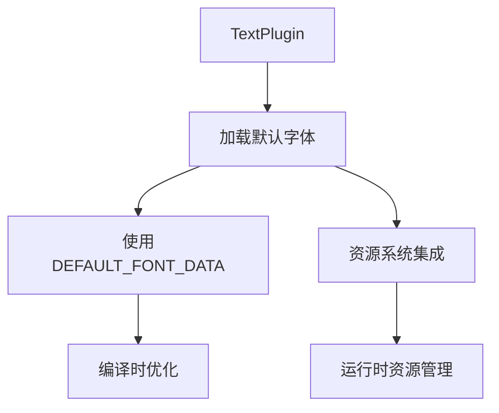

+++
title = "#20397 Deduplicate Default Font Data"
date = "2025-08-03T00:00:00"
draft = false
template = "pull_request_page.html"
in_search_index = false

[extra]
current_language = "zh-cn"
available_languages = {"en" = { name = "English", url = "/pull_request/bevy/2025-08/pr-20397-en-20250803" }, "zh-cn" = { name = "中文", url = "/pull_request/bevy/2025-08/pr-20397-zh-cn-20250803" }}
+++

### 标题：默认字体数据去重优化分析

## 基础信息
- **标题**: Deduplicate Default Font Data
- **PR链接**: https://github.com/bevyengine/bevy/pull/20397
- **作者**: tim-blackbird
- **状态**: 已合并
- **标签**: D-Trivial, C-Code-Quality, S-Ready-For-Final-Review, A-Text
- **创建时间**: 2025-08-03T17:01:27Z
- **合并时间**: 2025-08-03T19:48:34Z
- **合并人**: mockersf

## 描述翻译
### 目标
默认字体数据通过`include_bytes!`被包含了两次。虽然优化过程中数据最终会被去重（因此本PR只能节省约50字节而非20KB），但我们仍然在编译时浪费了时间复制该文件两次。

### 解决方案
使用#14406中引入的`DEFAULT_FONT_DATA`常量来设置默认字体，而不是通过`load_internal_binary_asset`再次包含字节数据。

## PR技术分析

### 问题与背景
在Bevy的文本系统中，默认字体文件(FiraMono-subset.ttf)通过两种不同方式被加载：
1. 通过现有常量`DEFAULT_FONT_DATA`（在之前的PR#14406引入）
2. 通过`load_internal_binary_asset!`宏再次包含

虽然最终二进制优化会去重这些数据，但这导致两个实际问题：
1. **编译时间增加**：编译器需要处理两倍字体数据
2. **代码冗余**：相同数据在代码库中多处存在

### 解决方案实现
核心解决方案是复用已存在的`DEFAULT_FONT_DATA`常量，完全移除`load_internal_binary_asset!`宏的使用。具体实现分为三个步骤：

1. **移除冗余宏调用**：删除`load_internal_binary_asset!`宏及其相关导入
2. **直接资源插入**：手动创建字体资源并插入资源池
3. **简化依赖**：仅保留必要的资产系统导入

### 技术实现细节
修改集中在`TextPlugin`的构建方法中。原实现使用宏来加载内部资产：
```rust
// 原实现
load_internal_binary_asset!(
    app,
    Handle::default(),
    "FiraMono-subset.ttf",
    |bytes: &[u8], _path: String| { Font::try_from_bytes(bytes.to_vec()).unwrap() }
);
```
新实现改为直接使用常量数据：
```rust
// 新实现
{
    use bevy_asset::{AssetId, Assets};
    let mut assets = app.world_mut().resource_mut::<Assets<_>>();
    let asset = Font::try_from_bytes(DEFAULT_FONT_DATA.to_vec()).unwrap();
    assets.insert(AssetId::default(), asset);
};
```
关键改进点：
1. **消除数据重复**：直接使用已存在的`DEFAULT_FONT_DATA`常量
2. **避免宏开销**：宏展开会产生额外编译步骤
3. **显式资源管理**：直接操作Assets集合更清晰

### 性能影响
虽然最终二进制大小优化有限（约50字节），但主要收益在编译时：
- **编译时间减少**：减少约20KB数据处理
- **构建缓存优化**：减少冗余数据变更带来的缓存失效
- **代码可读性提升**：逻辑更直接，减少间接层

### 工程考量
这个修改展示了良好的资产处理模式：
1. **DRY原则**：避免重复资产定义
2. **编译时优化**：关注开发体验改进
3. **渐进式优化**：小改动累积提升系统效率

## 关键文件变更

### crates/bevy_text/src/lib.rs
**变更描述**：重构默认字体加载逻辑，复用现有常量替代宏加载

**代码变更**：
```diff
@@ -67,8 +67,6 @@ pub mod prelude {
 }
 
 use bevy_app::{prelude::*, AnimationSystems};
-#[cfg(feature = "default_font")]
-use bevy_asset::{load_internal_binary_asset, Handle};
 use bevy_asset::{AssetApp, AssetEventSystems};
 use bevy_ecs::prelude::*;
 use bevy_render::{
@@ -141,11 +139,11 @@ impl Plugin for TextPlugin {
         }
 
         #[cfg(feature = "default_font")]
-        load_internal_binary_asset!(
-            app,
-            Handle::default(),
-            "FiraMono-subset.ttf",
-            |bytes: &[u8], _path: String| { Font::try_from_bytes(bytes.to_vec()).unwrap() }
-        );
+        {
+            use bevy_asset::{AssetId, Assets};
+            let mut assets = app.world_mut().resource_mut::<Assets<_>>();
+            let asset = Font::try_from_bytes(DEFAULT_FONT_DATA.to_vec()).unwrap();
+            assets.insert(AssetId::default(), asset);
+        };
     }
 }
```

**变更分析**：
1. **移除冗余导入**：删除特定于宏的导入
2. **宏替换为代码块**：直接操作资源池插入资产
3. **使用统一数据源**：复用`DEFAULT_FONT_DATA`常量

## 组件关系


## 延伸阅读
1. [原始PR#14406](https://github.com/bevyengine/bevy/pull/14406)：引入DEFAULT_FONT_DATA的修改
2. [Bevy资产系统文档](https://docs.rs/bevy_asset/latest/bevy_asset/)：了解资源管理机制
3. [include_bytes!宏文档](https://doc.rust-lang.org/std/macro.include_bytes.html)：Rust内置二进制包含机制

## 完整代码变更
```diff
diff --git a/crates/bevy_text/src/lib.rs b/crates/bevy_text/src/lib.rs
index b36f5fa2bb0d7..71b82a03f4741 100644
--- a/crates/bevy_text/src/lib.rs
+++ b/crates/bevy_text/src/lib.rs
@@ -67,8 +67,6 @@ pub mod prelude {
 }
 
 use bevy_app::{prelude::*, AnimationSystems};
-#[cfg(feature = "default_font")]
-use bevy_asset::{load_internal_binary_asset, Handle};
 use bevy_asset::{AssetApp, AssetEventSystems};
 use bevy_ecs::prelude::*;
 use bevy_render::{
@@ -141,11 +139,11 @@ impl Plugin for TextPlugin {
         }
 
         #[cfg(feature = "default_font")]
-        load_internal_binary_asset!(
-            app,
-            Handle::default(),
-            "FiraMono-subset.ttf",
-            |bytes: &[u8], _path: String| { Font::try_from_bytes(bytes.to_vec()).unwrap() }
-        );
+        {
+            use bevy_asset::{AssetId, Assets};
+            let mut assets = app.world_mut().resource_mut::<Assets<_>>();
+            let asset = Font::try_from_bytes(DEFAULT_FONT_DATA.to_vec()).unwrap();
+            assets.insert(AssetId::default(), asset);
+        };
     }
 }
```