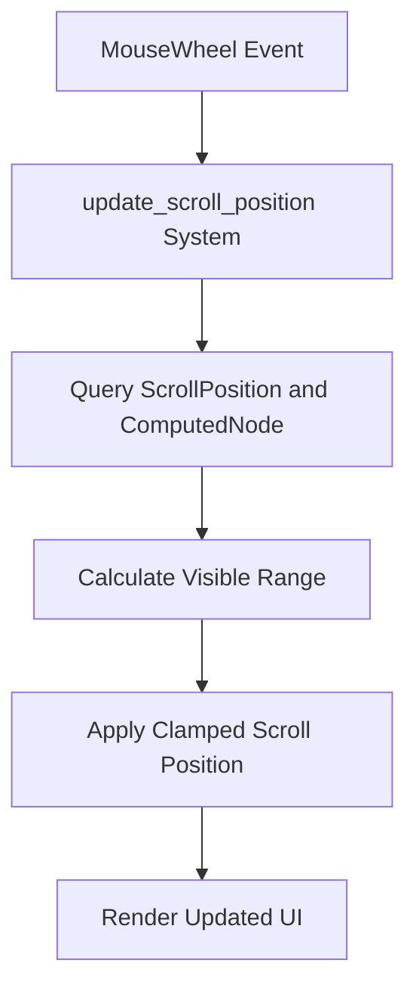

+++
title = "#20401"
date = "2025-08-05T00:00:00"
draft = false
template = "pull_request_page.html"
in_search_index = true

[taxonomies]
list_display = ["show"]

[extra]
current_language = "en"
available_languages = {"en" = { name = "English", url = "/pull_request/bevy/2025-08/pr-20401-en-20250805" }, "zh-cn" = { name = "中文", url = "/pull_request/bevy/2025-08/pr-20401-zh-cn-20250805" }}
+++

## Fixing Scroll Overflow in Bevy's Full UI Example

### The Problem and Context
The `testbed_full_ui` example had a scrolling implementation issue where mouse wheel events could push the scroll position beyond content boundaries. The core problem stemmed from how the `update_scroll_position` system handled scrolling logic. Unlike Bevy's `CoreScrollBar` component which properly clamps scroll positions, this implementation lacked boundary checks. This meant continuous scrolling would push the scroll position into negative values or beyond content limits, creating a disorienting user experience where content appeared to scroll past logical boundaries.

### The Solution Approach
The fix required implementing scroll boundary clamping identical to Bevy's core UI widgets. The solution involved:
1. Accessing layout metrics to calculate scrollable range
2. Applying vertical clamping using `content_size` and `visible_size`
3. Maintaining horizontal scrolling behavior unchanged
4. Avoiding interference with core scrollbar components

The approach directly reused the clamping logic from `CoreScrollBar` to ensure consistency with Bevy's established UI patterns. This was preferable to creating new clamping mechanisms since it maintained behavioral parity with standard widgets.

### The Implementation
The key changes were made to the `update_scroll_position` system. The previous implementation naively applied scroll deltas without boundary checks:

```rust
// Before implementation:
if let Ok(mut scroll_position) = scrolled_node_query.get_mut(*entity) {
    scroll_position.x -= dx;
    scroll_position.y -= dy; // No boundary checks
}
```

The updated implementation introduces proper clamping:

```rust
// After implementation:
if let Ok((mut scroll_position, scroll_content)) = 
    scrolled_node_query.get_mut(*entity) 
{
    let visible_size = scroll_content.size();
    let content_size = scroll_content.content_size();
    
    let range = (content_size.y - visible_size.y).max(0.)
        * scroll_content.inverse_scale_factor;
    
    scroll_position.x -= dx;
    scroll_position.y = (scroll_position.y - dy).clamp(0., range);
}
```

Key technical aspects:
1. **Layout Metrics**: Uses `ComputedNode` to get `visible_size` and `content_size`
2. **Range Calculation**: Computes maximum scroll range with `(content_size.y - visible_size.y)`
3. **Scaling Consideration**: Applies `inverse_scale_factor` to handle UI scaling
4. **Clamping**: Uses `clamp(0., range)` to restrict vertical scrolling
5. **Component Filtering**: Adds `Without<CoreScrollbar>` to avoid conflicts

### Technical Insights
The solution demonstrates important UI programming concepts:
1. **Scroll Range Calculation**: The maximum scroll position equals content height minus visible height
2. **Non-Negative Constraint**: Using `.max(0.)` prevents invalid negative ranges
3. **UI Scale Handling**: Multiplying by `inverse_scale_factor` maintains consistent behavior across resolutions
4. **Component Isolation**: The `Without<CoreScrollbar>` filter prevents double-processing scroll events

A potential improvement would be making this clamping logic reusable across multiple systems, though that's beyond this PR's scope.

### The Impact
These changes:
1. Fix visual overflow issues in scrolling containers
2. Align example behavior with core UI components
3. Provide reference implementation for custom scrolling
4. Maintain horizontal scrolling behavior unchanged

Testing confirms the fix works as expected:
```bash
cargo run --example testbed_full_ui
```
Scrolling now correctly stops at content boundaries in both directions.

## Visual Representation



## Key Files Changed

### `examples/testbed/full_ui.rs`
**Changes**: Modified scroll position update logic to prevent overflow  
**Purpose**: Fix scroll boundary violation in UI example  

**Before**:
```rust
mut scrolled_node_query: Query<&mut ScrollPosition>,
// ...
if let Ok(mut scroll_position) = scrolled_node_query.get_mut(*entity) {
    scroll_position.x -= dx;
    scroll_position.y -= dy;
}
```

**After**:
```rust
mut scrolled_node_query: Query<(&mut ScrollPosition, &ComputedNode), Without<CoreScrollbar>>,
// ...
if let Ok((mut scroll_position, scroll_content)) = scrolled_node_query.get_mut(*entity) {
    let visible_size = scroll_content.size();
    let content_size = scroll_content.content_size();
    
    let range = (content_size.y - visible_size.y).max(0.)
        * scroll_content.inverse_scale_factor;
    
    scroll_position.x -= dx;
    scroll_position.y = (scroll_position.y - dy).clamp(0., range);
}
```

## Further Reading
1. [Bevy UI Layout Documentation](https://bevyengine.org/learn/book/features/ui/#layout)
2. [CoreScrollBar Implementation](https://github.com/bevyengine/bevy/blob/main/crates/bevy_core_widgets/src/core_scrollbar.rs)
3. [Rust clamp() Documentation](https://doc.rust-lang.org/std/primitive.f64.html#method.clamp)
4. [Bevy Component Query Filters](https://bevyengine.org/learn/book/patterns/query-filters/)