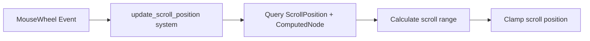

+++
title = "#20401 Fix full_ui example overflowing scroll position"
date = "2025-08-05T00:00:00"
draft = false
template = "pull_request_page.html"
in_search_index = false

[extra]
current_language = "zh-cn"
available_languages = {"en" = { name = "English", url = "/pull_request/bevy/2025-08/pr-20401-en-20250805" }, "zh-cn" = { name = "中文", url = "/pull_request/bevy/2025-08/pr-20401-zh-cn-20250805" }}
labels = ["D-Trivial", "C-Examples", "A-UI"]
+++

# Fix full_ui example overflowing scroll position

## Basic Information
- **Title**: Fix full_ui example overflowing scroll position
- **PR Link**: https://github.com/bevyengine/bevy/pull/20401
- **Author**: nekonimous
- **Status**: MERGED
- **Labels**: D-Trivial, C-Examples, A-UI, S-Ready-For-Final-Review
- **Created**: 2025-08-03T22:24:10Z
- **Merged**: 2025-08-05T19:19:49Z
- **Merged By**: alice-i-cecile

## Description Translation
### 目标
`testbed_full_ui` 示例中有一个监听 `MouseWheel` 事件的系统，它会将滚轮增量应用到悬停的滚动位置节点。

然而，此实现未将滚动位置的范围限制在内容大小内（不同于 `CoreScrollBar`）。持续滚动时，即使已经到达"可见"边界，仍会出现上溢/下溢现象。

### 解决方案
使用与[此处](https://github.com/bevyengine/bevy/blob/197cbcb68ae1ccc8aa4e33cc3ab80afd960cf8a2/crates/bevy_core_widgets/src/core_scrollbar.rs#L209-L212)相同的逻辑，将 `scroll_position.y` 限制在内容大小范围内。

### 测试
`cargo run --example testbed_full_ui`

## 本次 Pull Request 的技术分析

### 问题背景
在 `testbed_full_ui` 示例中，`update_scroll_position` 系统负责处理鼠标滚轮事件并更新滚动位置。原实现直接应用滚轮增量到 `ScrollPosition` 组件，但未对滚动范围进行边界检查。这导致当用户持续滚动时，滚动位置会超出内容边界（上溢或下溢），产生不符合预期的行为。

### 解决方案设计
核心修复方案是引入与 Bevy 核心部件 `CoreScrollBar` 相同的边界检查逻辑：
1. 获取滚动内容的可见区域尺寸和完整内容尺寸
2. 计算有效的滚动范围（content_size - visible_size）
3. 应用滚轮增量后，将 `scroll_position.y` 限制在 [0, range] 区间

### 具体实现
修改集中在 `update_scroll_position` 系统：
1. **扩展查询**：在原有 `ScrollPosition` 组件基础上增加 `ComputedNode` 查询，用于获取尺寸信息
2. **排除滚动条**：添加 `Without<CoreScrollbar>` 过滤，避免对滚动条本身应用滚动事件
3. **计算滚动范围**：基于内容尺寸和可见尺寸计算最大可滚动距离
4. **应用边界限制**：使用 `clamp()` 确保滚动位置始终在有效范围内

关键计算逻辑：
```rust
let visible_size = scroll_content.size();
let content_size = scroll_content.content_size();
let range = (content_size.y - visible_size.y).max(0.) * scroll_content.inverse_scale_factor;
scroll_position.y = (scroll_position.y - dy).clamp(0., range);
```

### 技术考量
1. **性能影响**：新增的 `ComputedNode` 查询不会显著增加开销，因为滚动事件本身是低频操作
2. **边界条件处理**：
   - 使用 `max(0.)` 确保范围值非负
   - 通过 `inverse_scale_factor` 处理可能的UI缩放
3. **系统隔离**：`Without<CoreScrollbar>` 确保不会干扰滚动条自身的逻辑

### 修复效果
该PR解决了以下具体问题：
1. 阻止滚动位置超出内容边界
2. 使示例行为与核心组件 `CoreScrollBar` 保持一致
3. 提升示例的交互体验和正确性

## 可视化关系


## 关键文件变更

### `examples/testbed/full_ui.rs`
**变更原因**：修复滚动位置溢出问题，使示例行为符合预期

**代码变更**：
```rust
// 修改前：
mut scrolled_node_query: Query<&mut ScrollPosition>

// 在事件处理中：
if let Ok(mut scroll_position) = scrolled_node_query.get_mut(*entity) {
    scroll_position.x -= dx;
    scroll_position.y -= dy; // 无边界检查
}
```

```rust
// 修改后：
mut scrolled_node_query: Query<(&mut ScrollPosition, &ComputedNode), Without<CoreScrollbar>>

// 在事件处理中：
if let Ok((mut scroll_position, scroll_content)) = scrolled_node_query.get_mut(*entity) {
    let visible_size = scroll_content.size();
    let content_size = scroll_content.content_size();
    let range = (content_size.y - visible_size.y).max(0.) * scroll_content.inverse_scale_factor;
    
    scroll_position.x -= dx;
    scroll_position.y = (scroll_position.y - dy).clamp(0., range); // 新增边界检查
}
```

**关联性**：
- 通过获取 `ComputedNode` 组件得到尺寸数据
- 使用与 `CoreScrollBar` 相同的边界计算逻辑
- `Without<CoreScrollbar>` 确保不处理滚动条自身

## 扩展阅读
1. [CoreScrollBar 实现参考](https://github.com/bevyengine/bevy/blob/main/crates/bevy_core_widgets/src/core_scrollbar.rs) - 核心滚动组件的边界处理实现
2. [Bevy UI 布局文档](https://bevyengine.org/learn/book/features/ui/) - UI 布局和尺寸计算原理
3. [Rust clamp() 文档](https://doc.rust-lang.org/std/primitive.f32.html#method.clamp) - 边界限制函数使用说明