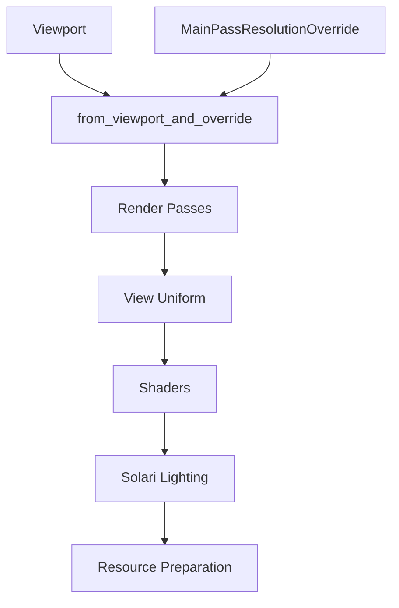

+++
title = "#20403 MainPassResolutionOverride changes"
date = "2025-08-04T00:00:00"
draft = false
template = "pull_request_page.html"
in_search_index = true

[taxonomies]
list_display = ["show"]

[extra]
current_language = "en"
available_languages = {"en" = { name = "English", url = "/pull_request/bevy/2025-08/pr-20403-en-20250804" }, "zh-cn" = { name = "中文", url = "/pull_request/bevy/2025-08/pr-20403-zh-cn-20250804" }}
labels = ["A-Rendering", "D-Straightforward"]
+++

## MainPassResolutionOverride changes

### Basic Information
- **Title**: MainPassResolutionOverride changes
- **PR Link**: https://github.com/bevyengine/bevy/pull/20403
- **Author**: JMS55
- **Status**: MERGED
- **Labels**: A-Rendering, S-Ready-For-Final-Review, D-Straightforward
- **Created**: 2025-08-04T00:04:02Z
- **Merged**: 2025-08-04T22:29:22Z
- **Merged By**: alice-i-cecile

### Description Translation
Lots of changes extracted from #19864.

I haven't added support for MainPassResolutionOverride to every rendering feature yet. Mostly just Solari and some of the main passes as a proof of concept.

### The Story of This Pull Request

The PR addresses how `MainPassResolutionOverride` integrates with Bevy's rendering pipeline. Previously, viewport handling had limitations when resolution overrides were applied. The original `Viewport::with_override` method cloned viewports unconditionally and applied overrides directly to the cloned instance. This approach didn't handle cases where cameras might not have existing viewports defined, leading to inconsistent state management across rendering passes.

To resolve this, we refactored the viewport override mechanism. The new `Viewport::from_viewport_and_override` function replaces `with_override`, providing more robust handling of optional viewports. This function creates a default viewport when none exists before applying the resolution override, ensuring consistent behavior whether or not a camera defines a viewport. The return type changed to `Option<Viewport>` to clearly communicate when a viewport is available.

We then updated all major rendering passes to use this new function:
- Core 3D passes (opaque, transparent, transmissive)
- Prepass and deferred rendering nodes
- Meshlet-based rendering passes
- OIT resolve node
- Custom render phase example

Concurrently, we needed to propagate resolution overrides to shaders. The `ViewUniform` struct was extended with a new `main_pass_viewport` field. In the `prepare_view_uniforms` system, we now compute this value by checking for `MainPassResolutionOverride` components. When present, we override the viewport dimensions in the uniform while preserving the original viewport for other uses. This required adding the override component to the system's query.

Shader handling was updated to use the new `main_pass_viewport` field:
- `view.wgsl` now includes `main_pass_viewport` in the View struct
- ReSTIR DI/GI shaders in Solari were modified to reference `main_pass_viewport` instead of `viewport`
- Coordinate calculations in shaders now use `main_pass_viewport` for resolution-dependent operations

For Solari's lighting system, we improved resource management:
- The `SolariLightingResources` preparation system now accounts for resolution overrides
- The lighting node uses the resource's view size instead of camera viewport
- Workgroup dispatch calculations were updated to use the resource's dimensions
- Texture copy operations now use the resource's view size

Finally, we added debug derivation to `MainPassResolutionOverride` for better diagnostics and updated documentation to clarify that shaders should use `main_pass_viewport` for main pass dimensions.

### Visual Representation



### Key Files Changed

#### `crates/bevy_camera/src/camera.rs`
Refactored viewport override handling:
```rust
// Before:
pub fn with_override(
    &self,
    main_pass_resolution_override: Option<&MainPassResolutionOverride>,
) -> Self {
    let mut viewport = self.clone();
    if let Some(override_size) = main_pass_resolution_override {
        viewport.physical_size = **override_size;
    }
    viewport
}

// After:
pub fn from_viewport_and_override(
    viewport: Option<&Self>,
    main_pass_resolution_override: Option<&MainPassResolutionOverride>,
) -> Option<Self> {
    let mut viewport = viewport.cloned();
    if let Some(override_size) = main_pass_resolution_override {
        if viewport.is_none() {
            viewport = Some(Viewport::default());
        }
        viewport.as_mut().unwrap().physical_size = **override_size;
    }
    viewport
}
```
This change ensures consistent viewport handling when overrides are present.

#### `crates/bevy_render/src/view/mod.rs`
Added main pass viewport to uniforms:
```rust
// ViewUniform struct modification:
pub struct ViewUniform {
    // ...
    pub viewport: Vec4,
    pub main_pass_viewport: Vec4,
    // ...
}

// Updated uniform preparation:
if let Some(resolution_override) = resolution_override {
    main_pass_viewport.z = resolution_override.0.x as f32;
    main_pass_viewport.w = resolution_override.0.y as f32;
}
```
This propagates resolution overrides to shaders.

#### `crates/bevy_solari/src/realtime/node.rs`
Updated workgroup calculations:
```rust
// Before:
pass.dispatch_workgroups(viewport.x.div_ceil(8), viewport.y.div_ceil(8), 1);

// After:
let dx = solari_lighting_resources.view_size.x.div_ceil(8);
let dy = solari_lighting_resources.view_size.y.div_ceil(8);
pass.dispatch_workgroups(dx, dy, 1);
```
This uses resource-based dimensions instead of camera viewport.

#### `crates/bevy_solari/src/realtime/restir_di.wgsl`
Updated viewport references:
```rust
// Before:
if any(global_id.xy >= vec2u(view.viewport.zw)) { return; }
let pixel_index = global_id.x + global_id.y * u32(view.viewport.z);

// After:
if any(global_id.xy >= vec2u(view.main_pass_viewport.zw)) { return; }
let pixel_index = global_id.x + global_id.y * u32(view.main_pass_viewport.z);
```
This uses the main pass viewport in shader calculations.

#### `crates/bevy_solari/src/realtime/prepare.rs`
Added resolution override handling:
```rust
// Modified resource preparation:
if let Some(MainPassResolutionOverride(resolution_override)) = resolution_override {
    view_size = *resolution_override;
}
```
This ensures Solari resources reflect the overridden resolution.

### Further Reading
- [WebGPU Coordinate Systems](https://www.w3.org/TR/webgpu/#coordinate-systems)
- [Bevy Rendering Architecture](https://bevyengine.org/learn/book/getting-started/rendering/)
- [ReSTIR GI Paper](https://research.nvidia.com/publication/2021-06_restir-gi-path-resampling-real-time-path-tracing)