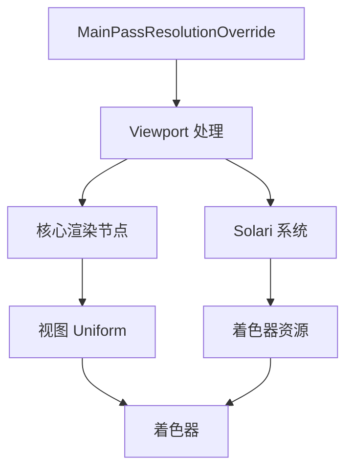

+++
title = "#20403 MainPassResolutionOverride changes"
date = "2025-08-04T00:00:00"
draft = false
template = "pull_request_page.html"
in_search_index = false

[extra]
current_language = "zh-cn"
available_languages = {"en" = { name = "English", url = "/pull_request/bevy/2025-08/pr-20403-en-20250804" }, "zh-cn" = { name = "中文", url = "/pull_request/bevy/2025-08/pr-20403-zh-cn-20250804" }}
+++

# PR 分析报告：MainPassResolutionOverride 变更

## 基础信息
- **标题**: MainPassResolutionOverride changes
- **PR 链接**: https://github.com/bevyengine/bevy/pull/20403
- **作者**: JMS55
- **状态**: 已合并
- **标签**: A-Rendering, S-Ready-For-Final-Review, D-Straightforward
- **创建时间**: 2025-08-04T00:04:02Z
- **合并时间**: 2025-08-04T22:29:22Z
- **合并人**: alice-i-cecile

## 描述翻译
从 #19864 中提取了大量变更。  
我尚未为所有渲染功能添加对 MainPassResolutionOverride 的支持。目前主要只在 Solari 和部分主通道中作为概念验证。

## PR 技术分析

### 问题背景
在 Bevy 渲染系统中，`MainPassResolutionOverride` 组件允许覆盖主通道的分辨率，这对于实现动态分辨率渲染或性能优化至关重要。然而，现有实现存在两个主要限制：

1. **视口处理不一致**：各渲染节点通过 `viewport.with_override()` 手动应用分辨率覆盖，导致代码重复且容易出错
2. **着色器兼容性问题**：着色器直接使用原始视口尺寸，而非覆盖后的分辨率，导致使用 `MainPassResolutionOverride` 时渲染结果不正确

### 解决方案
本次修改采用双管齐下的方法：
1. **重构视口处理逻辑**：引入集中化的 `Viewport::from_viewport_and_override()` 方法处理分辨率覆盖
2. **扩展视图 Uniform**：在 `ViewUniform` 中添加 `main_pass_viewport` 字段，使着色器能正确访问覆盖后的分辨率

### 具体实现

#### 1. 视口处理重构 (crates/bevy_camera/src/camera.rs)
关键变更是将 `with_override()` 方法替换为更健壮的 `from_viewport_and_override()`：

```rust
// Before:
pub fn with_override(
    &self,
    main_pass_resolution_override: Option<&MainPassResolutionOverride>,
) -> Self {
    let mut viewport = self.clone();
    if let Some(override_size) = main_pass_resolution_override {
        viewport.physical_size = **override_size;
    }
    viewport
}

// After:
pub fn from_viewport_and_override(
    viewport: Option<&Self>,
    main_pass_resolution_override: Option<&MainPassResolutionOverride>,
) -> Option<Self> {
    let mut viewport = viewport.cloned();
    
    if let Some(override_size) = main_pass_resolution_override {
        if viewport.is_none() {
            viewport = Some(Viewport::default());
        }
        
        viewport.as_mut().unwrap().physical_size = **override_size;
    }
    
    viewport
}
```
此变更：
- 正确处理 `viewport` 为 `None` 的情况
- 返回 `Option<Viewport>` 更符合 Rust 的惯用模式
- 集中了分辨率覆盖逻辑，减少重复代码

#### 2. 视图 Uniform 扩展 (crates/bevy_render/src/view/mod.rs)
添加新的 `main_pass_viewport` 字段到视图 Uniform：

```rust
pub struct ViewUniform {
    // ...
    pub viewport: Vec4,
    pub main_pass_viewport: Vec4, // 新增字段
    // ...
}
```
在 Uniform 准备阶段计算实际使用的视口：
```rust
let viewport = extracted_view.viewport.as_vec4();
let mut main_pass_viewport = viewport;
if let Some(resolution_override) = resolution_override {
    main_pass_viewport.z = resolution_override.0.x as f32;
    main_pass_viewport.w = resolution_override.0.y as f32;
}
```

#### 3. 渲染节点适配
所有核心渲染节点更新为使用新方法：
```rust
// 典型变更模式 (crates/bevy_core_pipeline/src/core_3d/main_opaque_pass_3d_node.rs)
// Before:
if let Some(viewport) = camera.viewport.as_ref() {
    render_pass.set_camera_viewport(&viewport.with_override(resolution_override));
}

// After:
if let Some(viewport) =
    Viewport::from_viewport_and_override(camera.viewport.as_ref(), resolution_override)
{
    render_pass.set_camera_viewport(&viewport);
}
```
此模式在以下节点中一致应用：
- 不透明通道 (MainOpaquePass3dNode)
- 透射通道 (MainTransmissivePass3dNode)
- 透明通道 (MainTransparentPass3dNode)
- 延迟渲染节点 (Deferred Node)
- OIT 解析节点 (OitResolveNode)
- 预处理节点 (Prepass Node)

#### 4. Solari 集成 (crates/bevy_solari)
Solari 实时全局光照系统进行多处适配：

**资源准备系统** (prepare.rs)：
```rust
// 添加分辨率覆盖支持
let Some(mut view_size) = camera.physical_viewport_size else {
    continue;
};
if let Some(MainPassResolutionOverride(resolution_override)) = resolution_override {
    view_size = *resolution_override; // 应用覆盖
}
```

**计算着色器** (restir_di.wgsl & restir_gi.wgsl)：
```wgsl
// Before:
if any(global_id.xy >= vec2u(view.viewport.zw)) { return; }
let pixel_index = global_id.x + global_id.y * u32(view.viewport.z);

// After:
if any(global_id.xy >= vec2u(view.main_pass_viewport.zw)) { return; }
let pixel_index = global_id.x + global_id.y * u32(view.main_pass_viewport.z);
```

**光照节点** (node.rs)：
```rust
// 移除直接视口依赖，使用资源中的 view_size
let dx = solari_lighting_resources.view_size.x.div_ceil(8);
let dy = solari_lighting_resources.view_size.y.div_ceil(8);
// ...
pass.dispatch_workgroups(dx, dy, 1); // 使用计算后的尺寸
```

### 技术洞察
1. **设计一致性**：通过集中化分辨率处理逻辑，减少各渲染节点的重复代码，提高可维护性
2. **着色器兼容性**：新增 `main_pass_viewport` 确保所有着色器能正确响应分辨率覆盖
3. **资源管理**：Solari 的资源准备系统现在正确考虑分辨率覆盖，避免无效资源重建
4. **API 清晰度**：更新 `MainPassResolutionOverride` 的文档说明，强调着色器中应使用 `main_pass_viewport`

### 影响分析
1. **功能完整性**：使 `MainPassResolutionOverride` 在核心渲染通道和 Solari 系统中正常工作
2. **渲染正确性**：修复分辨率覆盖时的着色器计算问题
3. **性能优化**：避免 Solari 资源在分辨率未变化时的不必要重建
4. **代码健壮性**：统一处理逻辑减少未来引入错误的风险

## 组件关系图


## 关键文件变更

### crates/bevy_camera/src/camera.rs (+13/-6)
重构视口处理逻辑，引入更健壮的 `from_viewport_and_override` 方法：
```rust
pub fn from_viewport_and_override(
    viewport: Option<&Self>,
    main_pass_resolution_override: Option<&MainPassResolutionOverride>,
) -> Option<Self> {
    // 处理逻辑...
}
```

### crates/bevy_render/src/view/mod.rs (+21/-2)
扩展视图 Uniform 并添加计算逻辑：
```rust
pub struct ViewUniform {
    // ...
    pub main_pass_viewport: Vec4, // 新增字段
}

// 在 prepare_view_uniforms 中：
if let Some(resolution_override) = resolution_override {
    main_pass_viewport.z = resolution_override.0.x as f32;
    main_pass_viewport.w = resolution_override.0.y as f32;
}
```

### crates/bevy_solari/src/realtime/restir_di.wgsl (+11/-11)
适配着色器使用主通道视口：
```wgsl
// 所有 view.viewport 引用替换为 view.main_pass_viewport
if any(global_id.xy >= vec2u(view.main_pass_viewport.zw)) { return; }
let pixel_index = global_id.x + global_id.y * u32(view.main_pass_viewport.z);
```

### crates/bevy_solari/src/realtime/restir_gi.wgsl (+11/-11)
类似 di 通道的变更：
```wgsl
// 统一使用 main_pass_viewport
if any(global_id.xy >= vec2u(view.main_pass_viewport.zw)) { return; }
```

### crates/bevy_solari/src/realtime/node.rs (+9/-11)
更新计算调度逻辑：
```rust
// 使用资源中的 view_size 而非直接视口
let dx = solari_lighting_resources.view_size.x.div_ceil(8);
let dy = solari_lighting_resources.view_size.y.div_ceil(8);
pass.dispatch_workgroups(dx, dy, 1);
```

## 延伸阅读
1. [Bevy 渲染管线架构](https://bevyengine.org/learn/book/getting-started/rendering/)
2. [WGSL 着色语言规范](https://www.w3.org/TR/WGSL/)
3. [动态分辨率渲染技术](https://developer.nvidia.com/gpugems/gpugems3/part-iv-image-effects/chapter-27-motion-blur-post-processing-effect)
4. [现代渲染引擎设计原则](https://arxiv.org/abs/2007.14172)