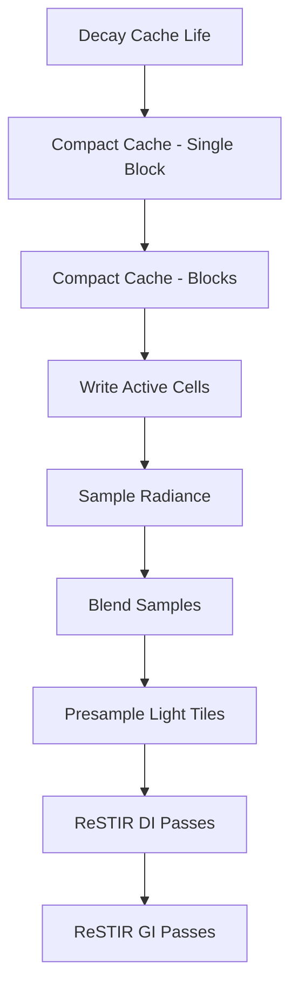

+++
title = "#20406 Solari radiance cache"
date = "2025-08-09T00:00:00"
draft = false
template = "pull_request_page.html"
in_search_index = true

[taxonomies]
list_display = ["show"]

[extra]
current_language = "en"
available_languages = {"en" = { name = "English", url = "/pull_request/bevy/2025-08/pr-20406-en-20250809" }, "zh-cn" = { name = "中文", url = "/pull_request/bevy/2025-08/pr-20406-zh-cn-20250809" }}
labels = ["C-Feature", "A-Rendering", "D-Complex"]
+++

# Solari Radiance Cache

## Basic Information
- **Title**: Solari radiance cache
- **PR Link**: https://github.com/bevyengine/bevy/pull/20406
- **Author**: JMS55
- **Status**: MERGED
- **Labels**: C-Feature, A-Rendering, S-Ready-For-Final-Review, D-Complex
- **Created**: 2025-08-04T02:49:54Z
- **Merged**: 2025-08-09T22:53:03Z
- **Merged By**: alice-i-cecile

## Description Translation
# Objective

- Make GI pass cheaper
- Improve GI quality after disocclusions
- Have multibounce GI instead of the current single bounce

## Solution

- Add a persistent world cache based on spatial hashing
- Each hash key is a combination of position, normal, and cell size, where the cell size is based on the distance from the camera

1. Each entry/cell in the cache has a "life" counter. It starts at 30, and the first pass each frame decrements each entry by 1. When it reaches 0, the entry is deallocated. 
2. Passes 2-4 compact and write a list of the active cells (life != 0) in the cache via parallel prefix sum
3. Pass 5 samples lighting for each cache cell (direct via light sampling, indirect via BRDF sampling and querying the cache at hit points)
4. Pass 6 blends the new radiance into the existing cell's radiance. Unlike ReSTIR/RIS we are _not_ storing a single light sample/path. We are instead storing radiance.
5. The ReSTIR GI pass is basically the same, except at the sample point, instead of sampling direct lighting via another raytrace, it instead queries the world cache. Querying a cache cell resets its life to 30. 

## Issues
* Querying an empty cache cell initializes the position/normal used for sampling lighting for the cell to the values used in the query. This means that each cache entry has a fixed sample point to represent the entire volume, which can sometimes lead to problems if the chosen sample point poorly represents the volume. 
* When transitioning LODs, cells start out as empty rather than initializing themselves via querying adjacent LOD levels. Not a huge problem in practice though, at least in the cornell box I was hard pressed to notice this as ReSTIR GI temporal reservoirs hide the issue. Yay for two level caching!
* I'm not entirely sure that cache entries will ever die in larger worlds. The cache can keep itself alive since cells can query each other (resetting their life to 30) when updating cells. Probably need to think about how to handle larger scenes.
* Worse stability in larger scenes like bistro. The jacobian leads to temporal bright spots with ReSTIR GI more often than not using the cache, and the cache itself can be very unstable. Might need some form of ReSTIR in the cache, like https://wangningbei.github.io/2023/ReSTIR_files/paper_ReSTIRGI.pdf. (EDIT: Added RIS which helps a ton. ReSTIR might be desirable for better responsiveness though)
* Lots more tweaking of hashing stuff possible.
* Like the rest of Solari, I haven't done any testing of dynamic content yet. Gotta get static content working first :)
* The pipeline setup code for Solari has gotten super messy. Ideas on how to fix it are welcome.

---

## Showcase


## The Story of This Pull Request

### Problem and Context
The Solari real-time global illumination system faced performance challenges with its GI pass and limitations with single-bounce lighting. The existing ReSTIR GI implementation required expensive direct lighting ray traces at each sample point. Additionally, the system only supported single-bounce indirect lighting, limiting lighting realism. The goals were to reduce GI pass cost, improve quality during disocclusions, and enable multibounce GI.

### Solution Approach
The solution introduces a persistent radiance cache using spatial hashing. Cache entries are keyed by position, normal, and adaptive cell size based on camera distance. The cache lifecycle management involves:
1. Life counters that decrement each frame and deallocate stale entries
2. Compaction passes that identify active cells
3. Lighting sampling passes that compute direct/indirect radiance
4. Blending passes that integrate new samples into the cache

The ReSTIR GI pass was modified to query this cache instead of performing direct lighting ray traces. RIS (Resampled Importance Sampling) was added to improve stability in complex scenes.

### Implementation Details
The implementation added several key components:
- A spatial hash grid with 2²⁰ entries
- Life management with automatic entry expiration
- Radiance storage with temporal blending
- Multibounce support through recursive cache queries

The cache uses quantized positions and normals for hashing:
```wgsl
fn quantize_position(world_position: vec3<f32>, view_position: vec3<f32>) -> vec3<f32> {
    let base_size = WORLD_CACHE_POSITION_BASE_CELL_SIZE;
    let d = distance(view_position, world_position);
    let step = max((d * base_size) / 7.0, base_size);
    let quantization_factor = exp2(floor(log2(step)));
    return floor(world_position / quantization_factor + 0.0001);
}
```

Cache queries reset cell lifetimes and initialize empty cells:
```wgsl
if existing_checksum == checksum {
    atomicStore(&world_cache_life[key], WORLD_CACHE_CELL_LIFETIME);
    return world_cache_radiance[key].rgb;
} else if existing_checksum == WORLD_CACHE_EMPTY_CELL {
    atomicStore(&world_cache_life[key], WORLD_CACHE_CELL_LIFETIME);
    world_cache_geometry_data[key].world_position = world_position;
    world_cache_geometry_data[key].world_normal = world_normal;
    return vec3(0.0);
}
```

The lighting sampling pass uses RIS for better stability:
```wgsl
fn sample_random_light_ris(world_position: vec3<f32>, world_normal: vec3<f32>, workgroup_id: vec2<u32>, rng: ptr<function, u32>) -> vec3<f32> {
    // RIS implementation with 32 samples
    // ...
}
```

### Technical Insights
The cache uses several innovative techniques:
- **Adaptive cell sizing**: Cell size increases with distance from camera (LOD)
- **Temporal blending**: New samples are integrated using moving average
- **Multibounce support**: Secondary rays query the cache recursively
- **Life management**: Unused entries expire after 30 frames

The implementation faces challenges with:
- Representative sample points for cache cells
- LOD transition artifacts
- Cache immortality in large scenes
- Stability in complex scenes like bistro

### Impact
The radiance cache provides:
- **Performance gains**: GI pass avoids expensive direct lighting traces
- **Quality improvements**: Better disocclusion handling and multibounce GI
- **Memory efficiency**: Automatic expiration of unused cache entries
- **Foundation for future work**: Basis for more advanced caching techniques

The solution demonstrates how spatial hashing and temporal caching can significantly enhance real-time GI systems while maintaining interactive frame rates.

## Visual Representation



## Key Files Changed

### `crates/bevy_solari/src/realtime/node.rs` (+197/-39)
Added compute pipelines for cache management passes and integrated them into the rendering graph. Modified existing pipelines to include push constants.

```rust
// Added new pipeline creation
decay_world_cache_pipeline: create_pipeline(
    "solari_lighting_decay_world_cache_pipeline",
    "decay_world_cache",
    load_embedded_asset!(world, "world_cache_compact.wgsl"),
    Some(&bind_group_layout_world_cache_active_cells_dispatch),
    vec!["WORLD_CACHE_NON_ATOMIC_LIFE_BUFFER".into()],
),
```

### `crates/bevy_solari/src/realtime/world_cache_query.wgsl` (+114/-0)
Defined cache structures, hash functions, and query logic. Implemented spatial hashing with position/normal quantization.

```wgsl
fn compute_key(world_position: vec3<u32>, world_normal: vec3<u32>) -> u32 {
    var key = pcg_hash(world_position.x);
    key = pcg_hash(key + world_position.y);
    key = pcg_hash(key + world_position.z);
    key = pcg_hash(key + world_normal.x);
    key = pcg_hash(key + world_normal.y);
    key = pcg_hash(key + world_normal.z);
    return wrap_key(key);
}
```

### `crates/bevy_solari/src/realtime/world_cache_update.wgsl` (+98/-0)
Implemented radiance sampling and blending. Added multibounce support through secondary rays.

```wgsl
@compute @workgroup_size(1024, 1, 1)
fn blend_new_samples(@builtin(global_invocation_id) active_cell_id: vec3<u32>) {
    if active_cell_id.x < world_cache_active_cells_count {
        let cell_index = world_cache_active_cell_indices[active_cell_id.x];
        let old_radiance = world_cache_radiance[cell_index];
        let new_radiance = world_cache_active_cells_new_radiance[active_cell_id.x];
        let sample_count = min(old_radiance.a + 1.0, WORLD_CACHE_MAX_TEMPORAL_SAMPLES);
        let blended_radiance = mix(old_radiance.rgb, new_radiance, 1.0 / sample_count);
        world_cache_radiance[cell_index] = vec4(blended_radiance, sample_count);
    }
}
```

### `crates/bevy_solari/src/realtime/prepare.rs` (+93/-0)
Created buffers for cache storage and management. Added buffers for checksums, life counters, radiance, and active cells.

```rust
let world_cache_checksums = render_device.create_buffer(&BufferDescriptor {
    label: Some("solari_lighting_world_cache_checksums"),
    size: WORLD_CACHE_SIZE * size_of::<u32>() as u64,
    usage: BufferUsages::STORAGE,
    mapped_at_creation: false,
});
```

### `crates/bevy_solari/src/realtime/world_cache_compact.wgsl` (+70/-0)
Implemented cache decay and compaction using parallel prefix sum. Handles active cell list generation.

```wgsl
@compute @workgroup_size(1024, 1, 1)
fn decay_world_cache(@builtin(global_invocation_id) global_id: vec3<u32>) {
    var life = world_cache_life[global_id.x];
    if life > 0u {
        life -= 1u;
        world_cache_life[global_id.x] = life;
        if life == 0u {
            world_cache_checksums[global_id.x] = WORLD_CACHE_EMPTY_CELL;
            world_cache_radiance[global_id.x] = vec4(0.0);
        }
    }
}
```

## Further Reading
- [ReSTIR GI Paper](https://wangningbei.github.io/2023/ReSTIR_files/paper_ReSTIRGI.pdf) - Advanced caching techniques
- Spatial Hashing Techniques - For understanding the underlying data structure
- Temporal Filtering Methods - For radiance blending approaches
- Parallel Prefix Sum Algorithms - For compaction implementation details