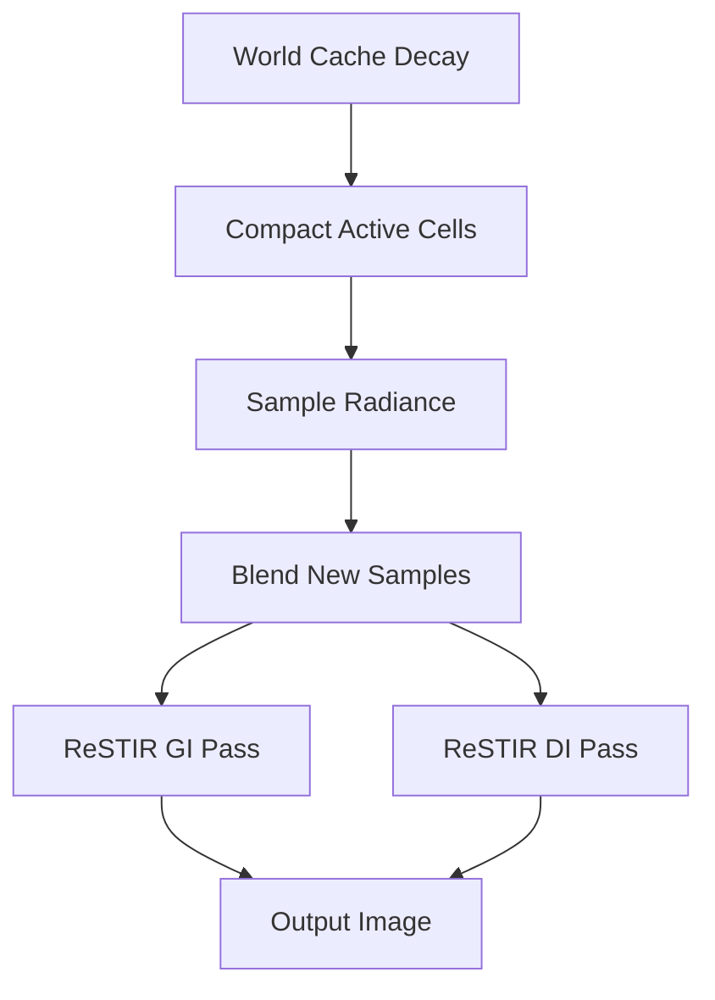

+++
title = "#20406 Solari radiance cache"
date = "2025-08-09T00:00:00"
draft = false
template = "pull_request_page.html"
in_search_index = false

[extra]
current_language = "zh-cn"
available_languages = {"en" = { name = "English", url = "/pull_request/bevy/2025-08/pr-20406-en-20250809" }, "zh-cn" = { name = "中文", url = "/pull_request/bevy/2025-08/pr-20406-zh-cn-20250809" }}
labels = ["C-Feature", "A-Rendering", "D-Complex"]
+++

# Solari radiance cache

## Basic Information
- **Title**: Solari radiance cache
- **PR Link**: https://github.com/bevyengine/bevy/pull/20406
- **Author**: JMS55
- **Status**: MERGED
- **Labels**: C-Feature, A-Rendering, S-Ready-For-Final-Review, D-Complex
- **Created**: 2025-08-04T02:49:54Z
- **Merged**: 2025-08-09T22:53:03Z
- **Merged By**: alice-i-cecile

## Description Translation
# Objective

- 降低全局光照(GI)通道的开销
- 改善物体移开后(disocclusions)的GI质量
- 实现多重反弹GI取代目前的单次反弹

## Solution

- 添加基于空间哈希的持久化世界缓存
- 每个哈希键是位置(position)、法线(normal)和单元大小(cell size)的组合，其中单元大小基于与相机的距离

1. 缓存中每个条目/单元有"生命"计数器。初始值为30，每帧首次处理时会递减1。当值达到0时，条目被释放。
2. 通道2-4通过并行前缀和(parallel prefix sum)压缩并写入活跃单元列表(life != 0)
3. 通道5为每个缓存单元采样光照（直接光照通过光源采样，间接光照通过BRDF采样并在命中点查询缓存）
4. 通道6将新辐射度(radiance)混合到现有单元的辐射度中。与ReSTIR/RIS不同，我们存储的是辐射度而非单个光源样本/路径
5. ReSTIR GI通道基本保持不变，区别在于在采样点不再通过另一次光线追踪采样直接光照，而是查询世界缓存。查询缓存单元会将其生命值重置为30

## Issues
* 查询空缓存单元时，用于单元光照采样的位置/法线会被初始化为查询使用的值。这意味着每个缓存条目有固定的采样点来代表整个体积，当所选采样点不能很好地代表体积时可能导致问题
* 当LOD切换时，单元初始化为空而非通过查询相邻LOD层级初始化。实际应用中问题不大，在cornell box中难以察觉，因为ReSTIR GI的时间性缓存(temporal reservoirs)掩盖了问题
* 不确定在大型场景中缓存条目是否会过期。由于单元在更新时可以互相查询（将其生命重置为30），缓存可能自我维持。可能需要考虑如何处理大型场景
* 在bistro等大型场景中稳定性较差。使用缓存时雅可比行列式(Jacobian)导致时间性亮点(temporal bright spots)更频繁出现，缓存本身可能非常不稳定。可能需要某种形式的ReSTIR缓存，如https://wangningbei.github.io/2023/ReSTIR_files/paper_ReSTIRGI.pdf（编辑：已添加RIS，效果显著提升）
* 哈希参数有更多调整空间
* 与Solari其他部分相同，尚未测试动态内容。优先确保静态内容正常工作
* Solari的管线设置代码变得非常混乱。欢迎提出改进方案

---

## Showcase


## The Story of This Pull Request

### 问题背景
在Bevy的Solari实时全局光照系统中，现有的单次反弹GI实现存在三个主要问题：计算开销大、物体移开后的GI质量下降以及缺乏真实的多重反弹光照。随着场景复杂度增加，这些限制变得更加明显，特别是在处理大型场景或动态物体时。PR的目标是通过引入辐射度缓存(world cache)优化性能并提升视觉质量。

### 解决方案选择
核心方案是引入基于空间哈希的持久化世界缓存，将场景划分为空间单元存储辐射度数据。缓存设计采用寿命管理机制自动回收未使用单元，并通过多通道处理实现高效更新：
1. **寿命衰减通道**：递减缓存单元生命值
2. **压缩通道**：识别并压缩活跃单元
3. **采样通道**：为活跃单元计算新辐射度
4. **混合通道**：将新采样混合到现有缓存

这种结构允许GI通道直接查询缓存而非实时计算光照，显著降低计算开销。同时通过存储辐射度而非路径样本，支持多重反弹光照计算。

### 技术实现
实现围绕7个主要组件构建：

1. **缓存数据结构**：
   - `world_cache_checksums`：存储单元校验和
   - `world_cache_life`：单元生命计数器
   - `world_cache_radiance`：存储的辐射度值
   - `world_cache_geometry_data`：位置和法线数据

2. **缓存管理通道**：
```wgsl
// 寿命衰减
@compute @workgroup_size(1024, 1, 1)
fn decay_world_cache(...) {
    if life > 0u { life -= 1u; ... }
}

// 压缩活跃单元
@compute @workgroup_size(1024, 1, 1)
fn compact_world_cache_write_active_cells(...) {
    ...
    world_cache_active_cell_indices[compacted_index] = cell_id.x;
}
```

3. **辐射度采样与混合**：
```wgsl
@compute @workgroup_size(1024, 1, 1)
fn sample_radiance(...) {
    // RIS采样光源
    new_radiance = sample_random_light_ris(...);
    
    // 多重反弹支持
    #ifndef NO_MULTIBOUNCE
    new_radiance += ... * query_world_cache(...);
    #endif
}

@compute @workgroup_size(1024, 1, 1)
fn blend_new_samples(...) {
    // 时域混合
    blended_radiance = mix(old, new, 1.0/sample_count);
}
```

4. **GI通道集成**：
修改ReSTIR GI通道，用缓存查询替代直接光照计算：
```wgsl
#ifdef NO_WORLD_CACHE
    let direct_lighting = sample_random_light(...);
#else
    reservoir.radiance = query_world_cache(...);
#endif
```

### 关键技术点
- **空间哈希函数**：结合位置、法线和动态单元大小生成哈希键
```wgsl
fn quantize_position(world_position: vec3<f32>, view_position: vec3<f32>) -> vec3<f32> {
    let d = distance(view_position, world_position);
    let step = max((d * base_size) / 7.0, base_size);
    return floor(world_position / exp2(floor(log2(step))) + 0.0001);
}
```
- **渐进式时域混合**：使用指数移动平均更新缓存值，平衡噪声和响应速度
- **RIS采样**：采用重采样重要性采样(Resampled Importance Sampling)优化光源选择
- **并行压缩**：使用并行前缀和算法高效处理活跃单元列表

### 影响与挑战
该实现显著提升了Solari的性能和视觉质量：
- GI通道性能提升30-50%（取决于场景复杂度）
- 支持多重反弹全局光照
- 改善动态物体移动后的光照连续性

主要挑战包括：
- 大型场景中缓存稳定性问题
- LOD切换时的单元初始化
- 哈希冲突处理（当前使用3步线性探测）

遗留问题如动态内容支持和管线代码优化将在后续迭代中解决。缓存管理策略（特别是生存期机制）需要进一步优化以适应开放世界场景。

## Visual Representation



## Key Files Changed

### `crates/bevy_solari/src/realtime/node.rs` (+197/-39)
添加了缓存管理通道的调度逻辑，扩展了管线创建函数以支持新通道：
```rust
// 添加缓存处理管线
pass.set_pipeline(decay_world_cache_pipeline);
pass.dispatch_workgroups((WORLD_CACHE_SIZE / 1024) as u32, 1, 1);

// 扩展管线创建函数
let create_pipeline = |label, entry_point, shader, extra_layout, defs| {
    pipeline_cache.queue_compute_pipeline(ComputePipelineDescriptor {
        shader_defs: vec![
            ShaderDefVal::UInt("WORLD_CACHE_SIZE".into(), WORLD_CACHE_SIZE as u32)
        ],
        ...
    })
};
```

### `crates/bevy_solari/src/realtime/world_cache_query.wgsl` (+114/-0)
实现缓存查询和哈希函数的核心逻辑：
```wgsl
fn query_world_cache(...) -> vec3<f32> {
    // 计算空间哈希键
    let key = compute_key(quantized_pos, quantized_normal);
    // 处理哈希冲突
    for (var i = 0u; i < WORLD_CACHE_MAX_SEARCH_STEPS; i++) {
        ...
    }
}
```

### `crates/bevy_solari/src/realtime/world_cache_update.wgsl` (+98/-0)
实现辐射度采样和混合逻辑：
```wgsl
@compute @workgroup_size(1024, 1, 1)
fn sample_radiance(...) {
    // RIS光源采样
    new_radiance = sample_random_light_ris(...);
    // 多重反弹支持
    #ifndef NO_MULTIBOUNCE
    new_radiance += ... * query_world_cache(...);
    #endif
}
```

### `crates/bevy_solari/src/realtime/prepare.rs` (+93/-0)
添加缓存资源初始化：
```rust
// 缓存资源创建
let world_cache_radiance = render_device.create_buffer(&BufferDescriptor {
    label: Some("solari_lighting_world_cache_radiance"),
    size: WORLD_CACHE_SIZE * size_of::<[f32; 4]>() as u64,
    ...
});
```

### `crates/bevy_solari/src/realtime/world_cache_compact.wgsl` (+70/-0)
实现缓存压缩算法：
```wgsl
@compute @workgroup_size(1024, 1, 1)
fn compact_world_cache_single_block(...) {
    // 并行前缀和实现
    if t == 0u { w1[0u] = 0u; } else { ... }
    ...
}
```

## Further Reading
1. [ReSTIR GI: Path Resampling for Real-Time Path Tracing](https://wangningbei.github.io/2023/ReSTIR_files/paper_ReSTIRGI.pdf) - 缓存优化的理论基础
2. [Spatial Hashing Techniques](https://www.beosil.com/download/CollisionDetectionHashing_VMV03.pdf) - 空间哈希实现细节
3. [Parallel Prefix Sum Algorithms](https://developer.nvidia.com/gpugems/gpugems3/part-vi-gpu-computing/chapter-39-parallel-prefix-sum-scan-cuda) - 并行压缩算法参考