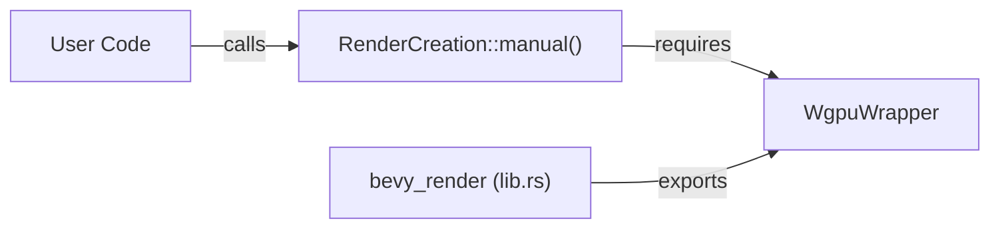

+++
title = "#20409 Make WgpuWrapper public again"
date = "2025-08-04T00:00:00"
draft = false
template = "pull_request_page.html"
in_search_index = true

[taxonomies]
list_display = ["show"]

[extra]
current_language = "en"
available_languages = {"en" = { name = "English", url = "/pull_request/bevy/2025-08/pr-20409-en-20250804" }, "zh-cn" = { name = "中文", url = "/pull_request/bevy/2025-08/pr-20409-zh-cn-20250804" }}
labels = ["A-Rendering", "P-Regression"]
+++

## Make WgpuWrapper public again

### Basic Information
- **Title**: Make WgpuWrapper public again
- **PR Link**: https://github.com/bevyengine/bevy/pull/20409
- **Author**: tronical
- **Status**: MERGED
- **Labels**: A-Rendering, S-Ready-For-Final-Review, P-Regression
- **Created**: 2025-08-04T07:17:03Z
- **Merged**: 2025-08-04T17:59:45Z
- **Merged By**: james7132

### Description Translation
# Objective

- WgpuWrapper was public in 0.16 and is needed to be able to call RenderCreation::manual.

## Solution

- Make it public again after the revert #20220

## Testing

- cargo build

### The Story of This Pull Request

This PR addresses a regression in Bevy's public API surface. The `WgpuWrapper` type, which was publicly accessible in version 0.16, became inaccessible after a previous change. This broke existing functionality for users who relied on `RenderCreation::manual`, a public API method that requires access to `WgpuWrapper` in its implementation. 

The core issue stemmed from PR #20220, which inadvertently changed the visibility of `WgpuWrapper` from public to private. This broke the public contract of `RenderCreation::manual` since its implementation depends on this type. Users attempting to use this API method would encounter compilation errors due to the now-private type.

The solution is straightforward: restore the public visibility of `WgpuWrapper` by changing its import statement to use `pub use` instead of a regular `use`. This maintains API consistency with Bevy 0.16 and ensures downstream consumers can continue using `RenderCreation::manual` without modification. The change is minimal but crucial for maintaining backward compatibility.

The implementation required modifying just one line in the render crate's root module. By making `WgpuWrapper` publicly accessible again, we restore the required visibility for `RenderCreation::manual` to function properly. This approach preserves the existing architecture while fixing the regression.

The impact is significant for users who depend on `RenderCreation::manual` for advanced rendering setup scenarios. Without this fix, their code would fail to compile when upgrading Bevy versions. The change demonstrates the importance of carefully considering visibility changes in public APIs, especially for types used in public method signatures.

### Visual Representation



### Key Files Changed

1. **crates/bevy_render/src/lib.rs**  
   Changed the import visibility to restore public access to `WgpuWrapper`

```rust
// Before:
use wgpu_wrapper::WgpuWrapper;

// After:
pub use wgpu_wrapper::WgpuWrapper;
```

This change makes `WgpuWrapper` publicly accessible again, allowing `RenderCreation::manual` to function as intended. The single-character change (+ "pub ") fixes the regression while maintaining all existing functionality.

### Further Reading
1. [Bevy Render Architecture](https://bevyengine.org/learn/book/getting-started/rendering/) - Official documentation on Bevy's rendering system
2. [wgpu Documentation](https://docs.rs/wgpu) - Underlying graphics API used by Bevy
3. [Rust Visibility Rules](https://doc.rust-lang.org/book/ch07-03-paths-for-referring-to-an-item-in-the-module-tree.html) - Understanding pub/private modifiers in Rust

### Full Code Diff
```diff
diff --git a/crates/bevy_render/src/lib.rs b/crates/bevy_render/src/lib.rs
index 5c55bd7193b5f..bf13c491ea96d 100644
--- a/crates/bevy_render/src/lib.rs
+++ b/crates/bevy_render/src/lib.rs
@@ -123,7 +123,7 @@ use bitflags::bitflags;
 use core::ops::{Deref, DerefMut};
 use std::sync::Mutex;
 use tracing::debug;
-use wgpu_wrapper::WgpuWrapper;
+pub use wgpu_wrapper::WgpuWrapper;
 
 /// Inline shader as an `embedded_asset` and load it permanently.
 ///
```