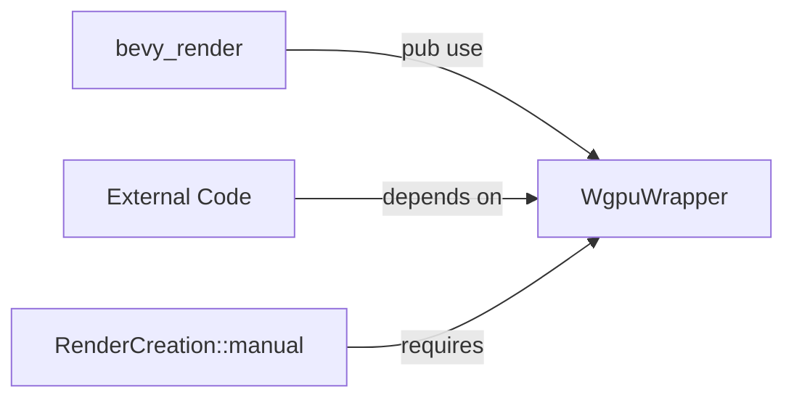

+++
title = "#20409 Make WgpuWrapper public again"
date = "2025-08-04T00:00:00"
draft = false
template = "pull_request_page.html"
in_search_index = false

[extra]
current_language = "zh-cn"
available_languages = {"en" = { name = "English", url = "/pull_request/bevy/2025-08/pr-20409-en-20250804" }, "zh-cn" = { name = "中文", url = "/pull_request/bevy/2025-08/pr-20409-zh-cn-20250804" }}
+++

## Make WgpuWrapper public again

### 基本信息
- **标题**: Make WgpuWrapper public again
- **PR链接**: https://github.com/bevyengine/bevy/pull/20409
- **作者**: tronical
- **状态**: MERGED
- **标签**: A-Rendering, S-Ready-For-Final-Review, P-Regression
- **创建时间**: 2025-08-04T07:17:03Z
- **合并时间**: 2025-08-04T17:59:45Z
- **合并者**: james7132

### 描述翻译
# Objective

- WgpuWrapper 在 0.16 版本是公开的，调用 RenderCreation::manual 时需要它。

## Solution

- 在 #20220 的还原后再次将其公开

## Testing

- cargo build

### PR技术分析
这个PR解决了一个由API修改引起的回归问题。在Bevy 0.16版本中，`WgpuWrapper`类型是公开导出的，允许开发者通过`RenderCreation::manual`方法进行底层图形API操作。但在后续的PR #20220中，这个类型的可见性被意外改为私有，破坏了依赖此公共API的外部代码。

问题的核心在于可见性变化影响了API合约。当`WgpuWrapper`从public变为private后，所有依赖它的代码（特别是使用`RenderCreation::manual`的代码）都会编译失败。这是一个典型的breaking change，但未被识别为有意的API变更。

解决方案直接明了：将`WgpuWrapper`的导入声明恢复为公开状态。技术实现只需在`use`语句前添加`pub`关键字。这种修改符合最小变更原则，仅恢复原有API行为而不引入新功能或改动。

从工程角度看，这个案例展示了API可见性管理的重要性：
1. 公共类型/方法的可见性变化应视为重大变更
2. 非故意的可见性修改可能导致下游项目中断
3. 简单的`pub`声明对维护API稳定性至关重要

验证方法也很务实：只需确保项目能通过`cargo build`编译，证明`WgpuWrapper`已正确公开导出。

### 可视化关系


### 关键文件变更
**文件**: `crates/bevy_render/src/lib.rs`

**变更说明**: 将`WgpuWrapper`的导入从私有改为公开，恢复0.16版本的API可见性

**代码对比**:
```rust
// 变更前:
use wgpu_wrapper::WgpuWrapper;

// 变更后:
pub use wgpu_wrapper::WgpuWrapper;
```

**关联性**: 这个单行修改直接解决了PR的核心目标——恢复`WgpuWrapper`的公共访问权限

### 延伸阅读
1. [Rust可见性规则](https://doc.rust-lang.org/book/ch07-03-paths-for-referring-to-an-item-in-the-module-tree.html#making-structs-and-enums-public)
2. [Bevy渲染架构概览](https://bevyengine.org/learn/book/getting-started/rendering/)
3. [wgpu文档](https://docs.rs/wgpu/latest/wgpu/) (底层图形API封装)