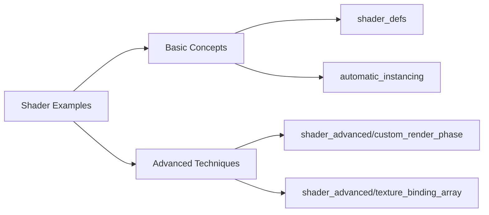

+++
title = "#20415 Move advanced shader examples to separate category"
date = "2025-08-05T00:00:00"
draft = false
template = "pull_request_page.html"
in_search_index = true

[taxonomies]
list_display = ["show"]

[extra]
current_language = "en"
available_languages = {"en" = { name = "English", url = "/pull_request/bevy/2025-08/pr-20415-en-20250805" }, "zh-cn" = { name = "中文", url = "/pull_request/bevy/2025-08/pr-20415-zh-cn-20250805" }}
labels = ["A-Rendering", "C-Examples", "D-Straightforward"]
+++

## Move advanced shader examples to separate category

### Basic Information
- **Title**: Move advanced shader examples to separate category
- **PR Link**: https://github.com/bevyengine/bevy/pull/20415
- **Author**: IceSentry
- **Status**: MERGED
- **Labels**: A-Rendering, C-Examples, S-Ready-For-Final-Review, D-Straightforward
- **Created**: 2025-08-04T16:24:36Z
- **Merged**: 2025-08-05T19:11:02Z
- **Merged By**: alice-i-cecile

### Description Translation
# Objective

- Some shader examples are much more complicated than others. It can be confusing for new users that simple example and advanced examples are next to each other

## Solution

- Introduce a new "shader_advanced" example category
	- I'm open to other names, but I named it like that so both folders are next to each other

## Testing

N/A

## Notes

We should maybe consider a different name than "shader" because some of them aren't that much about shaders. It could be advanced_rendering or something like that.

I'm opened to moving more example to this. I just picked the one that felt the most advanced to me.

I didn't move the compute_game_of_life example because, while it is complex, the complexity is unavoidable if you want to run a compute shader right now. I also plan on simplifying it a bit and introduce a plugin to make it much easier but as it is today I think it's okay to stay there.

### The Story of This Pull Request

The PR addresses a usability issue in Bevy's example organization. The existing shader examples ranged from basic introductory material to advanced rendering techniques, all located in the same directory. This created friction for new users who might be overwhelmed when introductory examples appear alongside complex low-level rendering implementations. The proximity of simple and advanced examples made it difficult for users to progressively build their skills.

To solve this, the author created a new "shader_advanced" category specifically for complex examples that demonstrate lower-level rendering APIs. This separation maintains discoverability while reducing cognitive load. The author selected examples that represent advanced concepts like custom render phases, bindless textures, and specialized pipelines:

```rust
// Before: All examples in /shader
examples/shader/custom_vertex_attribute.rs
examples/shader/custom_post_processing.rs
examples/shader/custom_shader_instancing.rs

// After: Advanced examples moved to new category
examples/shader_advanced/custom_vertex_attribute.rs
examples/shader_advanced/custom_post_processing.rs
examples/shader_advanced/custom_shader_instancing.rs
```

The implementation required updates in two key areas: build configuration (Cargo.toml) and documentation (examples/README.md). In Cargo.toml, the author reorganized example declarations by:
1. Removing advanced examples from the main shader section
2. Adding a new "Shaders - advanced" category description
3. Re-registering the moved examples under the new category

The README.md updates ensure documentation links point to the new locations. The author maintained existing example names and descriptions while updating file paths. For instance:

```markdown
# Before:
[Custom Render Phase](../examples/shader/custom_render_phase.rs)

# After:
[Custom Render Phase](../examples/shader_advanced/custom_render_phase.rs)
```

Notably, the compute_game_of_life example remained in the standard shader category. The author reasoned that while complex, it represents unavoidable complexity for compute shaders and will be simplified later. The naming "shader_advanced" was chosen pragmatically to keep related categories adjacent in file explorers, though alternatives like "advanced_rendering" were considered.

The changes improve onboarding by providing clear progression paths. New users can start with core shader concepts before tackling advanced rendering techniques. The separation also makes it easier to maintain examples since contributors can clearly see which examples target advanced use cases.

### Visual Representation



### Key Files Changed

1. **Cargo.toml**
   - Reorganized example declarations and added new category
   - Key changes: Moved 7 examples to new category and added category description

```toml
# Before:
[[example]]
name = "custom_vertex_attribute"
path = "examples/shader/custom_vertex_attribute.rs"

# After:
[[example]]
name = "custom_vertex_attribute"
path = "examples/shader_advanced/custom_vertex_attribute.rs"

# Added new category description:
[[package.metadata.example_category]]
name = "Shaders - advanced"
description = """
These examples demonstrate how to use the lower level rendering apis...
"""
```

2. **examples/README.md**
   - Updated documentation paths for moved examples
   - Key changes: Updated 7 paths to reference shader_advanced directory

```markdown
# Before:
- [Custom Render Phase](../examples/shader/custom_render_phase.rs)

# After:
- [Custom Render Phase](../examples/shader_advanced/custom_render_phase.rs)
```

3. **Example file moves** (8 files)
   - All file contents preserved during relocation
   - Files moved from examples/shader/ to examples/shader_advanced/:
     - custom_phase_item.rs
     - custom_post_processing.rs
     - custom_render_phase.rs
     - custom_shader_instancing.rs
     - custom_vertex_attribute.rs
     - specialized_mesh_pipeline.rs
     - texture_binding_array.rs

### Further Reading
1. [Bevy Rendering Pipeline Documentation](https://bevyengine.org/learn/book/rendering/pipeline/)
2. [WGSL Shader Language Specification](https://gpuweb.github.io/gpuweb/wgsl/)
3. [Bevy Render Phase Implementation](https://github.com/bevyengine/bevy/blob/main/crates/bevy_render/src/render_phase/mod.rs)
4. [Modern Graphics Programming Techniques](https://github.com/bevyengine/bevy/blob/main/docs/beginner/graphics.md)