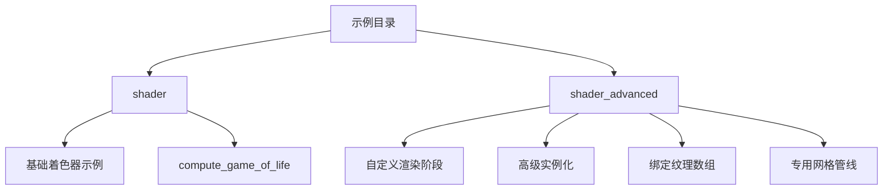

+++
title = "#20415 Move advanced shader examples to separate category"
date = "2025-08-05T00:00:00"
draft = false
template = "pull_request_page.html"
in_search_index = false

[extra]
current_language = "zh-cn"
available_languages = {"en" = { name = "English", url = "/pull_request/bevy/2025-08/pr-20415-en-20250805" }, "zh-cn" = { name = "中文", url = "/pull_request/bevy/2025-08/pr-20415-zh-cn-20250805" }}
+++

# Move advanced shader examples to separate category

## 基本信息
- **标题**: Move advanced shader examples to separate category
- **PR链接**: https://github.com/bevyengine/bevy/pull/20415
- **作者**: IceSentry
- **状态**: MERGED
- **标签**: A-Rendering, C-Examples, S-Ready-For-Final-Review, D-Straightforward
- **创建时间**: 2025-08-04T16:24:36Z
- **合并时间**: 2025-08-05T19:11:02Z
- **合并者**: alice-i-cecile

## 描述翻译
**目标**

- 一些着色器(shader)示例比其他示例复杂得多。对于新用户来说，简单示例和高级示例放在一起可能会造成混淆

**解决方案**

- 引入一个新的"shader_advanced"示例类别
  - 我对其他名称持开放态度，但我这样命名是为了让两个文件夹相邻

**测试**

N/A

**备注**

我们也许应该考虑一个不同于"shader"的名称，因为其中一些并不完全关于着色器。可以是"advanced_rendering"之类的名称。

我开放于移动更多示例到这个新类别。我只是挑选了我觉得最高级的那些。

我没有移动compute_game_of_life示例，因为虽然它很复杂，但如果你现在想运行一个计算着色器(compute shader)，这种复杂性是不可避免的。我还计划稍作简化并引入一个插件(plugin)使其更容易，但就目前而言，我认为它可以留在那里。

## 这个PR的故事

这个PR始于一个用户引导(user onboarding)问题：Bevy引擎的着色器(shader)示例目录混合了不同复杂度的示例，导致新用户可能意外接触到高级实现而增加学习曲线。现有结构将基础着色器概念与底层渲染API(rendering API)实现放在同一目录，没有明确的难度区分。

作者IceSentry选择通过创建新目录`shader_advanced`来分离高级示例。这种解决方案直接解决了核心问题，同时保持了向后兼容性(backward compatibility)和文件组织逻辑。在实现上，作者采用了保守策略，只移动了最复杂的示例，而保留了`compute_game_of_life`在原有位置，因为该示例的复杂性源于计算着色器(compute shader)的必要实现细节。

技术实现主要涉及两个关键部分：Cargo.toml元数据更新和文档路径调整。在Cargo.toml中，作者重构了示例分类结构，添加了新的"Shaders - advanced"类别并更新了文件路径。例如：

```toml
# 新增高级着色器类别
[[package.metadata.example_category]]
name = "Shaders - advanced"
description = """
These examples demonstrate how to use the lower level rendering apis exposed from bevy.

These are generally simplified examples of bevy's own rendering infrastructure.
"""

# 示例路径从shader改为shader_advanced
[[example]]
name = "custom_vertex_attribute"
path = "examples/shader_advanced/custom_vertex_attribute.rs"
doc-scrape-examples = true
```

这种重构保持了每个示例的元数据(metadata)完整，包括名称、描述、分类和WASM兼容性标记，仅修改了物理路径。这种处理方式确保构建系统和文档生成不受影响。

在examples/README.md中，作者更新了所有移动示例的链接路径，并调整了示例排序以反映新的组织结构。例如：

```markdown
# 之前
[Custom Render Phase](../examples/shader/custom_render_phase.rs)

# 之后
[Custom Render Phase](../examples/shader_advanced/custom_render_phase.rs)
```

值得注意的是，作者保留了"Instancing"示例的两个版本：自动实例化(automatic instancing)保留在基础目录，而手动实现的低级API版本则移到高级目录。这种处理展示了清晰的认知边界(cognitive boundary)划分 - 将引擎内置功能与需要直接操作渲染API的示例区分开。

文件移动操作采用了Git重命名检测，所有7个.rs文件保持内容不变，仅改变路径：
```
custom_phase_item.rs → shader_advanced/custom_phase_item.rs
custom_post_processing.rs → shader_advanced/custom_post_processing.rs
custom_render_phase.rs → shader_advanced/custom_render_phase.rs
custom_shader_instancing.rs → shader_advanced/custom_shader_instancing.rs
custom_vertex_attribute.rs → shader_advanced/custom_vertex_attribute.rs
specialized_mesh_pipeline.rs → shader_advanced/specialized_mesh_pipeline.rs
texture_binding_array.rs → shader_advanced/texture_binding_array.rs
```

最终效果是创建了清晰的难度梯度(learning gradient)：基础着色器概念保留在`shader`目录，而需要理解渲染管线(render pipeline)、自定义渲染阶段(custom render phase)等底层概念的示例移入`shader_advanced`。这种组织结构降低了新用户的认知负荷(cognitive load)，同时为高级用户提供了明确的进阶路径。

## 视觉表示



## 关键文件变更

1. **`Cargo.toml`**
   - 变更：+67/-58
   - 将高级着色器示例从`shader`目录移动到`shader_advanced`目录
   - 添加新的"Shaders - advanced"分类描述
   - 关键代码片段：
```toml
# 之前配置
[[example]]
name = "custom_vertex_attribute"
path = "examples/shader/custom_vertex_attribute.rs"

# 之后配置
[[example]]
name = "custom_vertex_attribute"
path = "examples/shader_advanced/custom_vertex_attribute.rs"
```

2. **`examples/README.md`**
   - 变更：+7/-7
   - 更新所有移动示例的文档链接路径
   - 调整示例顺序以反映新的分类结构
   - 关键代码片段：
```markdown
# 之前
-[Post Processing - Custom Render Pass](../examples/shader/custom_post_processing.rs)

# 之后
-[Post Processing - Custom Render Pass](../examples/shader_advanced/custom_post_processing.rs)
```

3. **`examples/shader_advanced/custom_phase_item.rs` (重命名)**
   - 变更：路径变更 (原位置: examples/shader/custom_phase_item.rs)
   - 演示如何将自定义绘制命令加入渲染阶段(render phase)
   - 内容未改动，仅移动位置

4. **`examples/shader_advanced/custom_post_processing.rs` (重命名)**
   - 变更：路径变更 (原位置: examples/shader/custom_post_processing.rs)
   - 实现自定义后处理效果(custom post-processing effect)
   - 内容未改动，仅移动位置

5. **`examples/shader_advanced/custom_render_phase.rs` (重命名)**
   - 变更：路径变更 (原位置: examples/shader/custom_render_phase.rs)
   - 展示如何创建完整的自定义渲染阶段
   - 内容未改动，仅移动位置

## 延伸阅读

1. [Bevy渲染管线架构](https://bevyengine.org/learn/book/next/render/)
2. [WGSL着色语言规范](https://gpuweb.github.io/gpuweb/wgsl/)
3. [现代图形API概念](https://vkguide.dev/docs/chapter-3/graphics_pipeline/)
4. [实例化渲染技术](https://learnopengl.com/Advanced-OpenGL/Instancing)