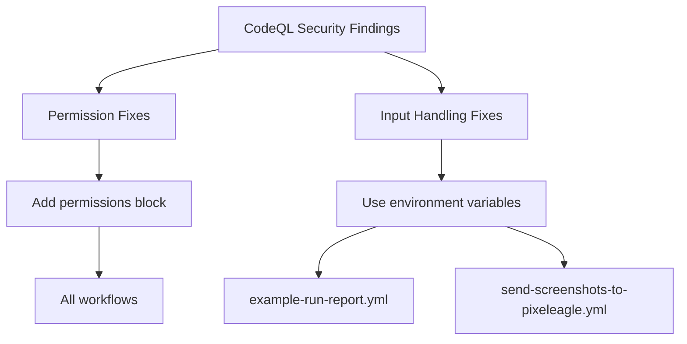

+++
title = "#20416 Fix security issues on actions"
date = "2025-08-05T00:00:00"
draft = false
template = "pull_request_page.html"
in_search_index = true

[taxonomies]
list_display = ["show"]

[extra]
current_language = "en"
available_languages = {"en" = { name = "English", url = "/pull_request/bevy/2025-08/pr-20416-en-20250805" }, "zh-cn" = { name = "中文", url = "/pull_request/bevy/2025-08/pr-20416-zh-cn-20250805" }}
labels = ["A-Build-System", "D-Straightforward"]
+++

### Fix security issues on actions

#### Basic Information
- **Title**: Fix security issues on actions
- **PR Link**: https://github.com/bevyengine/bevy/pull/20416
- **Author**: mockersf
- **Status**: MERGED
- **Labels**: A-Build-System, S-Ready-For-Final-Review, D-Straightforward
- **Created**: 2025-08-04T17:27:56Z
- **Merged**: 2025-08-05T19:19:23Z
- **Merged By**: alice-i-cecile

#### Description Translation
# Objective

- CodeQL is reporting some issues on actions


## Solution

- Fix them
- Follow https://securitylab.github.com/resources/github-actions-untrusted-input/ for the code injection
- Set default permissions to every workflow that doesn't specify some

## Testing

- Not entirely sure permissions specified are enough, but I guess CI will fail if they aren't

---

### The Story of This Pull Request

#### The Problem and Context
CodeQL security scanning identified vulnerabilities across several GitHub Actions workflows. The primary concerns were:
1. Missing explicit permission declarations in workflows, defaulting to overly broad access
2. Potential code injection vulnerabilities from unsafe handling of untrusted input (branch names)
3. Insecure direct use of GitHub context variables in shell commands

These issues posed security risks:
- Overly permissive workflows could be exploited to modify repository contents
- Malicious branch names containing special characters could execute arbitrary code
- Context variables like `github.event.workflow_run.head_branch` could be manipulated

The solution needed to follow GitHub's security best practices while maintaining workflow functionality.

#### The Solution Approach
The fix implemented two key security measures across all affected workflows:
1. **Principle of Least Privilege**: Added explicit `contents: read` permissions to restrict workflows to minimal necessary access
2. **Input Sanitization**: Mitigated code injection risks by:
   - Passing untrusted input through environment variables
   - Using safe variable expansion in shell commands
   - Avoiding direct interpolation of context variables

The approach referenced GitHub's security advisory on untrusted input handling. Since the workflows didn't require write access, `contents: read` was sufficient for all cases.

#### The Implementation
All 8 modified workflow files received the base permissions declaration:
```yaml
permissions:
  contents: read
```

Two workflows required additional changes to handle untrusted input safely. In `example-run-report.yml`, branch name handling was updated to use environment variables:
```yaml
# Before:
- name: branch name
  id: branch-name
  run: |
    echo "result=PR-$(cat PR)-${{ github.event.workflow_run.head_branch }}" >> $GITHUB_OUTPUT

# After:
- name: branch name
  id: branch-name
  env:
    BRANCH_NAME: ${{ github.event.workflow_run.head_branch }}
  run: |
    echo "result=PR-$(cat PR)-$BRANCH_NAME" >> $GITHUB_OUTPUT
```

Similarly, `send-screenshots-to-pixeleagle.yml` was updated to safely handle branch input:
```yaml
# Before:
run: |
  metadata='{"os":"${{ inputs.os }}", "commit": "${{ inputs.commit }}", "branch": "${{ inputs.branch }}"}'

# After:
env:
  branch: ${{ inputs.branch }}
run: |
  metadata='{"os":"${{ inputs.os }}", "commit": "${{ inputs.commit }}", "branch": "$branch"}'
```

These changes ensure:
1. Environment variables sanitize input before use
2. Variable expansion happens within quoted strings
3. No direct execution of untrusted strings

#### Technical Insights
Key security considerations addressed:
1. **Permission Scoping**: GitHub Actions default permissions include read/write access. Explicitly setting `contents: read` follows the principle of least privilege.
2. **Injection Prevention**: Passing values through environment variables avoids bash interpreting special characters in branch names as code.
3. **Context Safety**: GitHub context variables can contain user-supplied content. Treating them as untrusted input is critical for security.

The changes maintain functionality while adding security:
- Environment variables preserve all characters in branch names
- Permission changes don't affect workflow operations since no write access was needed
- Minimal syntax changes reduce risk of introducing new errors

#### The Impact
These changes significantly improve security posture:
1. Eliminate CodeQL-identified vulnerabilities
2. Prevent potential code execution via malicious branch names
3. Reduce attack surface by minimizing workflow permissions
4. Establish security patterns for future workflow development

The solution demonstrates effective security practices for GitHub Actions:
- Always declare minimal required permissions
- Treat all user-supplied input as untrusted
- Use environment variables as safe intermediaries
- Follow platform security advisories

---

### Visual Representation



---

### Key Files Changed

1. **.github/workflows/ci.yml** (+3/-0)
   - Added base permissions to restrict workflow access
```yaml
permissions:
  contents: read
```

2. **.github/workflows/dependencies.yml** (+7/-4)
   - Added permissions block
   - Standardized path quoting for consistency
```yaml
paths:
- "**/Cargo.toml"
- "deny.toml"
```

3. **.github/workflows/example-run-report.yml** (+3/-1)
   - Fixed branch name handling using environment variables
```yaml
# Before:
run: |
  echo "result=PR-$(cat PR)-${{ github.event.workflow_run.head_branch }}" >> $GITHUB_OUTPUT

# After:
env:
  BRANCH_NAME: ${{ github.event.workflow_run.head_branch }}
run: |
  echo "result=PR-$(cat PR)-$BRANCH_NAME" >> $GITHUB_OUTPUT
```

4. **.github/workflows/send-screenshots-to-pixeleagle.yml** (+5/-1)
   - Secured branch input handling
```yaml
# Before:
run: |
  metadata='{"os":"${{ inputs.os }}", "commit": "${{ inputs.commit }}", "branch": "${{ inputs.branch }}"}'

# After:
env:
  branch: ${{ inputs.branch }}
run: |
  metadata='{"os":"${{ inputs.os }}", "commit": "${{ inputs.commit }}", "branch": "$branch"}'
```

5. **.github/workflows/weekly.yml** (+6/-4)
   - Added permissions block
   - Standardized cron syntax quoting
   - Improved job dependency syntax
```yaml
# Before:
- cron:  '0 12 * * 1'
needs: ['test', 'lint', 'check-compiles']

# After:
- cron: "0 12 * * 1"
needs: ["test", "lint", "check-compiles"]
```

---

### Further Reading
1. [GitHub Actions Security Hardening](https://docs.github.com/en/actions/security-guides/security-hardening-for-github-actions)
2. [Untrusted Input Handling in GitHub Actions](https://securitylab.github.com/research/github-actions-untrusted-input/)
3. [Workflow Permissions Documentation](https://docs.github.com/en/actions/using-workflows/workflow-syntax-for-github-actions#permissions)
4. [CodeQL Overview](https://codeql.github.com/)
5. [Environment Variable Security Best Practices](https://docs.github.com/en/actions/learn-github-actions/environment-variables#security-hardening)