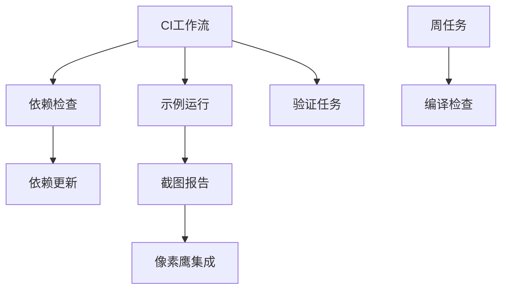

+++
title = "#20416 Fix security issues on actions"
date = "2025-08-05T00:00:00"
draft = false
template = "pull_request_page.html"
in_search_index = false

[extra]
current_language = "zh-cn"
available_languages = {"en" = { name = "English", url = "/pull_request/bevy/2025-08/pr-20416-en-20250805" }, "zh-cn" = { name = "中文", url = "/pull_request/bevy/2025-08/pr-20416-zh-cn-20250805" }}
+++

# Fix security issues on actions 安全分析报告

## 基本信息
- **标题**: Fix security issues on actions
- **PR链接**: https://github.com/bevyengine/bevy/pull/20416
- **作者**: mockersf
- **状态**: 已合并
- **标签**: A-Build-System, S-Ready-For-Final-Review, D-Straightforward
- **创建时间**: 2025-08-04T17:27:56Z
- **合并时间**: 2025-08-05T19:19:23Z
- **合并人**: alice-i-cecile

## 描述翻译
### 目标
- CodeQL 在 actions 上报告了一些安全问题


### 解决方案
- 修复这些问题
- 遵循 https://securitylab.github.com/resources/github-actions-untrusted-input/ 处理代码注入问题
- 为未指定权限的每个工作流设置默认权限

### 测试
- 不完全确定指定的权限是否足够，但预计如果不足，CI 会失败

## PR 的技术解析

### 问题背景
CodeQL 安全扫描在 GitHub Actions 工作流中检测到潜在安全漏洞，主要涉及两个关键问题：
1. **权限过度暴露**：多个工作流未显式定义权限，使用 GitHub 的默认权限设置，可能导致不必要的访问风险
2. **命令注入风险**：在 shell 命令中直接使用 `${{ }}` 表达式注入变量，可能被恶意分支名利用执行任意代码

这些问题源于 GitHub Actions 的安全最佳实践未被完全遵循。当工作流处理外部输入（如分支名）时，直接拼接进 shell 命令可能被利用执行任意代码。

### 解决方案
PR 采用双重策略解决安全问题：

1. **最小权限原则**：为所有工作流添加显式权限声明：
   ```yaml
   permissions:
     contents: read
   ```
   这覆盖了所有未设置权限的工作流，将默认权限降级为仅读取仓库内容

2. **输入消毒处理**：重构 shell 命令，通过环境变量传递潜在不可信输入：
   ```diff
   +        env:
   +          BRANCH_NAME: ${{ github.event.workflow_run.head_branch }}
   ```
   然后通过 `$ENV_VAR` 语法引用，避免直接命令拼接

### 实现细节
#### 权限管理改进
为 7 个关键工作流添加最小权限声明：
```diff
# .github/workflows/ci.yml
+permissions:
+  contents: read
```
这种模式应用于所有 CI 相关的工作流，确保：
- 工作流只能读取仓库内容
- 需要写权限的步骤必须显式提升权限
- 符合 GitHub 安全建议的最小权限原则

#### 命令注入防护
重构涉及用户输入的 shell 命令：
```diff
# .github/workflows/example-run-report.yml
       - name: branch name
         id: branch-name
+        env:
+          BRANCH_NAME: ${{ github.event.workflow_run.head_branch }}
         run: |
-          echo "result=PR-$(cat PR)-${{ github.event.workflow_run.head_branch }}" >> $GITHUB_OUTPUT
+          echo "result=PR-$(cat PR)-$BRANCH_NAME" >> $GITHUB_OUTPUT
```
技术要点：
1. 将 `github.event.workflow_run.head_branch` 存入环境变量
2. 通过 `$BRANCH_NAME` 引用而非直接插入命令
3. 防止特殊字符（如 `;`、`&&`）被解释为命令分隔符

同样的模式应用于像素鹰工作流：
```diff
# .github/workflows/send-screenshots-to-pixeleagle.yml
         env:
           project: B04F67C0-C054-4A6F-92EC-F599FEC2FD1D
+          branch: ${{ inputs.branch }}
         run: |
-          metadata='{"os":"${{ inputs.os }}", "commit": "${{ inputs.commit }}", "branch": "${{ inputs.branch }}"}'
+          metadata='{"os":"${{ inputs.os }}", "commit": "${{ inputs.commit }}", "branch": "$branch"}'
```

### 技术洞察
1. **权限隔离**：显式设置 `contents: read` 实现了权限最小化原则，即使工作流被攻破，攻击者也无法修改仓库
2. **环境变量消毒**：通过环境变量传递用户输入是防御命令注入的标准方法
3. **一致性改进**：统一工作流中路径模式的引号风格，提升可维护性：
   ```diff
   paths:
   -      - '**/Cargo.toml'
   -      - 'deny.toml'
   +      - "**/Cargo.toml"
   +      - "deny.toml"
   ```

### 影响评估
1. **安全提升**：消除 CodeQL 报告的安全警告，降低供应链攻击风险
2. **维护性增强**：统一权限管理模型，简化未来安全审计
3. **零功能影响**：所有修改保持工作流原有行为不变
4. **前置防御**：为处理用户输入建立安全模式，防止未来引入类似漏洞

## 关键文件变更

### .github/workflows/dependencies.yml
**变更原因**：添加最小权限并统一路径格式
```diff
+permissions:
+  contents: read
+
 on:
   pull_request:
     paths:
-      - '**/Cargo.toml'
-      - 'deny.toml'
+      - "**/Cargo.toml"
+      - "deny.toml"
```

### .github/workflows/weekly.yml
**变更原因**：添加权限并修复语法一致性
```diff
+permissions:
+  contents: read
+
 on:
   schedule:
-    - cron:  '0 12 * * 1'
+    - cron: "0 12 * * 1"
...
-    needs: ['test', 'lint', 'check-compiles']
+    needs: ["test", "lint", "check-compiles"]
```

### .github/workflows/send-screenshots-to-pixeleagle.yml
**变更原因**：添加权限并通过环境变量消毒输入
```diff
+permissions:
+  contents: read
+
...
         env:
           project: B04F67C0-C054-4A6F-92EC-F599FEC2FD1D
+          branch: ${{ inputs.branch }}
         run: |
-          metadata='{"os":"${{ inputs.os }}", "commit": "${{ inputs.commit }}", "branch": "${{ inputs.branch }}"}'
+          metadata='{"os":"${{ inputs.os }}", "commit": "${{ inputs.commit }}", "branch": "$branch"}'
```

### .github/workflows/example-run-report.yml
**变更原因**：修复命令注入漏洞
```diff
       - name: branch name
         id: branch-name
+        env:
+          BRANCH_NAME: ${{ github.event.workflow_run.head_branch }}
         run: |
-          echo "result=PR-$(cat PR)-${{ github.event.workflow_run.head_branch }}" >> $GITHUB_OUTPUT
+          echo "result=PR-$(cat PR)-$BRANCH_NAME" >> $GITHUB_OUTPUT
```

### .github/workflows/ci.yml
**变更原因**：添加基础权限
```diff
 name: CI
 
+permissions:
+  contents: read
+
 on:
   merge_group:
```

## 工作流关系


## 延伸阅读
1. [GitHub Actions 安全加固指南](https://securitylab.github.com/research/github-actions-untrusted-input/)
2. [CodeQL 文档](https://codeql.github.com/docs/)
3. [GitHub 工作流权限配置](https://docs.github.com/en/actions/using-workflows/workflow-syntax-for-github-actions#permissions)
4. [Shell 注入防御模式](https://cheatsheetseries.owasp.org/cheatsheets/Command_Injection_Defense_Cheat_Sheet.html)