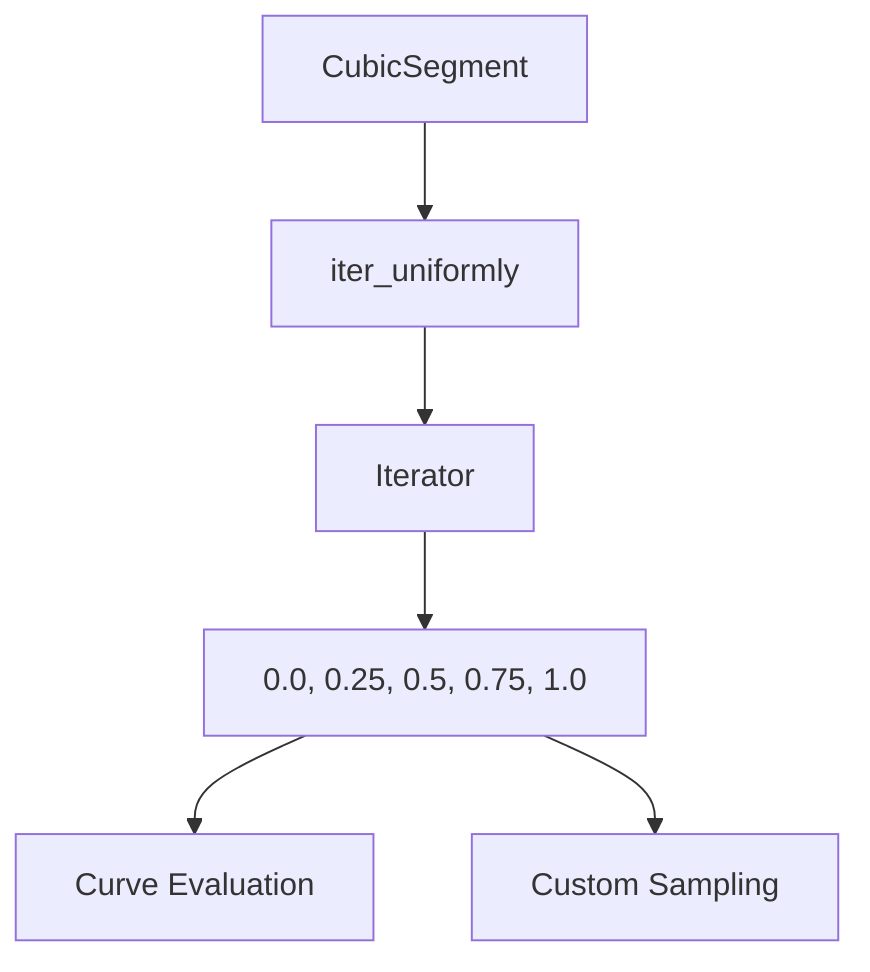

+++
title = "#20417"
date = "2025-08-05T00:00:00"
draft = false
template = "pull_request_page.html"
in_search_index = true

[taxonomies]
list_display = ["show"]

[extra]
current_language = "en"
available_languages = {"en" = { name = "English", url = "/pull_request/bevy/2025-08/pr-20417-en-20250805" }, "zh-cn" = { name = "中文", url = "/pull_request/bevy/2025-08/pr-20417-zh-cn-20250805" }}
+++

## Technical Analysis: Making `CubicSegment::iter_uniformly` Public

### The Problem and Context
In Bevy's math utilities, the `CubicSegment::iter_uniformly` method was implemented as a private helper function. This method provides uniform sampling of the `t` parameter along a cubic Bézier curve segment, which is essential for generating evenly spaced points along curves. While the method was internally used for curve evaluation, its private status prevented external consumers from leveraging this sampling functionality for their own curve-related operations. 

There was no technical justification for keeping this utility private – it doesn't mutate state, expose internal implementation details, or pose any security risks. Its private status was simply an oversight that limited the API's flexibility without providing any benefits.

### The Solution Approach
The straightforward solution was to change the method's visibility from private to public. Since the method was already fully implemented and tested through its existing internal usage, no implementation changes were needed beyond the visibility modifier. The author correctly identified that exposing this utility would:
1. Provide direct access to uniform parameter sampling
2. Maintain API consistency with other public curve utilities
3. Avoid unnecessary code duplication if users needed similar functionality

### The Implementation
The change is minimal but impactful, consisting of a single character change in the method signature:

```rust
// File: crates/bevy_math/src/cubic_splines/mod.rs
// Before:
#[inline]
fn iter_uniformly(&self, subdivisions: usize) -> impl Iterator<Item = f32> {
    let step = 1.0 / subdivisions as f32;
    (0..=subdivisions).map(move |i| i as f32 * step)
}

// After:
#[inline]
pub fn iter_uniformly(&self, subdivisions: usize) -> impl Iterator<Item = f32> {
    let step = 1.0 / subdivisions as f32;
    (0..=subdivisions).map(move |i| i as f32 * step)
}
```

This change makes the method part of `CubicSegment`'s public API while preserving:
1. The efficient iterator-based implementation
2. The `#[inline]` optimization hint
3. The clear mathematical logic (generating `subdivisions + 1` values from 0.0 to 1.0 inclusive)

### Technical Insights
The method generates a sequence of `t` values uniformly distributed across [0, 1] for cubic curve evaluation. Each `t` value represents a normalized position along the curve segment, where:
- `t = 0.0` corresponds to the segment's start point
- `t = 1.0` corresponds to the segment's end point
- Intermediate values represent proportional positions along the curve

The implementation efficiently creates an iterator that yields `(subdivisions + 1)` values without allocating a collection, making it suitable for both small and large subdivision counts.

### The Impact
This change enhances the cubic spline API's flexibility without introducing new maintenance burden. Consumers can now directly access uniform parameter sampling for:
1. Generating evenly spaced points along curves
2. Creating custom curve visualization tools
3. Implementing specialized interpolation logic
4. Performing analytical operations on curve segments

By exposing this utility, Bevy avoids forcing users to reimplement this common operation, reducing code duplication and potential implementation errors in downstream projects.

## Visual Representation



## Key Files Changed

### `crates/bevy_math/src/cubic_splines/mod.rs`
**Change:** Made `iter_uniformly` method public  
**Why:** To expose uniform curve parameter sampling to API consumers  

```rust
// Before (line 1036):
fn iter_uniformly(&self, subdivisions: usize) -> impl Iterator<Item = f32> {

// After:
pub fn iter_uniformly(&self, subdivisions: usize) -> impl Iterator<Item = f32> {
```

This change directly supports the PR's objective by modifying only the visibility modifier while preserving the method's existing functionality.

## Further Reading
1. [Bézier Curves Primer](https://pomax.github.io/bezierinfo/)
2. [Bevy Math Documentation](https://docs.rs/bevy_math/latest/bevy_math/)
3. [Iterator Pattern in Rust](https://doc.rust-lang.org/book/ch13-02-iterators.html)
4. [API Design Guidelines](https://rust-lang.github.io/api-guidelines/)