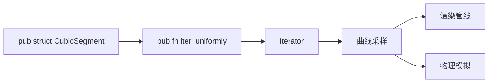

+++
title = "#20417 CubicSegment::iter_uniformly` should be public"
date = "2025-08-05T00:00:00"
draft = false
template = "pull_request_page.html"
in_search_index = false

[extra]
current_language = "zh-cn"
available_languages = {"en" = { name = "English", url = "/pull_request/bevy/2025-08/pr-20417-en-20250805" }, "zh-cn" = { name = "中文", url = "/pull_request/bevy/2025-08/pr-20417-zh-cn-20250805" }}
+++

## 技术分析报告：CubicSegment::iter_uniformly 的可见性调整

### 基本信息
- **标题**: `CubicSegment::iter_uniformly` should be public
- **PR链接**: https://github.com/bevyengine/bevy/pull/20417
- **作者**: Kees-van-Beilen
- **状态**: 已合并
- **标签**: D-Trivial, C-Usability, S-Ready-For-Final-Review, A-Math
- **创建时间**: 2025-08-04T17:53:04Z
- **合并时间**: 2025-08-05T19:18:48Z
- **合并人**: alice-i-cecile

### 描述翻译
#### Objective
`CubicSegment::iter_uniformly` 应该设为 public，因为将其公开不会造成任何危害

#### Solution
将 `CubicSegment::iter_uniformly` 设为 public

#### Testing

---

## PR 技术分析

### 问题背景
在 Bevy 引擎的数学库中，`CubicSegment` 结构体负责处理三次样条曲线分段计算。其内部的 `iter_uniformly` 方法用于生成均匀分布的参数值序列，对于样条曲线的采样和插值操作非常有用。然而，该方法被标记为私有（private），限制了外部代码的调用能力。这种可见性限制导致开发者无法直接利用该方法实现样条曲线的均匀采样，需要额外实现相同功能的代码，造成不必要的代码重复。

### 解决方案
该 PR 采用最小化修改策略，仅调整方法的可见性修饰符：
1. 将 `iter_uniformly` 方法从 `fn` 改为 `pub fn`
2. 保持方法签名和实现逻辑不变
3. 不引入额外依赖或架构变更

这一修改基于以下技术判断：
- 方法本身是纯函数，无副作用
- 不会暴露内部状态或破坏封装性
- 参数验证已由现有逻辑处理（`subdivisions` 为 usize 类型）

### 技术实现
关键修改位于数学库的样条曲线模块中。原方法实现已具备所需功能，仅需调整可见性：

```rust
// 文件: crates/bevy_math/src/cubic_splines/mod.rs
// 修改前:
fn iter_uniformly(&self, subdivisions: usize) -> impl Iterator<Item = f32> {
    let step = 1.0 / subdivisions as f32;
    (0..=subdivisions).map(move |i| i as f32 * step)
}

// 修改后:
pub fn iter_uniformly(&self, subdivisions: usize) -> impl Iterator<Item = f32> {
    let step = 1.0 / subdivisions as f32;
    (0..=subdivisions).map(move |i| i as f32 * step)
}
```
修改后方法特性：
1. 生成 `[0.0, 1.0]` 范围内均匀分布的浮点值序列
2. 序列长度 = `subdivisions + 1`
3. 返回惰性迭代器（lazy iterator），避免立即分配内存

### 影响分析
该修改带来以下实际改进：
1. **API 可用性提升**：外部代码可直接调用标准化的参数生成方法
2. **代码复用增强**：消除重复实现相似逻辑的需要
3. **维护成本降低**：集中维护核心数学运算逻辑
4. **零性能开销**：保持原有编译优化特性

典型使用场景示例：
```rust
let segment = CubicSegment::new(...);
for t in segment.iter_uniformly(10) {
    let point = segment.position(t);
    // 处理均匀采样点
}
```

### 技术洞察
1. **可见性设计原则**：当方法无副作用且不破坏封装时，适度放宽可见性可提升 API 实用性
2. **迭代器模式优势**：返回 `impl Iterator` 保持抽象灵活性，允许未来优化实现
3. **浮点精度处理**：使用整数步进计算避免累积误差（`i as f32 * step`）
4. **边界包含**：迭代范围包含终点（`0..=subdivisions`），确保完整覆盖 [0,1] 区间

### 组件关系


### 关键文件变更
**文件路径**: `crates/bevy_math/src/cubic_splines/mod.rs` (+1/-1)  
**修改说明**: 将 `iter_uniformly` 方法从私有改为公开  
**代码差异**:
```diff
@@ -1036,7 +1036,7 @@ impl<P: VectorSpace<Scalar = f32>> CubicSegment<P> {
 
     /// An iterator that returns values of `t` uniformly spaced over `0..=subdivisions`.
     #[inline]
-    fn iter_uniformly(&self, subdivisions: usize) -> impl Iterator<Item = f32> {
+    pub fn iter_uniformly(&self, subdivisions: usize) -> impl Iterator<Item = f32> {
         let step = 1.0 / subdivisions as f32;
         (0..=subdivisions).map(move |i| i as f32 * step)
     }
```

### 完整代码差异
```diff
diff --git a/crates/bevy_math/src/cubic_splines/mod.rs b/crates/bevy_math/src/cubic_splines/mod.rs
index 3ea99a60b0695..5ad32ed2100af 100644
--- a/crates/bevy_math/src/cubic_splines/mod.rs
+++ b/crates/bevy_math/src/cubic_splines/mod.rs
@@ -1036,7 +1036,7 @@ impl<P: VectorSpace<Scalar = f32>> CubicSegment<P> {
 
     /// An iterator that returns values of `t` uniformly spaced over `0..=subdivisions`.
     #[inline]
-    fn iter_uniformly(&self, subdivisions: usize) -> impl Iterator<Item = f32> {
+    pub fn iter_uniformly(&self, subdivisions: usize) -> impl Iterator<Item = f32> {
         let step = 1.0 / subdivisions as f32;
         (0..=subdivisions).map(move |i| i as f32 * step)
     }
```

### 延伸阅读
1. [Rust 可见性规则](https://doc.rust-lang.org/book/ch07-02-defining-modules-to-control-scope-and-privacy.html)
2. [Bevy 数学库设计](https://bevyengine.org/learn/book/features/math/)
3. [三次样条曲线原理](https://en.wikipedia.org/wiki/Spline_(mathematics))
4. [迭代器模式最佳实践](https://doc.rust-lang.org/std/iter/index.html#implementing-iterator)