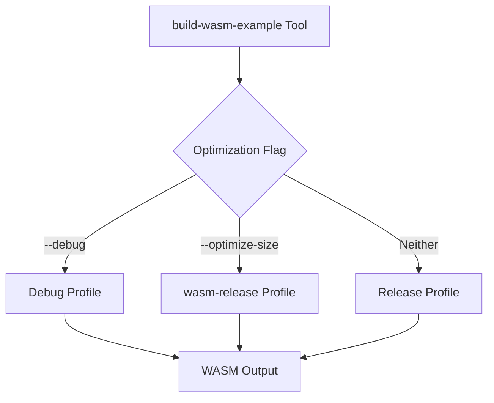

+++
title = "#20419"
date = "2025-08-05T00:00:00"
draft = false
template = "pull_request_page.html"
in_search_index = true

[taxonomies]
list_display = ["show"]

[extra]
current_language = "en"
available_languages = {"en" = { name = "English", url = "/pull_request/bevy/2025-08/pr-20419-en-20250805" }, "zh-cn" = { name = "中文", url = "/pull_request/bevy/2025-08/pr-20419-zh-cn-20250805" }}
+++

## Analysis of PR #20419: use the wasm-release profile for smaller bins and longer builds

### The Problem and Context
The Bevy engine's web deployment pipeline faced a critical issue: compiled WebAssembly (wasm) examples exceeded acceptable size limits for web distribution. When running the build command `cargo run -p build-wasm-example -- --api webgl2 breakout --optimize-size`, the output binaries remained too large for practical web deployment. This posed a significant limitation for web-based Bevy applications, where download size directly impacts user experience and performance.

The existing build process offered two profiles: debug (unoptimized) and release (optimized for speed). Neither provided sufficient size optimization for wasm targets. The release profile prioritized execution speed over binary size, while debug produced prohibitively large binaries. A specialized optimization approach was needed specifically for wasm targets.

### The Solution Approach
The solution leverages Rust's custom profile feature to create a dedicated optimization configuration for wasm targets. The approach modifies the build tool to select between three profiles:
1. `debug` for development builds
2. `release` for standard optimized builds
3. `wasm-release` for size-optimized wasm production builds

The `wasm-release` profile had already been defined in the project's Cargo.toml with size-optimized settings:
```toml
[profile.wasm-release]
inherits = "release"
opt-level = "s"  # Optimize for size
lto = true       # Link-time optimization
```

The engineering decision centered on modifying the build tool's profile selection logic to incorporate this third option when the `--optimize-size` flag is specified. This maintains backward compatibility while adding the new optimization path.

### The Implementation
The implementation modifies the profile selection logic in the wasm build tool. Previously, the tool used a simple debug/release binary choice. The new implementation:
1. Adds a conditional branch for the `wasm-release` profile
2. Eliminates the previous `--release` parameter push
3. Uses the `--profile` cargo flag instead of separate release parameters

Here are the key changes to `tools/build-wasm-example/src/main.rs`:

```rust
// Before:
let profile = if cli.debug {
    "debug"
} else {
    parameters.push("--release");
    "release"
};

let cmd = cmd!(
    sh,
    "cargo build {parameters...} --target wasm32-unknown-unknown --example {example}"
);

// After:
let profile = if cli.debug {
    "debug"
} else if cli.optimize_size {
    "wasm-release"
} else {
    "release"
};

let cmd = cmd!(
    sh,
    "cargo build {parameters...} --profile {profile} --target wasm32-unknown-unknown --example {example}"
);
```

The changes are concise but impactful:
1. The new `else if cli.optimize_size` branch selects the `wasm-release` profile
2. The `parameters.push("--release")` is removed since we now use the `--profile` flag
3. The cargo command is updated to use `--profile {profile}` instead of separate release flags

This implementation cleanly integrates with the existing command structure while adding the new optimization path. The changes maintain all existing functionality and flags, ensuring backward compatibility.

### Technical Insights
The solution demonstrates effective use of Rust's profile system for target-specific optimization. Key technical considerations:

1. **Size vs Build Time Tradeoff**: The `wasm-release` profile uses `opt-level = "s"` and `lto = true` to minimize binary size at the cost of longer compilation times. This is an appropriate tradeoff for production web builds where download size significantly impacts user experience.

2. **Profile Inheritance**: The `inherits = "release"` directive ensures the wasm-release profile maintains all release configuration defaults while overriding specific optimization settings.

3. **Backward Compatibility**: The solution preserves existing workflows by maintaining the original `--release` behavior when `--optimize-size` isn't specified.

4. **Parameter Handling**: The removal of the `parameters.push("--release")` and migration to profile-based builds simplifies parameter handling and avoids potential flag conflicts.

### The Impact
This change enables significantly smaller wasm binaries for web deployment while maintaining existing build workflows. The concrete improvements:
- Reduced wasm binary sizes suitable for web deployment
- Maintained debug/release workflows without modification
- Added explicit size optimization path via `--optimize-size` flag
- No breaking changes to existing commands or parameters

The solution addresses a specific pain point in Bevy's web deployment pipeline while demonstrating effective use of Rust's build profile system. The implementation is minimal and focused, making it easy to maintain and extend.

## Visual Representation



## Key Files Changed

### `tools/build-wasm-example/src/main.rs`
**What changed**: Modified profile selection logic to include the new wasm-release profile when using the optimize-size flag.

**Code Changes**:
```rust
// Before:
let profile = if cli.debug {
    "debug"
} else {
    parameters.push("--release");
    "release"
};

let cmd = cmd!(
    sh,
    "cargo build {parameters...} --target wasm32-unknown-unknown --example {example}"
);

// After:
let profile = if cli.debug {
    "debug"
} else if cli.optimize_size {
    "wasm-release"
} else {
    "release"
};

let cmd = cmd!(
    sh,
    "cargo build {parameters...} --profile {profile} --target wasm32-unknown-unknown --example {example}"
);
```

**Relationship to PR Purpose**: This is the core change that enables using the size-optimized wasm-release profile when requested via the optimize-size flag.

## Further Reading
1. [Rust Profiles Documentation](https://doc.rust-lang.org/cargo/reference/profiles.html)
2. [Optimizing WebAssembly Size](https://rustwasm.github.io/docs/book/reference/code-size.html)
3. [Cargo Configuration Options](https://doc.rust-lang.org/cargo/reference/config.html)
4. [Bevy WebAssembly Guide](https://bevyengine.org/learn/book/getting-started/web-assembly/)