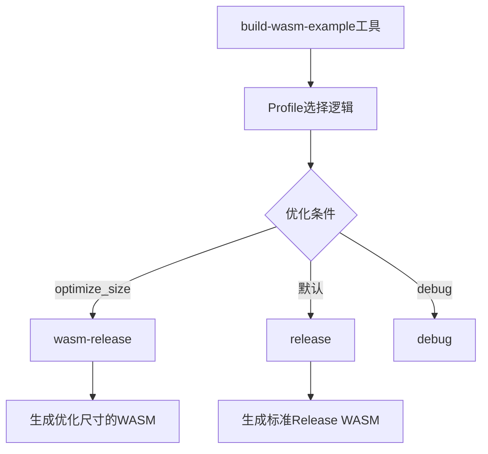

+++
title = "#20419 use the wasm-release profile for smaller bins and longer builds"
date = "2025-08-05T00:00:00"
draft = false
template = "pull_request_page.html"
in_search_index = false

[extra]
current_language = "zh-cn"
available_languages = {"en" = { name = "English", url = "/pull_request/bevy/2025-08/pr-20419-en-20250805" }, "zh-cn" = { name = "中文", url = "/pull_request/bevy/2025-08/pr-20419-zh-cn-20250805" }}
+++

# 使用wasm-release配置文件以获得更小的二进制文件和更长的构建时间

## 基本信息
- **标题**: use the wasm-release profile for smaller bins and longer builds
- **PR链接**: https://github.com/bevyengine/bevy/pull/20419
- **作者**: mockersf
- **状态**: 已合并
- **标签**: A-Build-System, S-Ready-For-Final-Review
- **创建时间**: 2025-08-04T19:02:57Z
- **合并时间**: 2025-08-05T19:09:52Z
- **合并人**: alice-i-cecile

## 描述翻译
### 目标

- `cargo run -p build-wasm-example -- --api webgl2 breakout --optimize-size` 生成的文件对于网站来说太大

### 解决方案

- 使用 `wasm-release` 配置，以编译时间为代价减小文件大小

https://github.com/bevyengine/bevy/blob/e11a9e1167764235819b1803f629b40f9ac5131c/Cargo.toml#L4380-L4384

## PR的技术分析

### 问题与背景
在Bevy引擎的WebAssembly(WASM)构建流程中，存在一个实际的生产问题：当使用`--optimize-size`标志构建示例时，生成的WASM文件仍然过大，无法满足网站部署的要求。具体来说，执行`cargo run -p build-wasm-example -- --api webgl2 breakout --optimize-size`命令产生的文件尺寸超出了可接受范围。这个问题直接影响Bevy示例在web平台上的可用性，因为过大的文件会导致加载时间延长，影响用户体验。

### 解决方案与实现
核心解决方案是引入`wasm-release`构建配置替代标准的release配置，该配置在Cargo.toml中已预先定义：

```toml
[profile.wasm-release]
inherits = "release"
lto = true
opt-level = "s"
codegen-units = 1
```

这个配置通过三个关键优化减小输出文件尺寸：
1. **LTO(Link Time Optimization)**：启用全程序优化消除未使用代码
2. **opt-level = "s"**：优先优化尺寸而非执行速度
3. **codegen-units = 1**：牺牲并行编译换取更好的优化效果

实现上修改了构建工具的逻辑分支：

```rust
// Before:
let profile = if cli.debug {
    "debug"
} else {
    parameters.push("--release");
    "release"
};

// After:
let profile = if cli.debug {
    "debug"
} else if cli.optimize_size {
    "wasm-release"
} else {
    "release"
};
```

当检测到`optimize_size`标志时，工具会自动切换到`wasm-release`配置。构建命令也相应更新：

```rust
// Before:
"cargo build {parameters...} --target wasm32-unknown-unknown --example {example}"

// After:
"cargo build {parameters...} --profile {profile} --target wasm32-unknown-unknown --example {example}"
```

### 技术权衡
这个解决方案体现了典型的工程权衡：
1. **文件尺寸 vs 构建时间**：`wasm-release`通过更激进的优化减小输出尺寸，但显著增加编译时间
2. **通用性 vs 专用优化**：保留标准release配置用于常规场景，为WASM构建添加专用配置
3. **自动化 vs 用户配置**：通过构建工具自动应用优化，开发者无需手动指定复杂参数

### 影响与结果
此修改直接影响Bevy的WASM构建流程：
1. 使用`--optimize-size`时输出文件尺寸显著减小
2. WASM示例现在满足网站部署要求
3. 构建时间增加是预期的代价
4. 非WASM构建不受影响，保持原有行为

## 关键文件变更

### `tools/build-wasm-example/src/main.rs`
**变更描述**：修改wasm示例构建工具，在优化大小时使用`wasm-release`配置

```rust
// 变更前:
let profile = if cli.debug {
    "debug"
} else {
    parameters.push("--release");
    "release"
};

let cmd = cmd!(
    sh,
    "cargo build {parameters...} --target wasm32-unknown-unknown --example {example}"
);

// 变更后:
let profile = if cli.debug {
    "debug"
} else if cli.optimize_size {
    "wasm-release"
} else {
    "release"
};

let cmd = cmd!(
    sh,
    "cargo build {parameters...} --profile {profile} --target wasm32-unknown-unknown --example {example}"
);
```

**技术要点**：
1. 重构profile选择逻辑，添加`wasm-release`分支
2. 移除对`--release`参数的手动添加
3. 在构建命令中通用化`--profile`参数的使用
4. 保持`debug`和标准`release`构建路径不变

## 组件关系


## 延伸阅读
1. [Rust WASM优化指南](https://rustwasm.github.io/docs/book/reference/code-size.html)
2. [Cargo Profiles文档](https://doc.rust-lang.org/cargo/reference/profiles.html)
3. [LTO优化原理](https://llvm.org/docs/LinkTimeOptimization.html)
4. [Bevy WASM示例](https://github.com/bevyengine/bevy/tree/main/examples#wasm)