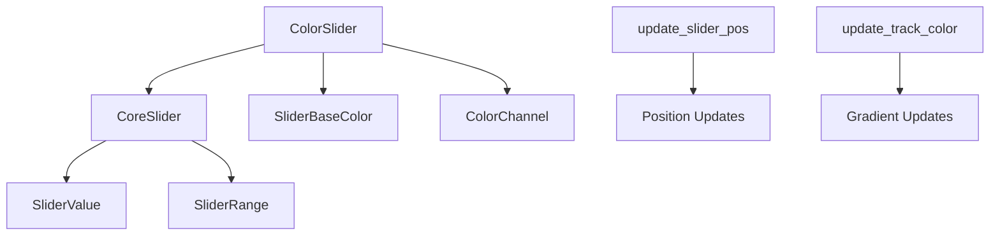

+++
title = "#20422 Color sliders"
date = "2025-08-05T00:00:00"
draft = false
template = "pull_request_page.html"
in_search_index = true

[taxonomies]
list_display = ["show"]

[extra]
current_language = "en"
available_languages = {"en" = { name = "English", url = "/pull_request/bevy/2025-08/pr-20422-en-20250805" }, "zh-cn" = { name = "中文", url = "/pull_request/bevy/2025-08/pr-20422-zh-cn-20250805" }}
labels = ["C-Feature", "A-UI", "A-Editor"]
+++

# Analysis of PR #20422: Color sliders

## Basic Information
- **Title**: Color sliders
- **PR Link**: https://github.com/bevyengine/bevy/pull/20422
- **Author**: viridia
- **Status**: MERGED
- **Labels**: C-Feature, A-UI, S-Ready-For-Final-Review, A-Editor, M-Needs-Release-Note
- **Created**: 2025-08-05T01:29:15Z
- **Merged**: 2025-08-05T21:12:05Z
- **Merged By**: alice-i-cecile

## Description Translation
# Objective

Part of #19236 

## Solution

This PR adds the color slider widgets, now that HSL gradients are working.

An earlier version of this PR included Oklab sliders, but those have been removed for now (Oklab requires a more sophisticated color picker).

# Showcase


## The Story of This Pull Request

### Problem and Context
Bevy Feathers needed specialized slider widgets for color manipulation as part of the ongoing UI toolkit development. Existing slider components were insufficient because color channels have different value ranges and require dynamic visual representations that change based on the current color state. The challenge was to create a slider that could:
1. Handle different color channels (RGB, HSL, alpha)
2. Display appropriate gradients showing the channel's value range
3. Maintain correct color space representations
4. Integrate with Bevy's ECS architecture

### Solution Approach
The implementation creates a new `ColorSlider` widget that extends Bevy's existing slider functionality. Key technical decisions included:
- Creating a `ColorChannel` enum to represent different editable color components
- Implementing gradient generation that varies only the target channel
- Using Bevy's ECS systems to dynamically update slider appearance
- Maintaining color space fidelity during gradient interpolation

The solution avoids over-engineering by deferring Oklab color space support to future work when more advanced color picking is implemented.

### Implementation Details
The `ColorSlider` consists of several components:
1. A track with rounded corners showing a gradient that represents the color channel's range
2. A draggable thumb for value selection
3. Systems that update the slider's visual representation when values change

The gradient generation is handled by the `gradient_ends()` method in `ColorChannel`, which calculates appropriate start, middle, and end colors based on the current base color and target channel. For example, when editing the red channel, it keeps green and blue constant while varying red:

```rust
ColorChannel::Red => {
    let base_rgb = base_color.to_srgba();
    (
        Color::srgb(0.0, base_rgb.green, base_rgb.blue),
        Color::srgb(0.5, base_rgb.green, base_rgb.blue),
        Color::srgb(1.0, base_rgb.green, base_rgb.blue),
    )
}
```

Two systems handle dynamic updates:
1. `update_slider_pos` - Repositions the thumb when the slider value changes
2. `update_track_color` - Updates the gradient when the base color changes

```rust
fn update_track_color(
    mut q_sliders: Query<(Entity, &ColorSlider, &SliderBaseColor), Changed<SliderBaseColor>>,
    // ... other queries
) {
    // Updates gradient stops based on current color state
}
```

### Technical Insights
The implementation handles several color spaces correctly by setting the gradient's `InterpolationColorSpace` appropriately:

```rust
linear_gradient.color_space = match slider.channel {
    ColorChannel::Red | ColorChannel::Green | ColorChannel::Blue => InterpolationColorSpace::Srgba,
    ColorChannel::HslHue | ColorChannel::HslLightness | ColorChannel::HslSaturation => {
        InterpolationColorSpace::Hsla
    }
    ColorChannel::Alpha => match base_color {
        // Handle different color representations
    },
};
```

The solution uses Bevy's change detection to optimize updates, only running systems when relevant components change. The thumb positioning uses percentage-based layout to remain responsive to slider track size changes.

### Impact
This PR:
1. Adds production-ready color slider widgets to Bevy Feathers
2. Demonstrates how to create specialized UI controls in Bevy
3. Provides foundation for future color picking tools
4. Shows proper handling of different color representations
5. Maintains performance through efficient change detection

The implementation avoids common pitfalls like hard-coded color spaces and provides clear extension points for future enhancements.

## Visual Representation



## Key Files Changed

### `crates/bevy_feathers/src/controls/color_slider.rs` (+378 lines)
New file implementing color slider widget

Key implementation:
```rust
#[derive(Component, Default, Clone)]
pub enum ColorChannel {
    #[default]
    Red,
    Green,
    Blue,
    HslHue,
    HslSaturation,
    HslLightness,
    Alpha,
}

impl ColorChannel {
    pub fn range(&self) -> SliderRange {
        match self {
            // Handle different value ranges
        }
    }

    pub fn gradient_ends(&self, base_color: Color) -> (Color, Color, Color) {
        // Generate appropriate gradient stops
    }
}

pub fn color_slider<B: Bundle>(props: ColorSliderProps, overrides: B) -> impl Bundle {
    // UI hierarchy construction
}
```

### `examples/ui/feathers.rs` (+204/-4)
Extended demo to showcase color sliders

Key changes:
```rust
// Added state management
#[derive(Resource)]
struct DemoWidgetStates {
    rgb_color: Srgba,
    hsl_color: Hsla,
}

// Added slider change handlers
let change_red = commands.register_system(
    |change: In<ValueChange<f32>>, mut color: ResMut<DemoWidgetStates>| {
        color.rgb_color.red = change.value;
    },
);

// Added HSL sliders
color_slider(
    ColorSliderProps {
        value: 0.5,
        on_change: Callback::System(change_hue),
        channel: ColorChannel::HslHue
    },
    ()
),
```

### `crates/bevy_feathers/src/controls/mod.rs` (+5/-0)
Registered new color slider module

```diff
+ mod color_slider;
// ...
+ pub use color_slider::{
+     color_slider, ColorChannel, ColorSlider, ColorSliderPlugin, ColorSliderProps, SliderBaseColor,
+ };
```

### `release-content/release-notes/feathers.md` (+1/-1)
Added PR to release notes

```diff
- pull_requests: [19730, 19900, 19928, 20237, 20169, 20350]
+ pull_requests: [19730, 19900, 19928, 20237, 20169, 20422, 20350]
```

## Further Reading
1. [Bevy UI Documentation](https://docs.rs/bevy_ui/latest/bevy_ui/)
2. [HSL Color Space](https://en.wikipedia.org/wiki/HSL_and_HSV)
3. [Bevy Color Types](https://docs.rs/bevy/latest/bevy/color/index.html)
4. [Bevy ECS Change Detection](https://bevy-cheatbook.github.io/programming/change-detection.html)