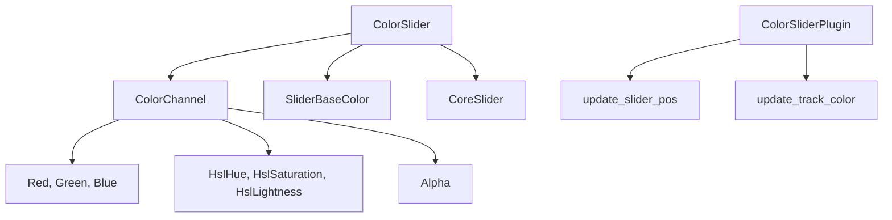

+++
title = "#20422 Color sliders"
date = "2025-08-05T00:00:00"
draft = false
template = "pull_request_page.html"
in_search_index = false

[extra]
current_language = "zh-cn"
available_languages = {"en" = { name = "English", url = "/pull_request/bevy/2025-08/pr-20422-en-20250805" }, "zh-cn" = { name = "中文", url = "/pull_request/bevy/2025-08/pr-20422-zh-cn-20250805" }}
labels = ["C-Feature", "A-UI", "A-Editor"]
+++

# PR分析报告：Color slippers

## Basic Information
- **Title**: Color sliders
- **PR Link**: https://github.com/bevyengine/bevy/pull/20422
- **Author**: viridia
- **Status**: MERGED
- **Labels**: C-Feature, A-UI, S-Ready-For-Final-Review, A-Editor, M-Needs-Release-Note
- **Created**: 2025-08-05T01:29:15Z
- **Merged**: 2025-08-05T21:12:05Z
- **Merged By**: alice-i-cecile

## Description Translation
该PR添加了颜色滑块控件，现在HSL渐变功能已经实现。

此PR的早期版本包含Oklab滑块，但目前已暂时移除（Oklab需要更复杂的颜色选择器）。

# Showcase


## The Story of This Pull Request

### 问题背景
作为#19236的一部分，Bevy需要实现颜色选择控件。在HSL渐变功能完成后，添加颜色滑块成为可能。早期尝试包含Oklab滑块，但由于Oklab需要更复杂的颜色处理逻辑，决定先专注于RGB和HSL颜色模型的实现。

### 解决方案方法
开发团队决定实现一个可配置的颜色滑块组件，支持多种颜色通道：
- RGB（红、绿、蓝）
- HSL（色相、饱和度、亮度）
- Alpha（透明度）

关键技术决策包括：
1. 使用`ColorChannel`枚举区分不同颜色通道
2. 实现动态渐变轨道，根据当前编辑的通道显示相应渐变
3. 使用`SliderBaseColor`组件存储未编辑的颜色通道值
4. 创建专用系统处理滑块位置和轨道颜色更新

### 具体实现
核心实现集中在`color_slider.rs`文件中，主要包含：
1. **UI构建**：通过`color_slider`函数创建滑块组件
2. **通道处理**：`ColorChannel`枚举定义支持的7种颜色通道
3. **渐变计算**：`gradient_ends()`方法根据当前通道和基础颜色计算渐变端点
4. **更新系统**：
   - `update_slider_pos`：根据值更新滑块位置
   - `update_track_color`：根据基础颜色更新轨道渐变

```rust
// 示例：渐变端点计算方法
pub fn gradient_ends(&self, base_color: Color) -> (Color, Color, Color) {
    match self {
        ColorChannel::Red => {
            let base_rgb = base_color.to_srgba();
            (
                Color::srgb(0.0, base_rgb.green, base_rgb.blue),
                Color::srgb(0.5, base_rgb.green, base_rgb.blue),
                Color::srgb(1.0, base_rgb.green, base_rgb.blue),
            )
        }
        // 其他通道处理...
    }
}
```

### 技术要点
1. **动态渐变**：滑块轨道根据当前编辑的通道显示线性渐变
2. **颜色空间处理**：根据基础颜色自动选择正确的插值颜色空间
3. **精确布局**：使用常量定义滑块尺寸，确保UI一致性
4. **响应式设计**：通过系统监听组件变化实时更新UI

```rust
// 颜色空间选择逻辑
match slider.channel {
    ColorChannel::Red | ColorChannel::Green | ColorChannel::Blue => {
    InterpolationColorSpace::Srgba
    }
    ColorChannel::HslHue | ColorChannel::HslLightness | ColorChannel::HslSaturation => 
    InterpolationColorSpace::Hsla,
    // Alpha通道根据基础颜色选择空间...
}
```

### 影响
1. 添加了7种颜色滑块控件
2. 完善了Bevy的UI组件库
3. 为更复杂的颜色选择器奠定了基础
4. 更新了示例程序展示新控件

## Visual Representation



## Key Files Changed

### crates/bevy_feathers/src/controls/color_slider.rs (+378/-0)
新增颜色滑块实现文件，包含：
- `ColorChannel`枚举定义支持的通道类型
- `SliderBaseColor`组件存储未编辑的颜色值
- `color_slider`函数构建UI组件
- 更新系统处理位置和颜色变化

```rust
// 滑块UI构建核心
pub fn color_slider<B: Bundle>(props: ColorSliderProps, overrides: B) -> impl Bundle {
    (
        Node { /* 布局属性 */ },
        CoreSlider { /* 交互属性 */ },
        ColorSlider { channel: props.channel.clone() },
        // ...其他组件
        children![
            // 轨道结构
            (Node { /* 轨道属性 */ }, children![
                // 左侧端盖
                (Node { /* 属性 */ }, BackgroundColor(...)),
                // 渐变轨道
                (Node { /* 属性 */ }, BackgroundGradient(...), children![
                    // 滑块柄
                    (Node { /* 属性 */ }, CoreSliderThumb, ...)
                ]),
                // 右侧端盖
                (Node { /* 属性 */ }, BackgroundColor(...))
            ])
        ]
    )
}
```

### examples/ui/feathers.rs (+204/-4)
更新示例程序：
1. 添加`DemoWidgetStates`资源管理颜色状态
2. 创建回调系统处理滑块值变化
3. 添加多组颜色滑块展示功能

```rust
// 添加RGB滑块示例
color_slider(
    ColorSliderProps {
        value: 0.5,
        on_change: Callback::System(change_red),
        channel: ColorChannel::Red
    },
    ()
)
```

### crates/bevy_feathers/src/controls/mod.rs (+5/-0)
注册新组件：
```rust
pub use color_slider::{
    color_slider, ColorChannel, ColorSlider, ColorSliderPlugin, ColorSliderProps, SliderBaseColor,
};

impl Plugin for ControlsPlugin {
    fn build(&self, app: &mut App) {
        app.add_plugins(/* ... */ ColorSliderPlugin);
    }
}
```

### release-content/release-notes/feathers.md (+1/-1)
更新发布说明包含此PR：
```diff
- pull_requests: [19730, 19900, 19928, 20237, 20169, 20350]
+ pull_requests: [19730, 19900, 19928, 20237, 20169, 20422, 20350]
```

## Further Reading
1. [Bevy UI 文档](https://docs.rs/bevy_ui/latest/bevy_ui/)
2. [HSL 颜色模型解释](https://en.wikipedia.org/wiki/HSL_and_HSV)
3. [Bevy 颜色系统](https://docs.rs/bevy_color/latest/bevy_color/)