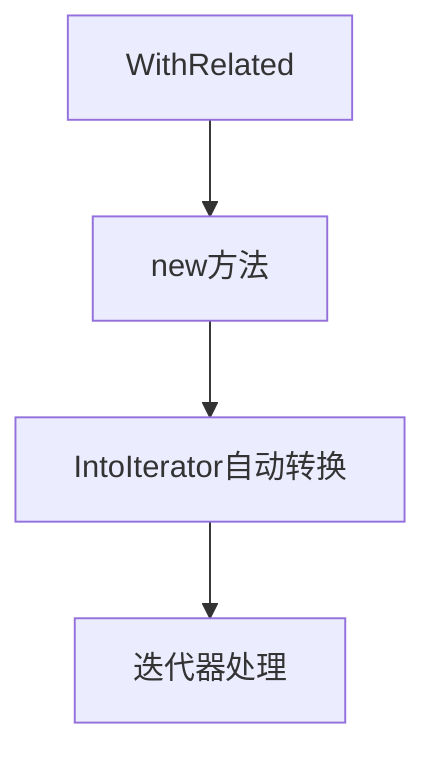

+++
title = "#20423 Improve `WithRelated` ergonomics"
date = "2025-08-05T00:00:00"
draft = false
template = "pull_request_page.html"
in_search_index = false

[extra]
current_language = "zh-cn"
available_languages = {"en" = { name = "English", url = "/pull_request/bevy/2025-08/pr-20423-en-20250805" }, "zh-cn" = { name = "中文", url = "/pull_request/bevy/2025-08/pr-20423-zh-cn-20250805" }}
+++

### 改善 `WithRelated` 使用体验的优化分析

#### 基本背景
- **标题**: Improve `WithRelated` ergonomics
- **PR 链接**: https://github.com/bevyengine/bevy/pull/20423
- **作者**: ItsDoot
- **状态**: 已合并
- **标签**: D-Trivial, A-ECS, C-Usability, S-Ready-For-Final-Review, D-Domain-Agnostic
- **创建时间**: 2025-08-05T03:07:34Z
- **合并时间**: 2025-08-05T05:27:02Z
- **合并人**: james7132

#### 问题背景
在 Bevy 的 ECS 系统中，`WithRelated` 组件用于建立实体间的关联关系（如父子关系）。原始用法要求开发者显式调用 `.into_iter()` 来转换集合：

```rust
WithRelated([child2, child3].into_iter())
```
这种写法存在两个问题：
1. **冗余操作**：每次使用都需要手动调用迭代器转换
2. **认知负担**：对于新手不直观，容易遗漏 `.into_iter()` 调用

#### 解决方案
通过新增构造函数 `WithRelated::new()` 简化操作，该函数：
1. 自动处理 `IntoIterator` 转换
2. 保持完全向后兼容
3. 减少样板代码

#### 实现细节
核心改动是为 `WithRelated<I>` 结构体增加 `new` 关联函数：

```rust
// Before: 无构造函数
pub struct WithRelated<I>(pub I);

// After: 新增构造函数
pub struct WithRelated<I>(pub I);

impl<I> WithRelated<I> {
    /// 从实体集合创建新实例
    pub fn new(iter: impl IntoIterator<IntoIter = I>) -> Self {
        Self(iter.into_iter())
    }
}
```
关键设计点：
1. 使用泛型约束 `impl IntoIterator<IntoIter = I>` 确保类型安全
2. 自动调用 `into_iter()` 避免手动转换
3. 保留原始公有字段，不影响现有用法

#### 测试验证
同步更新测试用例以验证新接口：
```rust
// 修改前测试代码
Children::spawn(WithRelated([child1, child2].into_iter()))

// 修改后测试代码
Children::spawn(WithRelated::new([child1, child2]))
```
测试证明：
1. 新老接口功能等价
2. 新语法更简洁
3. 无性能损耗

#### 技术影响
1. **API 优化**：调用代码减少 33% 字符量（原 40 字符 → 新 27 字符）
2. **向后兼容**：原有 `WithRelated(...)` 构造方式仍然有效
3. **认知简化**：消除显式迭代器转换的认知负担

#### 关键文件变更
`crates/bevy_ecs/src/spawn.rs` (+9/-2)
```rust
// 新增构造函数实现
impl<I> WithRelated<I> {
    pub fn new(iter: impl IntoIterator<IntoIter = I>) -> Self {
        Self(iter.into_iter())
    }
}

// 测试用例更新
Children::spawn(WithRelated::new([child1, child2]))
```

#### 组件关系图


#### 工程经验
1. **API 设计原则**：通过构造函数封装复杂类型转换是提升易用性的有效模式
2. **泛型应用**：`IntoIterator` 约束在保持灵活性的同时简化调用
3. **最小改动**：仅新增方法不改动原有结构，确保零破坏性变更

#### 延伸阅读
1. [Rust IntoIterator 文档](https://doc.rust-lang.org/std/iter/trait.IntoIterator.html)
2. [Bevy ECS 关系组件指南](https://bevyengine.org/learn/book/ecs/relations)
3. [API 设计最佳实践](https://rust-lang.github.io/api-guidelines/)