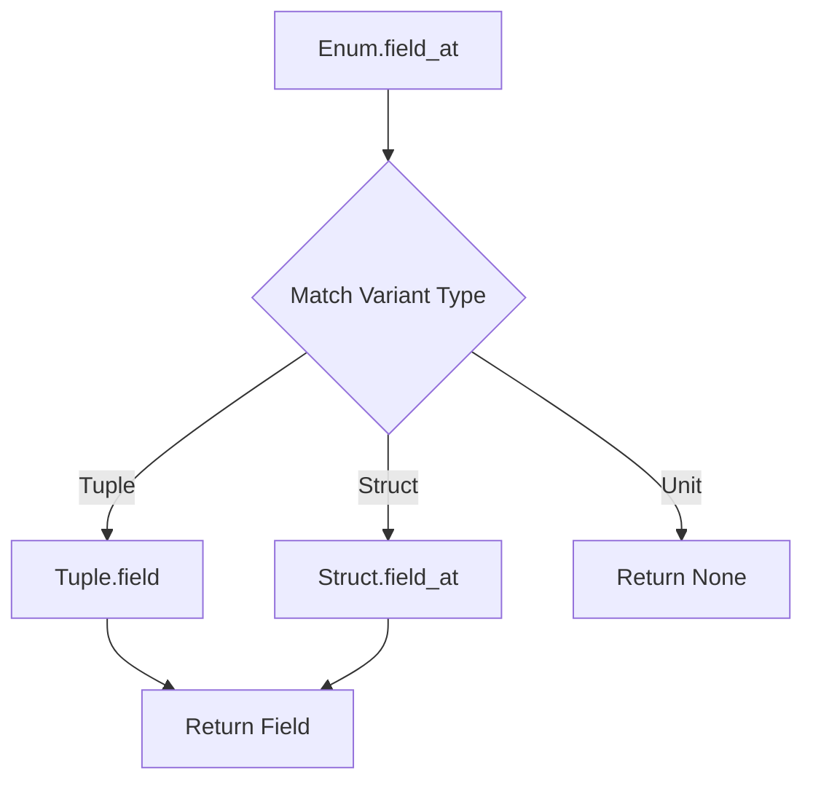

+++
title = "#20424 Fixing Field Access Inconsistencies in Bevy's Dynamic Enum Reflection"
date = "2025-08-05T00:00:00"
draft = false
template = "pull_request_page.html"
in_search_index = true

[taxonomies]
list_display = ["show"]

[extra]
current_language = "en"
available_languages = {"en" = { name = "English", url = "/pull_request/bevy/2025-08/pr-20424-en-20250805" }, "zh-cn" = { name = "中文", url = "/pull_request/bevy/2025-08/pr-20424-zh-cn-20250805" }}
labels = ["C-Bug", "D-Trivial", "A-Reflection"]
+++

## Title: Fixing Field Access Inconsistencies in Bevy's Dynamic Enum Reflection

### Basic Information
- **Title**: Implement field_at[_mut] for Struct DynamicVariant
- **PR Link**: https://github.com/bevyengine/bevy/pull/20424
- **Author**: jhgarner
- **Status**: MERGED
- **Labels**: C-Bug, D-Trivial, S-Ready-For-Final-Review, A-Reflection
- **Created**: 2025-08-05T04:36:16Z
- **Merged**: 2025-08-05T20:46:41Z
- **Merged By**: alice-i-cecile

### Description Translation
# Objective

This implements the field_at methods for Struct DynamicEnum Variants instead of only the Tuple variants. This brings it inline with DynamicStructs and the docs for the Enum trait.

Fixes #20402 

## Solution

Instead of only matching on the Tuple variant, it matches on the Struct variant as well

## Testing

Let me know if there's some place where unit tests should be added. I couldn't see any existing ones, but I can add them if needed.

### The Story of This Pull Request

#### The Problem and Context
In Bevy's reflection system, the `DynamicEnum` type had an inconsistency in how it handled field access for different variant types. The `Enum` trait requires implementations to provide `field_at` and `field_at_mut` methods for accessing fields by index. However, the existing implementation for `DynamicEnum` only supported these operations for tuple variants, completely ignoring struct variants. This violated the trait's contract and caused unexpected behavior when working with struct-style enums in reflection contexts.

Issue #20402 documented this gap: when users attempted to access fields of struct variants via reflection using index-based accessors, they received `None` instead of the expected field reference. This limited the usefulness of reflection operations on enum types and created an inconsistency compared to `DynamicStruct`, which properly supported field access operations.

#### The Solution Approach
The fix required extending the `field_at` and `field_at_mut` methods to handle struct variants in addition to tuple variants. The solution approach was straightforward:
1. Replace the conditional `if let` checks with comprehensive `match` expressions
2. Add handling for `DynamicVariant::Struct` case
3. Delegate to the existing `field_at` and `field_at_mut` implementations of `DynamicStruct`
4. Maintain existing behavior for tuple variants
5. Continue returning `None` for unit variants (which have no fields)

The implementation required no new data structures or complex logic - it simply routed the method calls to the appropriate underlying implementations based on the variant type.

#### The Implementation
The core changes occurred in two methods of the `Enum` implementation for `DynamicEnum`. Previously, these methods only handled tuple variants:

```rust
// Before changes
fn field_at(&self, index: usize) -> Option<&dyn PartialReflect> {
    if let DynamicVariant::Tuple(data) = &self.variant {
        data.field(index)
    } else {
        None
    }
}

fn field_at_mut(&mut self, index: usize) -> Option<&mut dyn PartialReflect> {
    if let DynamicVariant::Tuple(data) = &mut self.variant {
        data.field_mut(index)
    } else {
        None
    }
}
```

The updated implementation properly handles all variant types:

```rust
// After changes
fn field_at(&self, index: usize) -> Option<&dyn PartialReflect> {
    match &self.variant {
        DynamicVariant::Tuple(data) => data.field(index),
        DynamicVariant::Struct(data) => data.field_at(index),
        DynamicVariant::Unit => None,
    }
}

fn field_at_mut(&mut self, index: usize) -> Option<&mut dyn PartialReflect> {
    match &mut self.variant {
        DynamicVariant::Tuple(data) => data.field_mut(index),
        DynamicVariant::Struct(data) => data.field_at_mut(index),
        DynamicVariant::Unit => None,
    }
}
```

The key improvements:
1. The `match` expression explicitly handles all possible variants
2. Struct variants now correctly delegate to `DynamicStruct::field_at`
3. The code is more explicit about variant handling
4. Maintains backward compatibility for tuple and unit variants

#### Technical Insights
This change demonstrates several important reflection principles:
1. **Trait contract fulfillment**: The `Enum` trait requires consistent behavior across all variants. The fix ensures the implementation meets these requirements.
2. **Polymorphic dispatch**: Using pattern matching on the enum variant allows selecting the appropriate field access strategy for each variant type.
3. **Code reuse**: By leveraging `DynamicStruct`'s existing field access methods, the solution avoids code duplication.
4. **Reflection consistency**: The change aligns `DynamicEnum`'s behavior with `DynamicStruct`, creating a more predictable reflection API.

The match expression is particularly well-suited for this scenario because:
- It forces explicit handling of all variants
- The compiler can verify exhaustiveness
- It clearly communicates the different behaviors per variant type

#### The Impact
These changes resolve issue #20402 by enabling correct field access for struct variants in reflection operations. The impact includes:
1. Correct implementation of the `Enum` trait contract
2. Consistent behavior between struct and tuple variants
3. Elimination of unexpected `None` returns when accessing struct variant fields
4. Alignment with `DynamicStruct` field access patterns
5. Improved reliability of reflection-based systems using enum types

The changes maintain backward compatibility while fixing a clear inconsistency in the reflection API. The minimal nature of the changes (8 lines added, 8 lines removed) reduces risk while providing significant functional improvement.

### Visual Representation



### Key Files Changed

#### `crates/bevy_reflect/src/enums/dynamic_enum.rs`
**Purpose**: Fixes field access methods to handle struct variants correctly  
**Changes**: Modified `field_at` and `field_at_mut` implementations

**Code Changes**:
```diff
 fn field_at(&self, index: usize) -> Option<&dyn PartialReflect> {
-    if let DynamicVariant::Tuple(data) = &self.variant {
-        data.field(index)
-    } else {
-        None
+    match &self.variant {
+        DynamicVariant::Tuple(data) => data.field(index),
+        DynamicVariant::Struct(data) => data.field_at(index),
+        DynamicVariant::Unit => None,
     }
 }
 
 fn field_at_mut(&mut self, index: usize) -> Option<&mut dyn PartialReflect> {
-    if let DynamicVariant::Tuple(data) = &mut self.variant {
-        data.field_mut(index)
-    } else {
-        None
+    match &mut self.variant {
+        DynamicVariant::Tuple(data) => data.field_mut(index),
+        DynamicVariant::Struct(data) => data.field_at_mut(index),
+        DynamicVariant::Unit => None,
     }
 }
```

### Further Reading
1. [Bevy Reflection Documentation](https://docs.rs/bevy_reflect/latest/bevy_reflect/)
2. [Rust Enum Reflection Patterns](https://doc.rust-lang.org/book/ch19-04-advanced-types.html#enums)
3. [Original Issue #20402](https://github.com/bevyengine/bevy/issues/20402)