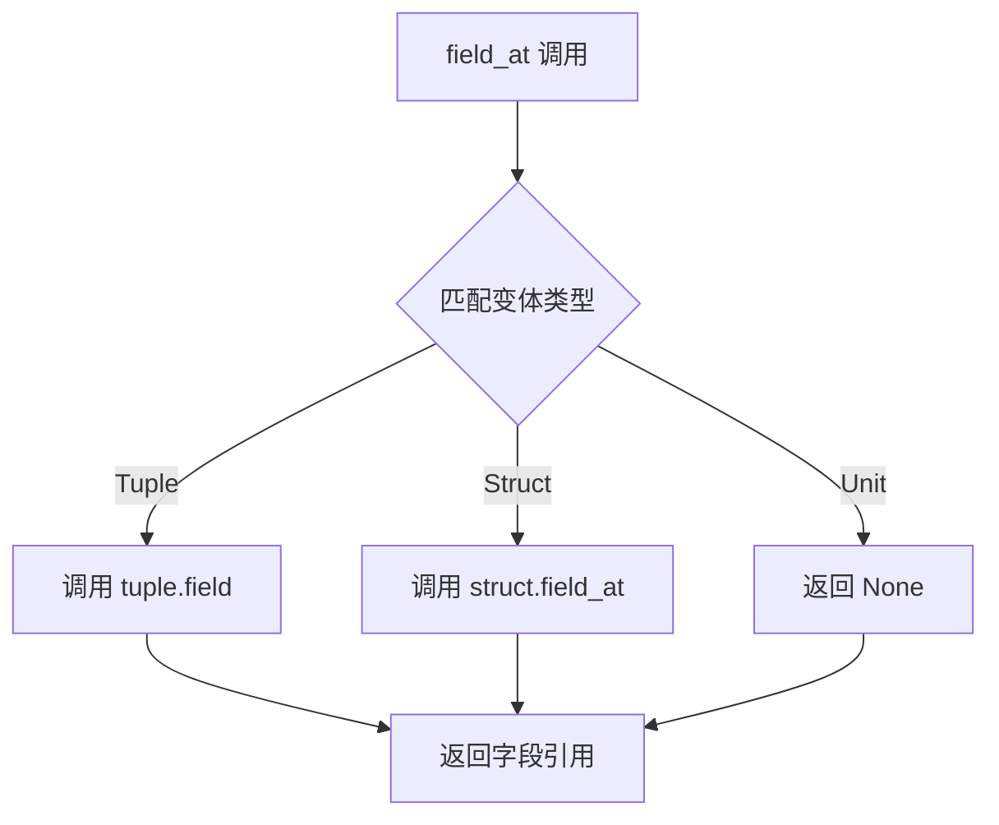

+++
title = "#20424 Implement field_at[_mut] for Struct DynamicVariant"
date = "2025-08-05T00:00:00"
draft = false
template = "pull_request_page.html"
in_search_index = false

[extra]
current_language = "zh-cn"
available_languages = {"en" = { name = "English", url = "/pull_request/bevy/2025-08/pr-20424-en-20250805" }, "zh-cn" = { name = "中文", url = "/pull_request/bevy/2025-08/pr-20424-zh-cn-20250805" }}
+++

# 实现 Struct DynamicVariant 的 field_at[_mut] 方法

## 基本信息
- **标题**: Implement field_at[_mut] for Struct DynamicVariant
- **PR 链接**: https://github.com/bevyengine/bevy/pull/20424
- **作者**: jhgarner
- **状态**: 已合并
- **标签**: C-Bug, D-Trivial, S-Ready-For-Final-Review, A-Reflection
- **创建时间**: 2025-08-05T04:36:16Z
- **合并时间**: 2025-08-05T20:46:41Z
- **合并人**: alice-i-cecile

## 问题描述翻译
### 目标
为 Struct DynamicEnum 变体实现 field_at 方法（而不仅是 Tuple 变体）。这使其与 DynamicStructs 和 Enum trait 的文档保持一致。

修复 #20402

### 解决方案
不再仅匹配 Tuple 变体，而是同时匹配 Struct 变体

### 测试
请告知是否需要添加单元测试。当前未见相关测试，但可依需添加。

## 修改背景与解决方案

### 问题背景
在 Bevy 的反射系统中，`DynamicEnum` 类型用于表示枚举的运行时动态表示。该类型有三种变体：Unit（无字段）、Tuple（元组结构）和 Struct（具名结构）。在修改前，`DynamicEnum` 的 `field_at` 和 `field_at_mut` 方法仅支持 Tuple 变体，这导致两个主要问题：

1. **行为不一致**：`DynamicStruct` 已完整支持字段访问，而 `DynamicEnum` 的 Struct 变体无法通过索引访问字段
2. **文档误导**：`Enum` trait 的文档暗示所有变体都应支持字段访问，但实际实现不符合该约定

具体问题体现在 issue #20402 中，用户无法通过索引访问 Struct 变体的字段，导致功能缺失和预期行为不符。

### 解决方案
核心修改是扩展 `field_at` 和 `field_at_mut` 方法的匹配逻辑，使其覆盖所有三种变体类型：
1. 对于 Tuple 变体：保持原有行为，调用元组的 `field` 方法
2. 对于 Struct 变体：新增支持，调用动态结构体的 `field_at` 方法
3. 对于 Unit 变体：维持返回 `None`

该方案选择直接扩展 `match` 分支而非修改现有逻辑，因为：
- 保持原有 Tuple 变体处理逻辑不变
- 复用 `DynamicStruct` 已有的字段访问方法
- 最小化变更范围，避免引入副作用

### 实现细节
关键修改位于 `DynamicEnum` 的 `Enum` trait 实现中。原先使用 `if let` 仅处理 Tuple 变体，现改为完整的 `match` 表达式覆盖所有情况：



### 影响分析
1. **功能完善**：Struct 变体现在完全支持按索引访问字段
2. **行为一致**：`DynamicEnum` 的字段访问行为与 `DynamicStruct` 保持一致
3. **符合约定**：满足 `Enum` trait 的文档约定，消除预期行为与实际实现的差异
4. **兼容性**：由于仅扩展功能而非修改现有行为，不影响现有 Tuple 变体的使用

### 潜在改进
虽然当前实现已解决问题，但未来可考虑：
1. 添加单元测试验证三种变体的字段访问行为
2. 为 `DynamicVariant` 实现统一的字段访问接口
3. 优化错误处理，为无效索引提供明确错误信息

## 关键文件变更

### `crates/bevy_reflect/src/enums/dynamic_enum.rs`
**变更说明**：扩展 `DynamicEnum` 的字段访问方法以支持 Struct 变体

```rust
// 修改前：
fn field_at(&self, index: usize) -> Option<&dyn PartialReflect> {
    if let DynamicVariant::Tuple(data) = &self.variant {
        data.field(index)
    } else {
        None
    }
}

// 修改后：
fn field_at(&self, index: usize) -> Option<&dyn PartialReflect> {
    match &self.variant {
        DynamicVariant::Tuple(data) => data.field(index),
        DynamicVariant::Struct(data) => data.field_at(index),
        DynamicVariant::Unit => None,
    }
}
```

```rust
// 修改前：
fn field_at_mut(&mut self, index: usize) -> Option<&mut dyn PartialReflect> {
    if let DynamicVariant::Tuple(data) = &mut self.variant {
        data.field_mut(index)
    } else {
        None
    }
}

// 修改后：
fn field_at_mut(&mut self, index: usize) -> Option<&mut dyn PartialReflect> {
    match &mut self.variant {
        DynamicVariant::Tuple(data) => data.field_mut(index),
        DynamicVariant::Struct(data) => data.field_at_mut(index),
        DynamicVariant::Unit => None,
    }
}
```

**变更关系**：
- 通过模式匹配覆盖所有 `DynamicVariant` 类型
- 为 Struct 变体委托调用 `DynamicStruct` 的字段访问方法
- 保持 Unit 变体的空返回行为
- 维持原有 Tuple 变体的处理逻辑不变

## 延伸阅读
1. [Bevy 反射系统文档](https://docs.rs/bevy_reflect/latest/bevy_reflect/)
2. [Rust 模式匹配最佳实践](https://doc.rust-lang.org/book/ch18-03-pattern-syntax.html)
3. [枚举类型设计模式](https://rust-unofficial.github.io/patterns/patterns/enum.html)