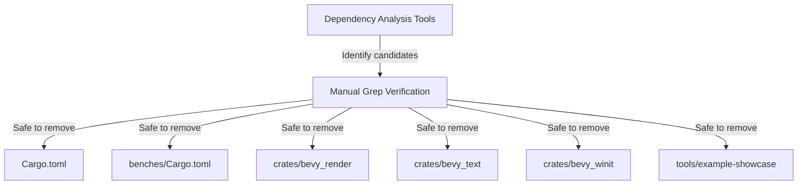

+++
title = "#20426 Trim dependencies."
date = "2025-08-06T00:00:00"
draft = false
template = "pull_request_page.html"
in_search_index = true

[taxonomies]
list_display = ["show"]

[extra]
current_language = "en"
available_languages = {"en" = { name = "English", url = "/pull_request/bevy/2025-08/pr-20426-en-20250806" }, "zh-cn" = { name = "中文", url = "/pull_request/bevy/2025-08/pr-20426-zh-cn-20250806" }}
labels = ["C-Dependencies", "C-Code-Quality", "D-Straightforward"]
+++

### Trim Dependencies: Removing Unused Crates from Bevy

## Basic Information
- **Title**: Trim dependencies.
- **PR Link**: https://github.com/bevyengine/bevy/pull/20426
- **Author**: nnethercote
- **Status**: MERGED
- **Labels**: C-Dependencies, C-Code-Quality, S-Ready-For-Final-Review, X-Uncontroversial, D-Straightforward
- **Created**: 2025-08-05T06:06:38Z
- **Merged**: 2025-08-06T09:04:39Z
- **Merged By**: alice-i-cecile

## Description Translation
# Objective

Remove unneeded dependencies.

## Solution

Found using `cargo-shear`, `cargo-machete`, and `cargo-udeps`. They all do the same thing (identify unused dependencies), they are all so-so at it (with lots of false negatives and positives) but the combination of all three is enough to get a useful outcome.

## Testing

- I double-checked all the removals by grepping for each removed dependency's name within the affected crate, to make sure there weren't any uses remaining. I think they're all ok.
- `cargo run -p ci`

## The Story of This Pull Request

Bevy's dependency tree had accumulated several unused crates over time, increasing build times and binary size without providing value. The primary challenge was reliably identifying which dependencies were truly unused, as existing tools like `cargo-udeps` produce both false positives and false negatives.

The solution combined three dependency analysis tools (`cargo-shear`, `cargo-machete`, and `cargo-udeps`) to cross-validate results. While each tool alone was unreliable, their combined output provided sufficient confidence to identify removable dependencies. For each candidate dependency, manual verification was performed using `grep` to confirm no references remained in the codebase.

The implementation focused on removing dependencies from several key locations:
1. Root workspace dependencies for non-essential utilities
2. Benchmarks that included unnecessary rendering components
3. Render/text/winit subsystems with unused helper crates
4. Example tooling with unneeded serialization formats

This approach maintained safety through redundant verification:
1. Tool-based identification provided the initial candidate list
2. Manual code inspection confirmed no remaining references
3. CI pipeline ensured no breakages after removal

The changes simplify Bevy's dependency graph and reduce build times. Future dependency audits could use this same multi-tool verification approach to maintain lean dependencies. The PR demonstrates that while dependency analysis tools have limitations, combining them with manual verification produces reliable results.

## Visual Representation



## Key Files Changed

### Root Cargo.toml
Removed unused networking and macro utilities from dev dependencies:
```toml
# Before:
[target.'cfg(not(target_family = "wasm"))'.dev-dependencies]
smol = "2"
smol-macros = "0.1"
smol-hyper = "0.1"

[dev-dependencies]
hyper = { version = "1", features = ["server", "http1"] }
http-body-util = "0.1"
macro_rules_attribute = "0.2"

# After: (all above dependencies removed)
```

### Benches Cargo.toml
Removed unnecessary utils and Linux-specific rendering dependencies:
```toml
# Before:
bevy_utils = { path = "../crates/bevy_utils" }

[target.'cfg(target_os = "linux")'.dev-dependencies]
bevy_winit = { path = "../crates/bevy_winit", features = ["x11"] }

# After: (both sections removed)
```

### Render Cargo.toml
Removed unused error reporting dependency:
```toml
# Before:
# misc
codespan-reporting = "0.12.0"

# After: (dependency removed)
```

### Text Cargo.toml
Removed unused bidirectional text processing:
```toml
# Before:
unicode-bidi = "0.3.13"

# After: (dependency removed)
```

### Winit Cargo.toml
Removed unused concurrency primitive for Wasm:
```toml
# Before:
[target.'cfg(target_arch = "wasm32")'.dependencies]
crossbeam-channel = "0.5"

# After: (dependency removed)
```

### Example Tools Cargo.toml
Removed unused serialization format:
```toml
# Before:
ron = "0.10"

# After: (dependency removed)
```

## Further Reading
1. [cargo-udeps documentation](https://github.com/est31/cargo-udeps) - Unused dependency checker
2. [cargo-machete](https://github.com/bnjbvr/cargo-machete) - Fast unused dependency remover
3. [Rust dependency management best practices](https://doc.rust-lang.org/cargo/guide/dependencies.html)