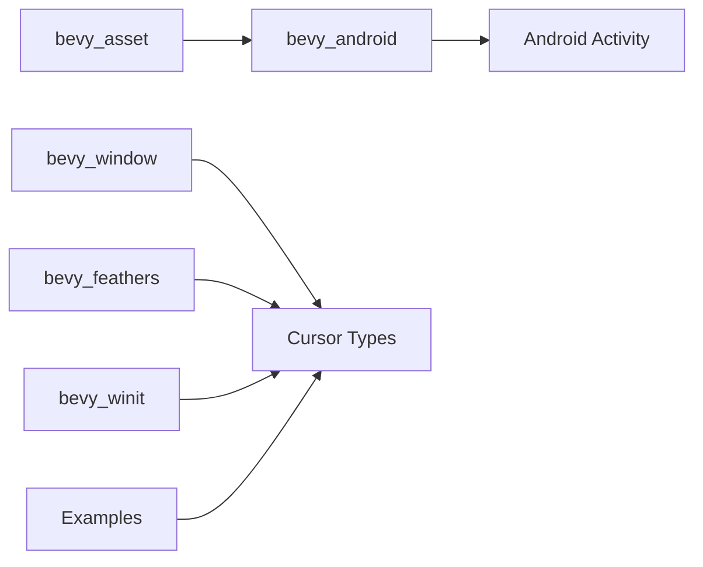

+++
title = "#20427 Untangle Cursor Dependencies"
date = "2025-08-05T00:00:00"
draft = false
template = "pull_request_page.html"
in_search_index = true

[taxonomies]
list_display = ["show"]

[extra]
current_language = "en"
available_languages = {"en" = { name = "English", url = "/pull_request/bevy/2025-08/pr-20427-en-20250805" }, "zh-cn" = { name = "中文", url = "/pull_request/bevy/2025-08/pr-20427-zh-cn-20250805" }}
labels = ["A-Windowing", "A-UI", "C-Code-Quality", "O-Android"]
+++

## Untangle Cursor Dependencies

### Basic Information
- **Title**: Untangle Cursor Dependencies
- **PR Link**: https://github.com/bevyengine/bevy/pull/20427
- **Author**: cart
- **Status**: MERGED
- **Labels**: A-Windowing, A-UI, C-Code-Quality, O-Android, S-Ready-For-Final-Review
- **Created**: 2025-08-05T07:00:59Z
- **Merged**: 2025-08-05T19:59:36Z
- **Merged By**: cart

### Description Translation
Fixes #20182  
Fixes #20381  
Alternative to #20384  

The root cause of the problems above is that `bevy_window` includes `bevy_window::ANDROID_APP`, which prevents it from behaving as a backend-agnostic window API. This forces `bevy_asset` to take a dependency on `bevy_window` just to provide android support, which is unnecessary. This in turn prevents `bevy_window` from owning the relevant CursorIcon / CustomCursor types, because it would need to depend on `bevy_asset`, which creates a circular dependency.  

The solution is to move `ANDROID_APP` to a new `bevy_android` crate, which `bevy_asset` can then depend on. This allows the "backend-agnostic" cursor types to live in `bevy_window`, which then allows `bevy_feathers` to remove its dependency on `bevy_winit`.  

While I was touching this code I also chose to make `CustomCursor::Url` available on all platforms. This is up to the backends to implement (or not implement). It also means that users no longer need to know the magic `#[cfg]` block to make their code compile on all platforms. `bevy_winit` currently logs a `error_once` if it is ever used on a platform where it is not supported. 

### The Story of This Pull Request

#### Problem and Context
The core issue stemmed from a circular dependency between `bevy_window` and `bevy_asset` caused by Android-specific code. The `bevy_window` crate contained `ANDROID_APP`, forcing `bevy_asset` to depend on `bevy_window` solely for Android asset loading. This prevented cursor-related types (like `CursorIcon` and `CustomCursor`) from being placed in `bevy_window` since they required asset loading capabilities, creating a dependency loop. Additionally, `bevy_feathers` unnecessarily depended on `bevy_winit` for cursor functionality.

#### Solution Approach
The solution involved:
1. Extracting Android-specific code into a new `bevy_android` crate
2. Moving cursor types to `bevy_window` now that the dependency loop was broken
3. Removing `bevy_winit` dependency from `bevy_feathers`
4. Making `CustomCursor::Url` platform-agnostic with proper fallback behavior

This approach maintained backend-agnosticism for windowing systems while resolving dependency issues.

#### Implementation Details
The key changes were:

1. **Created `bevy_android` crate**  
   This new crate houses the Android-specific `ANDROID_APP` static:
   ```rust
   // crates/bevy_android/src/lib.rs
   #[cfg(target_os = "android")]
   pub static ANDROID_APP: std::sync::OnceLock<android_activity::AndroidApp> = 
       std::sync::OnceLock::new();
   ```

2. **Updated Android dependencies**  
   `bevy_asset` now depends on `bevy_android` instead of `bevy_window` for Android:
   ```toml
   # crates/bevy_asset/Cargo.toml
   [target.'cfg(target_os = "android")'.dependencies]
   bevy_android = { path = "../bevy_android", version = "0.17.0-dev" }
   ```

3. **Refactored cursor types**  
   Moved cursor-related code to `bevy_window`:
   ```rust
   // crates/bevy_window/src/cursor/mod.rs
   pub enum CursorIcon {
       #[cfg(feature = "custom_cursor")]
       Custom(CustomCursor),
       System(SystemCursorIcon),
   }
   
   // crates/bevy_window/src/cursor/custom_cursor.rs
   pub enum CustomCursor {
       Image(CustomCursorImage),
       Url(CustomCursorUrl),  // Now available on all platforms
   }
   ```

4. **Updated `bevy_feathers`**  
   Removed `bevy_winit` dependency and updated cursor imports:
   ```toml
   # crates/bevy_feathers/Cargo.toml
   [features]
   custom_cursor = ["bevy_window/custom_cursor"]  // Updated feature
   ```

5. **Modified `bevy_winit` cursor handling**  
   WinIt-specific cursor logic remains in `bevy_winit` but now uses the cursor types from `bevy_window`:
   ```rust
   // crates/bevy_winit/src/cursor/mod.rs
   fn update_cursors(
       // ...
       cursor: Ref<CursorIcon>,  // From bevy_window
       // ...
   ) {
       match cursor.as_ref() {
           CursorIcon::Custom(custom) => { /* WinIt implementation */ },
           // ...
       }
   }
   ```

6. **Improved cross-platform support**  
   `CustomCursor::Url` now works on all platforms with proper fallbacks:
   ```rust
   // crates/bevy_winit/src/cursor/mod.rs
   CursorIcon::Custom(CustomCursor::Url(_c)) => {
       #[cfg(not(all(target_family = "wasm")))]
       {
           bevy_log::error_once!("CustomCursor::Url not supported");
           CursorSource::System(winit::window::CursorIcon::Default)
       }
   }
   ```

#### Technical Insights
The implementation demonstrates several important dependency management techniques:

1. **Separation of Concerns**  
   Android-specific code was isolated into a dedicated crate, following the principle that platform-specific implementations should be separate from core abstractions.

2. **Feature Flag Consistency**  
   The `custom_cursor` feature was standardized across crates using consistent activation paths:
   ```toml
   # crates/bevy_window/Cargo.toml
   [features]
   custom_cursor = ["bevy_image", "bevy_asset"]
   
   # crates/bevy_winit/Cargo.toml
   [features]
   custom_cursor = ["bevy_window/custom_cursor", ...]
   ```

3. **Backend-Agnostic Types**  
   Cursor types were made backend-independent by:
   - Defining fundamental types in `bevy_window`
   - Keeping WinIt-specific implementation details in `bevy_winit`
   - Using the type system to enforce proper abstraction boundaries

#### Impact
These changes resulted in:
1. Removed circular dependency between `bevy_asset` and `bevy_window`
2. Reduced unnecessary dependencies (`bevy_feathers` no longer needs `bevy_winit`)
3. Simplified cross-platform cursor code (no more platform-specific `#[cfg]` for `CustomCursor::Url`)
4. Improved code organization with clearer separation between:
   - Backend-agnostic windowing interfaces (`bevy_window`)
   - Platform-specific implementations (`bevy_winit`, `bevy_android`)
5. Maintained full backward compatibility for existing cursor APIs

### Visual Representation



### Key Files Changed

1. `crates/bevy_android/src/lib.rs` (+10/-0)  
   New crate for Android-specific functionality:
   ```rust
   #[cfg(target_os = "android")]
   pub static ANDROID_APP: std::sync::OnceLock<android_activity::AndroidApp> = 
       std::sync::OnceLock::new();
   ```

2. `crates/bevy_window/src/cursor/mod.rs` (+38/-0)  
   Centralized cursor management:
   ```rust
   pub enum CursorIcon {
       #[cfg(feature = "custom_cursor")]
       Custom(CustomCursor),
       System(SystemCursorIcon),
   }
   ```

3. `crates/bevy_feathers/src/cursor.rs` (+2/-3)  
   Removed WinIt dependency:
   ```rust
   // Before:
   use bevy_winit::cursor::{CustomCursor, CursorIcon};
   
   // After:
   use bevy_window::{CursorIcon, CustomCursor};
   ```

4. `crates/bevy_winit/src/cursor/mod.rs` (+232/-0)  
   WinIt-specific cursor handling:
   ```rust
   impl<T: BufferedEvent> WinitAppRunnerState<T> {
       pub(crate) fn update_cursors(
           &mut self,
           event_loop: &ActiveEventLoop,
       ) {
           // WinIt-specific cursor implementation
       }
   }
   ```

5. `examples/window/custom_cursor_image.rs` (+2/-2)  
   Updated example imports:
   ```rust
   // Before:
   use bevy::winit::cursor::{CursorIcon, CustomCursor, CustomCursorImage};
   
   // After:
   use bevy::window::{CursorIcon, CustomCursor, CustomCursorImage};
   ```

### Further Reading
1. [Bevy Engine Architecture](https://bevyengine.org/learn/book/getting-started/architecture/)
2. [Rust Feature Flags](https://doc.rust-lang.org/cargo/reference/features.html)
3. [Cross-platform Development Patterns](https://rust-lang.github.io/api-guidelines/future-proofing.html)
4. [Dependency Management in Rust](https://doc.rust-lang.org/cargo/guide/dependencies.html)