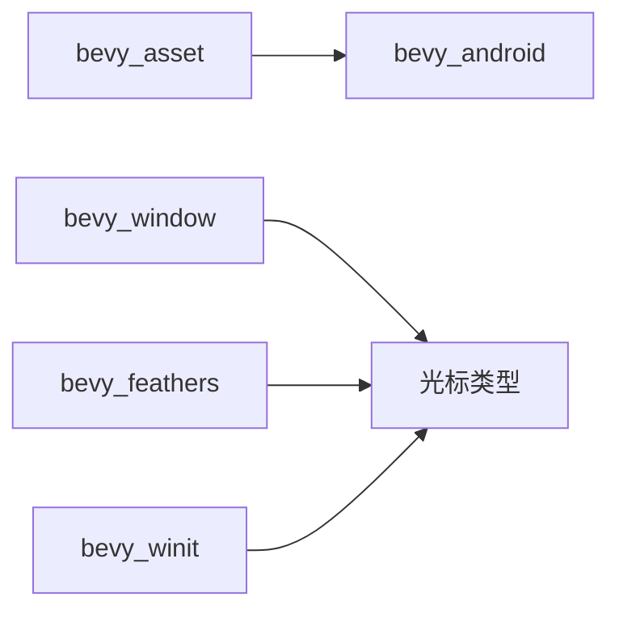
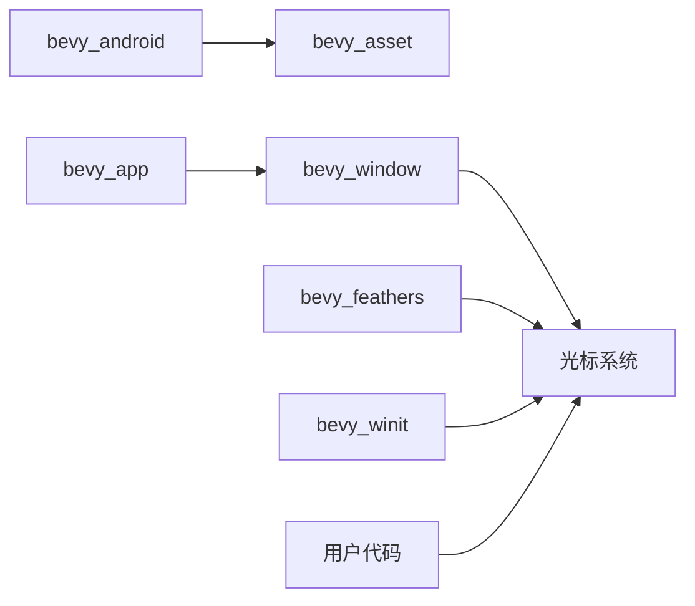

+++
title = "#20427 Untangle Cursor Dependencies"
date = "2025-08-05T00:00:00"
draft = false
template = "pull_request_page.html"
in_search_index = false

[extra]
current_language = "zh-cn"
available_languages = {"en" = { name = "English", url = "/pull_request/bevy/2025-08/pr-20427-en-20250805" }, "zh-cn" = { name = "中文", url = "/pull_request/bevy/2025-08/pr-20427-zh-cn-20250805" }}
+++

# 解耦光标依赖

## 基本信息
- **标题**: Untangle Cursor Dependencies
- **PR 链接**: https://github.com/bevyengine/bevy/pull/20427
- **作者**: cart
- **状态**: 已合并
- **标签**: A-Windowing, A-UI, C-Code-Quality, O-Android, S-Ready-For-Final-Review
- **创建时间**: 2025-08-05T07:00:59Z
- **合并时间**: 2025-08-05T19:59:36Z
- **合并人**: cart

## 描述翻译
### 目标
修复 #20182  
修复 #20381  
替代 #20384

### 解决方案
以上问题的根本原因是 `bevy_window` 包含了 `bevy_window::ANDROID_APP`，这阻止了它作为后端无关的窗口 API 运行。这迫使 `bevy_asset` 仅为了提供 Android 支持就依赖于 `bevy_window`，这是不必要的。这反过来又阻止了 `bevy_window` 拥有相关的 CursorIcon / CustomCursor 类型，因为它需要依赖于 `bevy_asset`，从而形成循环依赖。

解决方案是将 `ANDROID_APP` 移动到一个新的 `bevy_android` crate 中，然后 `bevy_asset` 可以依赖于该 crate。这允许"后端无关"的光标类型存在于 `bevy_window` 中，然后允许 `bevy_feathers` 移除其对 `bevy_winit` 的依赖。

在修改此代码时，我还选择使 `CustomCursor::Url` 在所有平台上可用。这取决于后端的实现（或不实现）。这也意味着用户不再需要知道神奇的 `#[cfg]` 块来使他们的代码在所有平台上编译。如果 `bevy_winit` 在不受支持的平台上使用，它目前会记录一个 `error_once`。

## 问题背景
在原始实现中，`bevy_window` 模块包含了一个 Android 特定的常量 `ANDROID_APP`。这导致 `bevy_asset` 为了提供 Android 支持而不得不依赖 `bevy_window`，即使这种依赖是不必要的。同时，这也阻止了 `bevy_window` 拥有光标图标类型（如 `CursorIcon` 和 `CustomCursor`），因为这会形成与 `bevy_asset` 的循环依赖。

具体来说：
1. `bevy_asset` 需要访问 `ANDROID_APP` 来提供 Android 资源加载
2. 但 `bevy_window` 需要定义光标类型，这些类型又可能依赖 `bevy_asset`（用于加载自定义光标图像）
3. 这形成了 `bevy_asset → bevy_window → bevy_asset` 的循环依赖

此外，`bevy_feathers` UI 库需要访问光标功能，但被迫依赖 `bevy_winit`（特定后端的实现），而不是更通用的 `bevy_window` 接口。

## 解决方案
### 核心思想
将平台特定代码（Android 支持）从通用窗口 API 中分离出来，使光标类型能够存在于通用层而不引起循环依赖。

### 关键步骤
1. **创建 `bevy_android` crate**：
   - 将 `ANDROID_APP` 移动到这个新 crate
   - 提供轻量级的 Android 特定功能

```rust
// crates/bevy_android/src/lib.rs
#[cfg(target_os = "android")]
pub static ANDROID_APP: std::sync::OnceLock<android_activity::AndroidApp> =
    std::sync::OnceLock::new();
```

2. **重构依赖关系**：
   - `bevy_asset` 改为依赖 `bevy_android` 而不是 `bevy_window`
   - `bevy_feathers` 移除对 `bevy_winit` 的依赖

```diff
// crates/bevy_asset/Cargo.toml
[target.'cfg(target_os = "android")'.dependencies]
-bevy_window = { path = "../bevy_window", version = "0.17.0-dev" }
+bevy_android = { path = "../bevy_android", version = "0.17.0-dev", default-features = false }
```

3. **移动光标类型**：
   - 将 `CursorIcon` 和 `CustomCursor` 从 `bevy_winit` 移动到 `bevy_window`
   - 使光标类型成为窗口系统的核心部分

```rust
// crates/bevy_window/src/cursor/mod.rs
pub enum CursorIcon {
    #[cfg(feature = "custom_cursor")]
    Custom(CustomCursor),
    System(SystemCursorIcon),
}
```

4. **改进跨平台支持**：
   - 使 `CustomCursor::Url` 在所有平台上可用
   - 在不支持的平台上记录错误而不是编译失败

```rust
// crates/bevy_window/src/cursor/custom_cursor.rs
pub struct CustomCursorUrl {
    pub url: String,
    pub hotspot: (u16, u16),
}
```

## 技术实现
### 依赖解耦
通过创建 `bevy_android` crate，解决了 `bevy_asset` 和 `bevy_window` 之间的循环依赖问题：



### 光标系统重构
将光标类型从 `bevy_winit` 移动到 `bevy_window`：

```diff
// 之前: bevy_winit 定义光标类型
bevy_winit::cursor::CursorIcon
bevy_winit::cursor::CustomCursor

// 之后: bevy_window 定义通用光标类型
bevy_window::CursorIcon
bevy_window::CustomCursor
```

### 平台特定处理
在 `bevy_winit` 中实现后端特定的光标处理：

```rust
// crates/bevy_winit/src/cursor/custom_cursor.rs
pub struct WinitCustomCursorCache(
    pub HashMap<CustomCursorCacheKey, winit::window::CustomCursor>
);

pub enum CustomCursorCacheKey {
    Image { /* ... */ },
    #[cfg(all(target_family = "wasm", target_os = "unknown"))]
    Url(String),
}
```

## 关键文件变更

### 1. `crates/bevy_winit/src/cursor/mod.rs` (+232/-0)
- **变更内容**：实现了 winit 后端的光标处理逻辑
- **关键代码**：
```rust
pub(crate) struct WinitCursorPlugin;

impl Plugin for WinitCursorPlugin {
    fn build(&self, app: &mut App) {
        app.add_systems(Last, update_cursors)
            .add_observer(on_remove_cursor_icon);
    }
}
```

### 2. `crates/bevy_window/src/cursor/mod.rs` (+0/-202 移动)
- **变更内容**：光标类型定义从 bevy_winit 移动到 bevy_window
- **关键代码**：
```rust
pub enum CursorIcon {
    #[cfg(feature = "custom_cursor")]
    Custom(CustomCursor),
    System(SystemCursorIcon),
}
```

### 3. `crates/bevy_android/LICENSE-APACHE` (+176/-0)
- **变更内容**：添加新 crate 的许可证文件
- **说明**：标准 Apache 2.0 许可证内容

### 4. `crates/bevy_winit/src/state.rs` (+4/-105)
- **变更内容**：简化状态管理，移除光标处理逻辑
- **关键变更**：
```diff
-// 移除的光标处理代码
-pub struct CustomCursorCache(...)
-pub enum CursorSource {...}
```

### 5. `crates/bevy_window/src/cursor/custom_cursor.rs` (+23/-81)
- **变更内容**：定义自定义光标数据结构
- **关键代码**：
```rust
pub struct CustomCursorImage {
    pub handle: Handle<Image>,
    pub texture_atlas: Option<TextureAtlas>,
    pub flip_x: bool,
    pub flip_y: bool,
    pub rect: Option<URect>,
    pub hotspot: (u16, u16),
}
```

## 影响与改进
1. **解决循环依赖**：
   - 打破 `bevy_asset` 和 `bevy_window` 之间的循环依赖
   - 允许 `bevy_window` 定义光标类型而不依赖 `bevy_asset`

2. **架构改进**：
   - 平台特定代码（Android）与通用窗口 API 分离
   - 光标系统现在位于更合理的抽象层（bevy_window）

3. **使用简化**：
   - `CustomCursor::Url` 现在在所有平台可用
   - 用户不再需要为不同平台编写条件编译代码

4. **性能优化**：
   - 自定义光标缓存机制保持不变
   - 减少不必要的依赖关系，可能改善编译时间

## 关系图


## 关键文件变更总结

### `crates/bevy_window/src/cursor/mod.rs`
```rust
// 新增文件
pub enum CursorIcon {
    #[cfg(feature = "custom_cursor")]
    Custom(CustomCursor),
    System(SystemCursorIcon),
}
```

### `crates/bevy_window/src/cursor/custom_cursor.rs`
```rust
// 新增文件
pub struct CustomCursorImage {
    pub handle: Handle<Image>,
    // ...其他字段
}

pub enum CustomCursor {
    Image(CustomCursorImage),
    Url(CustomCursorUrl),
}
```

### `crates/bevy_winit/src/cursor/custom_cursor.rs`
```rust
// 重构后的自定义光标缓存
pub struct WinitCustomCursorCache(
    pub HashMap<CustomCursorCacheKey, winit::window::CustomCursor>
);
```

## 进一步阅读
1. [Bevy 架构指南](https://github.com/bevyengine/bevy/blob/main/docs/plugins_guidelines.md)
2. [Rust 条件编译](https://doc.rust-lang.org/reference/conditional-compilation.html)
3. [Winit 光标文档](https://docs.rs/winit/latest/winit/window/struct.Window.html#method.set_cursor)

此 PR 通过合理的架构调整解决了循环依赖问题，使光标系统更加模块化并提高了跨平台一致性。