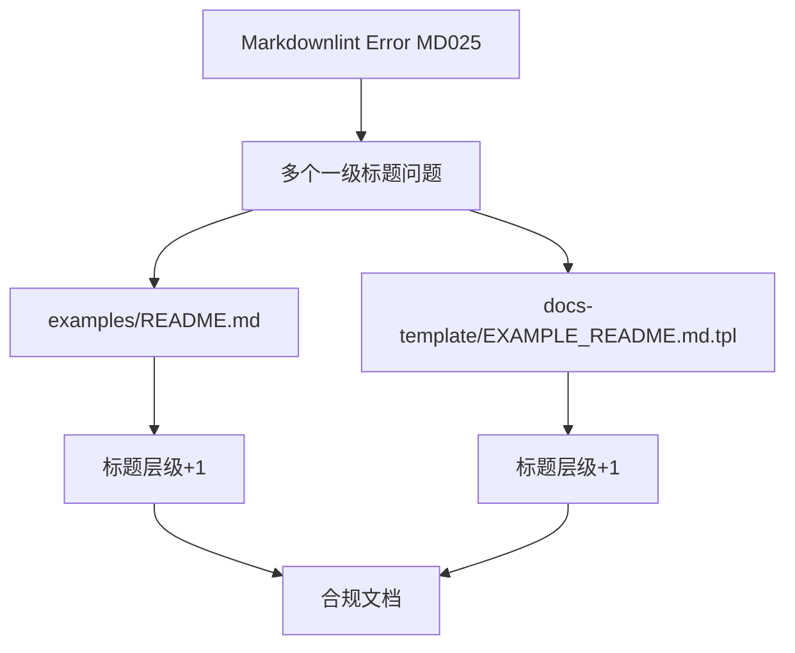

+++
title = "#20428 Fix examples REAMDE markdown"
date = "2025-08-05T00:00:00"
draft = false
template = "pull_request_page.html"
in_search_index = false

[extra]
current_language = "zh-cn"
available_languages = {"en" = { name = "English", url = "/pull_request/bevy/2025-08/pr-20428-en-20250805" }, "zh-cn" = { name = "中文", url = "/pull_request/bevy/2025-08/pr-20428-zh-cn-20250805" }}
labels = ["C-Docs", "D-Trivial", "C-Examples"]
+++

# PR 分析报告：Fix examples REAMDE markdown

## Basic Information
- **Title**: Fix examples REAMDE markdown
- **PR Link**: https://github.com/bevyengine/bevy/pull/20428
- **Author**: IceSentry
- **Status**: MERGED
- **Labels**: C-Docs, D-Trivial, C-Examples, S-Ready-For-Final-Review
- **Created**: 2025-08-05T15:28:34Z
- **Merged**: 2025-08-05T16:51:35Z
- **Merged By**: alice-i-cecile

## Description Translation
### 目标
- Markdownlint 不允许一个文件中有多个 h1 标题

### 解决方案
- 为所有标题增加一级缩进

### 测试
N/A

## The Story of This Pull Request

### 问题背景
Bevy 引擎的示例文档使用 Markdown 格式编写，并遵循 markdownlint 规范进行格式检查。其中 MD025 规则规定："Multiple top level headings in the same document" - 即单个 Markdown 文件只能包含一个一级标题（# Heading）。然而在 `examples/README.md` 和模板文件 `docs-template/EXAMPLE_README.md.tpl` 中，存在多个一级标题结构：

```markdown
# The Bare Minimum
## Hello, World!

# Cross-Platform Examples
## 2D Rendering

# Tests

# Platform-Specific Examples
## Android
```

这种结构违反了 markdownlint 的 MD025 规则，导致 CI 检查失败。虽然不影响文档功能，但会破坏自动化检查流程，且可能导致某些 Markdown 解析器渲染异常。

### 解决方案
通过系统性地增加标题层级来解决：
1. 所有一级标题 (#) → 二级标题 (##)
2. 所有二级标题 (##) → 三级标题 (###)
3. 所有三级标题 (###) → 四级标题 (####)

这种转换保持了文档的原始结构和可读性，同时完全符合 markdownlint 规范。例如：

```diff
- # The Bare Minimum
+ ## The Bare Minimum

- ## Hello, World!
+ ### Hello, World!

- # Cross-Platform Examples
+ ## Cross-Platform Examples
```

### 实现细节
修改集中在两个关键文件：
1. **文档模板** (`docs-template/EXAMPLE_README.md.tpl`): 
   确保自动生成的文档遵循新规范
2. **示例文档** (`examples/README.md`): 
   直接应用修正到现有文档

所有标题层级调整都保持严格一致性：
- 原 `# Section` → `## Section`
- 原 `### Subsection` → `#### Subsection`
- 原 `#### Note` → `##### Note`

特别处理了代码块内的注释标记，将单 `#` 改为双 `##` 以避免被误解析为标题：
```diff
- # cargo install basic-http-server
+ ## cargo install basic-http-server
```

### 技术考量
1. **兼容性优先**：严格保持原有文档结构和内容，仅修改标题层级
2. **自动化友好**：确保模板文件修改后生成的文档仍然合规
3. **最小变更**：仅修改标题标记，不调整内容或格式
4. **可扩展性**：新层级结构为未来内容扩展保留空间

### 影响分析
1. **立即解决**：永久修复 markdownlint 的 MD025 错误
2. **维护成本**：零额外维护成本，标题结构现在完全合规
3. **用户体验**：文档渲染效果保持不变，层级关系更清晰
4. **生态系统**：保持 Bevy 文档工具链的完整性

## Visual Representation



## Key Files Changed

### 1. `docs-template/EXAMPLE_README.md.tpl`
**修改说明**：调整自动生成文档的标题层级结构，确保符合 markdownlint 规范

```diff
# Before:
# The Bare Minimum
## Hello, World!

# Cross-Platform Examples
## {{ category }}

# Tests

# Platform-Specific Examples
## Android
### Setup

# After:
## The Bare Minimum
### Hello, World!

## Cross-Platform Examples
### {{ category }}

## Tests

## Platform-Specific Examples
### Android
#### Setup
```

### 2. `examples/README.md`
**修改说明**：同步修改示例文档的标题层级，保持与模板一致

```diff
# Before:
# The Bare Minimum
## Hello, World!

# Cross-Platform Examples
## 2D Rendering

# Tests

# Platform-Specific Examples
## Android
### Setup

# After:
## The Bare Minimum
### Hello, World!

## Cross-Platform Examples
### 2D Rendering

## Tests

## Platform-Specific Examples
### Android
#### Setup
```

## Further Reading
1. [Markdownlint Rules Documentation](https://github.com/DavidAnson/markdownlint/blob/main/doc/Rules.md#md025)
2. [Bevy Documentation Guidelines](https://github.com/bevyengine/bevy/blob/main/docs/CODING_GUIDELINES.md)
3. [Semantic Headings in Technical Docs](https://diataxis.fr/headings/)