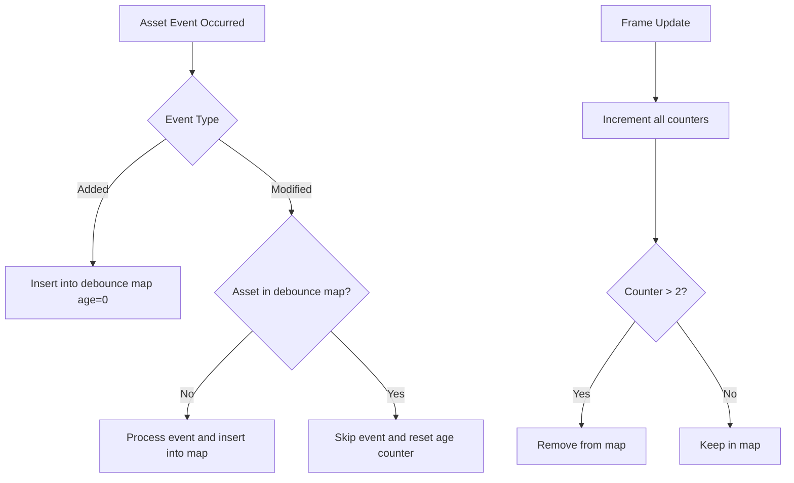

+++
title = "#20430 debounce asset events for scene reloading"
date = "2025-08-14T00:00:00"
draft = false
template = "pull_request_page.html"
in_search_index = true

[taxonomies]
list_display = ["show"]

[extra]
current_language = "en"
available_languages = {"en" = { name = "English", url = "/pull_request/bevy/2025-08/pr-20430-en-20250814" }, "zh-cn" = { name = "中文", url = "/pull_request/bevy/2025-08/pr-20430-zh-cn-20250814" }}
labels = ["C-Bug", "A-Assets", "A-Scenes", "X-Contentious"]
+++

## debounce asset events for scene reloading

### Basic Information
- **Title**: debounce asset events for scene reloading
- **PR Link**: https://github.com/bevyengine/bevy/pull/20430
- **Author**: mockersf
- **Status**: MERGED
- **Labels**: C-Bug, A-Assets, S-Ready-For-Final-Review, A-Scenes, X-Contentious
- **Created**: 2025-08-05T18:51:25Z
- **Merged**: 2025-08-14T20:34:40Z
- **Merged By**: mockersf

### Description Translation
# Objective

- examples `many_foxes` and `morph_targets` have stopped working since #18358
- any case that load several parts of a complex asset and a scene, and do setup on asset load will fail
- Fixes #20383

## Solution

- Debounce scene asset events so that we ignore modified event happening too quickly after each others

## Testing

- run examples `many_foxes` or `morph_targets`

## Alternative

I *don't* think this is a good long term fix, but this should be fixed in the 0.17 and I think alternatives are worse / too complex.

Alternatives are:
- Revert #18358. Normal scene loading is more important than hot reloading
- Implement partial asset loading in the asset server and the gltf loader so that when we load `file.gltf#Animation0`, only the animation data is loaded. This would be a very good change, but too big to do for the 0.17
- Have the asset server load parent assets only once, even when loading subassets. This would be a good change and less complex, but I think worse than the previous idea and  kinda not compatible with it

### The Story of This Pull Request

This PR addresses a regression in Bevy's asset handling system that broke several examples and real-world use cases after the introduction of hot-reloading in PR #18358. The core issue (#20383) manifested when loading complex assets like GLTF files containing multiple subassets (meshes, animations, textures). Each subasset load would trigger a separate `Modified` event for the parent scene asset, causing the scene to be unloaded and reloaded multiple times in quick succession. This behavior was particularly problematic for scenes with initial setup logic, as repeated reloads would reset entity transforms and other state.

The solution implements an event debouncing mechanism for scene assets. Rather than immediately processing every `Modified` event, the system now tracks event timestamps and ignores events occurring within a short time window (2 frames) of each other. This approach prevents multiple rapid-fire events from triggering repeated scene reloads while still allowing legitimate asset modifications to propagate.

Two new fields were added to the `SceneSpawner` struct to implement this debouncing logic:
```rust
// Before:
pub struct SceneSpawner {
    scene_asset_event_reader: EventCursor<AssetEvent<Scene>>,
    dynamic_scene_asset_event_reader: EventCursor<AssetEvent<DynamicScene>>,
    // ... other fields
}

// After:
pub struct SceneSpawner {
    // ... existing fields
    debounced_scene_asset_events: HashMap<AssetId<Scene>, u32>,
    debounced_dynamic_scene_asset_events: HashMap<AssetId<DynamicScene>, u32>,
    // ... other fields
}
```

The asset event processing logic was modified to incorporate the debouncing check. For `Modified` events, the system now verifies whether the asset ID is new to the debounce map before processing:
```rust
match event {
    AssetEvent::Added { id } => {
        scene_spawner.debounced_scene_asset_events.insert(*id, 0);
    }
    AssetEvent::Modified { id } => {
        if scene_spawner
            .debounced_scene_asset_events
            .insert(*id, 0)
            .is_none()
            && scene_spawner.spawned_scenes.contains_key(id)
        {
            updated_spawned_scenes.push(*id);
        }
    }
    _ => {}
}
```

A periodic cleanup mechanism increments counters each frame and removes stale entries after they exceed the threshold:
```rust
const SCENE_ASSET_AGE_THRESHOLD: u32 = 2;
for asset_id in scene_spawner.debounced_scene_asset_events.clone().keys() {
    let age = scene_spawner
        .debounced_scene_asset_events
        .get(asset_id)
        .unwrap();
    if *age > SCENE_ASSET_AGE_THRESHOLD {
        scene_spawner.debounced_scene_asset_events.remove(asset_id);
    } else {
        scene_spawner
            .debounced_scene_asset_events
            .insert(*asset_id, *age + 1);
    }
}
```

The implementation required adjustments to test cases, as multiple frame updates are now needed to clear the debounce buffer. Tests were updated with explicit frame advancement calls:
```rust
// Added to tests in lib.rs
app.update();
app.update();
app.update();
```

This solution is explicitly marked as a temporary fix in code comments. The long-term solution involves implementing partial asset loading where subassets like `file.gltf#Animation0` would load only required data without affecting the parent asset. However, this approach was deemed too complex for immediate implementation in the 0.17 release cycle.

### Visual Representation



### Key Files Changed

1. **crates/bevy_scene/src/scene_spawner.rs**  
   Added debounce logic for scene asset events:
   ```rust
   // New struct fields
   debounced_scene_asset_events: HashMap<AssetId<Scene>, u32>,
   debounced_dynamic_scene_asset_events: HashMap<AssetId<DynamicScene>, u32>,
   
   // Modified event handling
   match event {
       AssetEvent::Added { id } => {
           scene_spawner.debounced_scene_asset_events.insert(*id, 0);
       }
       AssetEvent::Modified { id } => {
           if scene_spawner
               .debounced_scene_asset_events
               .insert(*id, 0)
               .is_none()
               && scene_spawner.spawned_scenes.contains_key(id)
           {
               updated_spawned_scenes.push(*id);
           }
       }
       _ => {}
   }
   
   // Periodic cleanup
   const SCENE_ASSET_AGE_THRESHOLD: u32 = 2;
   for asset_id in scene_spawner.debounced_scene_asset_events.clone().keys() {
       // Age checking and removal logic
   }
   ```

2. **crates/bevy_scene/src/lib.rs**  
   Updated tests to account for debounce timing:
   ```rust
   // Before:
   app.update();
   
   // After:
   app.update();
   app.update();
   app.update();
   app.update();
   ```

### Further Reading
1. [Original Issue #20383](https://github.com/bevyengine/bevy/issues/20383) - Detailed bug report
2. [PR #18358](https://github.com/bevyengine/bevy/pull/18358) - Hot-reloading changes that introduced the regression
3. [Asset System Documentation](https://bevyengine.org/learn/book/features/assets/) - Bevy's asset handling fundamentals
4. [Event Handling Patterns](https://github.com/bevyengine/bevy/discussions/2543) - Discussion of event processing in ECS architectures