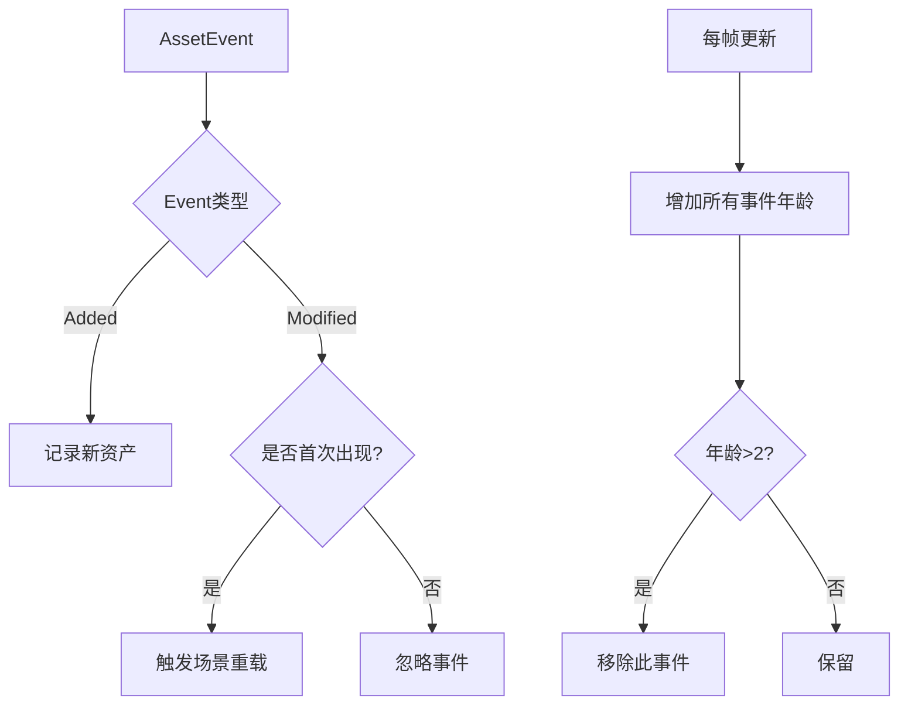

+++
title = "#20430 debounce asset events for scene reloading"
date = "2025-08-14T00:00:00"
draft = false
template = "pull_request_page.html"
in_search_index = false

[extra]
current_language = "zh-cn"
available_languages = {"en" = { name = "English", url = "/pull_request/bevy/2025-08/pr-20430-en-20250814" }, "zh-cn" = { name = "中文", url = "/pull_request/bevy/2025-08/pr-20430-zh-cn-20250814" }}
+++

## debounce asset events for scene reloading

### 基本信息
- **标题**: debounce asset events for scene reloading
- **PR链接**: https://github.com/bevyengine/bevy/pull/20430
- **作者**: mockersf
- **状态**: 已合并
- **标签**: C-Bug, A-Assets, S-Ready-For-Final-Review, A-Scenes, X-Contentious
- **创建时间**: 2025-08-05T18:51:25Z
- **合并时间**: 2025-08-14T20:34:40Z
- **合并人**: mockersf

### 描述翻译
#### 目标(Objective)
- 自#18358后，示例`many_foxes`和`morph_targets`停止工作
- 任何加载复杂资产多个部分和场景，并在资产加载时进行设置的情况都会失败
- 修复#20383

#### 解决方案(Solution)
- 对场景资产事件进行防抖处理，忽略短时间内连续发生的修改事件

#### 测试(Testing)
- 运行示例`many_foxes`或`morph_targets`

#### 替代方案(Alternative)
我不认为这是好的长期方案，但应在0.17版本修复，且其他方案更差/更复杂。

替代方案：
- 回退#18358。正常场景加载比热重载更重要
- 在资产服务器和gltf加载器中实现部分资产加载，例如加载`file.gltf#Animation0`时只加载动画数据。这是很好的改进，但对0.17版本来说改动太大
- 让资产服务器只加载父资产一次，即使加载子资产时也如此。这是较好的改进且较简单，但不如前一个方案好，且与之不兼容

---

## PR技术分析

### 问题背景
在#18358引入资产热重载后，复杂资产（如GLTF）加载时出现严重问题。当加载包含多个子资产（网格、动画等）的复合资产时，每个子资产加载都会触发父资产的`Modified`事件。这导致场景被多次卸载和重新加载，丢失初始设置。具体表现：
1. `many_foxes`和`morph_targets`示例无法运行
2. 任何加载复合资产后执行初始化逻辑的用例都会失败
3. 根本原因是事件风暴：单个资产加载触发多次`Modified`事件

### 解决方案
采用防抖机制(debounce)过滤高频资产事件：
1. 为每个资产事件添加"年龄"计数器
2. 仅处理超过阈值时间(2帧)的`Modified`事件
3. 忽略短时间内连续发生的重复事件

工程决策考虑：
- 短期方案：快速修复关键问题，确保0.17版本稳定
- 权衡取舍：引入2帧延迟换取系统稳定性
- 替代方案评估：
  - 回退热重载功能：不可取，会丢失重要功能
  - 实现部分加载：架构级改动，超出当前版本范围
  - 单次父资产加载：方案不完整，与部分加载冲突

### 实现细节
核心修改在`SceneSpawner`结构中添加防抖跟踪机制：

```rust
// crates/bevy_scene/src/scene_spawner.rs
pub struct SceneSpawner {
    // ...
    // 新增防抖映射表
    debounced_scene_asset_events: HashMap<AssetId<Scene>, u32>,
    debounced_dynamic_scene_asset_events: HashMap<AssetId<DynamicScene>, u32>,
}
```

事件处理逻辑重构：
```rust
match event {
    AssetEvent::Added { id } => {
        // 新事件加入跟踪
        scene_spawner.debounced_scene_asset_events.insert(*id, 0);
    }
    AssetEvent::Modified { id } => {
        // 仅处理首次出现的Modified事件
        if scene_spawner
            .debounced_scene_asset_events
            .insert(*id, 0)
            .is_none()
            && scene_spawner.spawned_scenes.contains_key(id)
        {
            updated_spawned_scenes.push(*id);
        }
    }
    _ => {}
}
```

防抖状态更新机制：
```rust
const SCENE_ASSET_AGE_THRESHOLD: u32 = 2;

// 每帧更新所有跟踪事件的年龄
for asset_id in scene_spawner.debounced_scene_asset_events.clone().keys() {
    let age = scene_spawner.debounced_scene_asset_events.get(asset_id).unwrap();
    if *age > SCENE_ASSET_AGE_THRESHOLD {
        // 超时移除
        scene_spawner.debounced_scene_asset_events.remove(asset_id);
    } else {
        // 未超时则增加年龄
        scene_spawner.debounced_scene_asset_events.insert(*asset_id, *age + 1);
    }
}
```

### 技术要点
1. **防抖阈值选择**：2帧平衡了响应性和稳定性
   - 足够长：覆盖典型子资产加载间隔
   - 足够短：不影响真实修改的检测
2. **事件状态机**：
   - `Added` → 开始跟踪(age=0)
   - `Modified` → 仅当首次出现时处理
   - 持续更新 → 直到超时移除
3. **测试适配**：
   ```rust
   // crates/bevy_scene/src/lib.rs
   app.update();
   // 新增多次update跳过防抖期
   app.update();
   app.update();
   app.update();
   ```

### 影响评估
1. **问题修复**：
   - 恢复`many_foxes`/`morph_targets`功能
   - 解决#20383资产初始化丢失问题
2. **系统影响**：
   - 场景重载延迟增加2帧
   - 内存开销：新增两个HashMap跟踪状态
3. **维护提示**：
   - 明确标记为临时方案(TODO注释)
   - 保留完整事件处理路径供未来优化

### 架构示意


## 关键文件变更

### crates/bevy_scene/src/scene_spawner.rs
**变更原因**：实现资产事件防抖机制  
**核心修改**：
```rust
// 新增防抖跟踪字段
pub struct SceneSpawner {
    // ...
    debounced_scene_asset_events: HashMap<AssetId<Scene>, u32>,
    debounced_dynamic_scene_asset_events: HashMap<AssetId<DynamicScene>, u32>,
}

// 事件处理逻辑重构
match event {
    AssetEvent::Added { id } => {
        scene_spawner.debounced_scene_asset_events.insert(*id, 0);
    }
    AssetEvent::Modified { id } => {
        if scene_spawner.debounced_scene_asset_events.insert(*id, 0).is_none()
            && scene_spawner.spawned_scenes.contains_key(id)
        {
            updated_spawned_scenes.push(*id);
        }
    }
    _ => {}
}

// 防抖状态更新
const SCENE_ASSET_AGE_THRESHOLD: u32 = 2;
for asset_id in scene_spawner.debounced_scene_asset_events.clone().keys() {
    let age = scene_spawner.debounced_scene_asset_events.get(asset_id).unwrap();
    if *age > SCENE_ASSET_AGE_THRESHOLD {
        scene_spawner.debounced_scene_asset_events.remove(asset_id);
    } else {
        scene_spawner.debounced_scene_asset_events.insert(*asset_id, *age + 1);
    }
}
```

### crates/bevy_scene/src/lib.rs
**变更原因**：适配测试中的防抖机制  
**核心修改**：
```rust
app.update();
// 新增多次update调用跳过防抖期
app.update();
app.update();
app.update();
```

## 延伸阅读
1. [Bevy资产系统文档](https://bevyengine.org/learn/book/assets/)
2. 防抖模式在GUI系统的应用：[debounce vs throttle](https://css-tricks.com/debouncing-throttling-explained-examples/)
3. [ECS架构中的事件处理模式](https://github.com/SanderMertens/ecs-faq#how-do-i-handle-events)