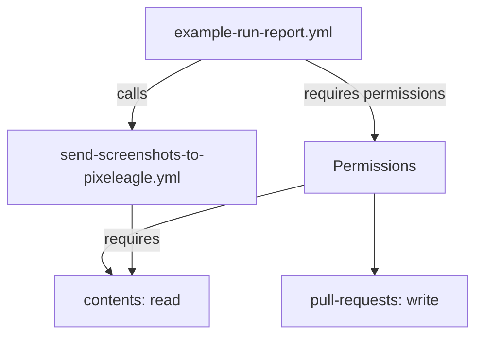

+++
title = "#20431 try to fix GitHub Actions permissions"
date = "2025-08-09T00:00:00"
draft = false
template = "pull_request_page.html"
in_search_index = true

[taxonomies]
list_display = ["show"]

[extra]
current_language = "en"
available_languages = {"en" = { name = "English", url = "/pull_request/bevy/2025-08/pr-20431-en-20250809" }, "zh-cn" = { name = "中文", url = "/pull_request/bevy/2025-08/pr-20431-zh-cn-20250809" }}
labels = ["C-Bug", "D-Trivial", "A-Build-System"]
+++

# PR Analysis: try to fix GitHub Actions permissions

## Basic Information
- **Title**: try to fix GitHub Actions permissions
- **PR Link**: https://github.com/bevyengine/bevy/pull/20431
- **Author**: mockersf
- **Status**: MERGED
- **Labels**: C-Bug, D-Trivial, A-Build-System, S-Ready-For-Final-Review
- **Created**: 2025-08-05T20:55:09Z
- **Merged**: 2025-08-09T01:23:56Z
- **Merged By**: james7132

## Description Translation
# Objective

- since #20416 GitHub Actions complains that:
```
Invalid workflow file
The workflow is not valid. .github/workflows/example-run-report.yml (Line: 71, Col: 3): Error calling workflow 'bevyengine/bevy/.github/workflows/send-screenshots-to-pixeleagle.yml@caafa03d21b722d79b9537b70e647fef32df37a5'. The workflow is requesting 'contents: read', but is only allowed 'contents: none'.
```

## Solution

- I couldn't find it in the documentation, but I suppose that permissions are inherited through workflow calls so I'm adding the permission to the parent workflow

🤞 

## The Story of This Pull Request

### The Problem and Context
After merging PR #20416, our GitHub Actions CI pipeline started failing with a permissions error when the `example-run-report.yml` workflow attempted to call the `send-screenshots-to-pixeleagle.yml` workflow. The error specifically indicated that the called workflow required `contents: read` permissions, but the parent workflow only had `contents: none` granted. This was blocking our CI pipeline from functioning correctly.

GitHub Actions permissions operate on a least-privilege model. When workflows call other workflows, permissions aren't automatically inherited - the calling workflow must explicitly grant the necessary permissions. The error occurred because the parent workflow lacked sufficient permissions for its child workflow to execute properly.

### The Solution Approach
After investigating GitHub's documentation on workflow permissions inheritance (which proved insufficiently clear), the developer hypothesized that adding the missing `contents: read` permission to the parent workflow would resolve the issue. This approach followed the principle that called workflows inherit their permissions context from their parent workflows. The solution was intentionally minimal - adding only the specifically required permission rather than broader access.

### The Implementation
The fix involved a single-line modification to the permissions section of the parent workflow configuration file. By adding `contents: "read"` to the permissions block, we explicitly granted the necessary access for the child workflow to execute:

```yaml
permissions:
  pull-requests: "write"
  contents: "read"  # Added permission
```

This change ensured that when `example-run-report.yml` called `send-screenshots-to-pixeleagle.yml`, the child workflow would have the required repository contents read access. The implementation maintained the principle of least privilege by only adding the specifically required permission.

### Technical Insights
Key technical considerations:
1. **Permission Inheritance**: When workflows call other workflows in GitHub Actions, permissions aren't automatically propagated. The calling workflow must explicitly declare all permissions required by itself and any workflows it calls.
2. **Principle of Least Privilege**: The solution adds only the minimal required permission (`contents: read`) rather than broader access like `contents: write`.
3. **Workflow Dependencies**: This fix highlights how workflow dependencies can create implicit permission requirements that must be satisfied in parent workflows.

### The Impact
This change:
1. Resolved immediate CI failures caused by insufficient permissions
2. Restored full functionality to our automated screenshot reporting system
3. Maintained security by adding only the minimally required permission
4. Provided a clear example of how to handle permission inheritance in complex workflow chains

The solution demonstrates the importance of understanding permission propagation in CI/CD systems and how to troubleshoot permissions errors in workflow dependencies.

## Visual Representation



## Key Files Changed

### .github/workflows/example-run-report.yml
**Change Description**: Added the missing `contents: read` permission to resolve workflow call permission errors.

**Code Snippet**:
```yaml
# Before:
permissions:
  pull-requests: "write"

# After:
permissions:
  pull-requests: "write"
  contents: "read"
```

**Relationship to PR**: This is the core change that fixes the permission inheritance issue by granting the necessary repository read access to the workflow and its children.

## Further Reading
- [GitHub Actions: Workflow syntax for permissions](https://docs.github.com/en/actions/using-workflows/workflow-syntax-for-github-actions#permissions)
- [GitHub Actions: Reusing workflows](https://docs.github.com/en/actions/using-workflows/reusing-workflows)
- [GitHub Actions: Authentication in a workflow](https://docs.github.com/en/actions/security-guides/automatic-token-authentication)

## Full Code Diff
```diff
diff --git a/.github/workflows/example-run-report.yml b/.github/workflows/example-run-report.yml
index 1382dddb7490a..fbde12411fc57 100644
--- a/.github/workflows/example-run-report.yml
+++ b/.github/workflows/example-run-report.yml
@@ -6,6 +6,7 @@ name: Example Run - PR Comments
 # Also requesting write permissions on PR to be able to comment
 permissions:
   pull-requests: "write"
+  contents: "read"
 
 on:
   workflow_run:
```