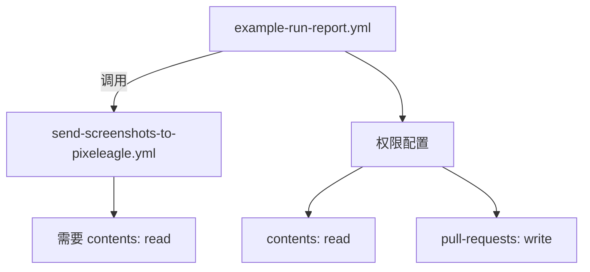

+++
title = "#20431 try to fix GitHub Actions permissions"
date = "2025-08-09T00:00:00"
draft = false
template = "pull_request_page.html"
in_search_index = false

[extra]
current_language = "zh-cn"
available_languages = {"en" = { name = "English", url = "/pull_request/bevy/2025-08/pr-20431-en-20250809" }, "zh-cn" = { name = "中文", url = "/pull_request/bevy/2025-08/pr-20431-zh-cn-20250809" }}
+++

# Pull Request 分析报告：修复 GitHub Actions 权限问题

## 基本信息
- **标题**: try to fix GitHub Actions permissions
- **PR 链接**: https://github.com/bevyengine/bevy/pull/20431
- **作者**: mockersf
- **状态**: 已合并
- **标签**: C-Bug, D-Trivial, A-Build-System, S-Ready-For-Final-Review
- **创建时间**: 2025-08-05T20:55:09Z
- **合并时间**: 2025-08-09T01:23:56Z
- **合并者**: james7132

## 问题描述翻译
### 目标 (Objective)
- 自从 #20416 后，GitHub Actions 报错如下：
```
Invalid workflow file
The workflow is not valid. .github/workflows/example-run-report.yml (Line: 71, Col: 3): Error calling workflow 'bevyengine/bevy/.github/workflows/send-screenshots-to-pixeleagle.yml@caafa03d21b722d79b9537b70e647fef32df37a5'. The workflow is requesting 'contents: read', but is only allowed 'contents: none'.
```

### 解决方案 (Solution)
- 我在文档中未找到明确说明，但推测权限会通过工作流调用继承，因此我在父工作流中添加了相应权限

🤞 

## 技术分析

### 问题背景
在 PR #20416 合并后，CI 流水线开始出现权限错误。具体表现为当 `example-run-report.yml` 工作流调用 `send-screenshots-to-pixeleagle.yml` 子工作流时，系统拒绝访问。错误信息明确指出子工作流需要 `contents: read` 权限，但父工作流仅配置了 `contents: none`。这导致 CI 流程中断，影响自动化测试和报告生成。

### 解决方案选择
作者基于对 GitHub Actions 权限继承机制的理解（尽管官方文档未明确说明），决定在父工作流中显式添加缺失的权限。这种方法：
1. 符合最小权限原则，仅添加必要的 `read` 权限
2. 避免过度授权，保持 `write` 权限仅用于 PR 评论
3. 无需修改子工作流，减少影响范围

### 具体实现
关键修改在 `.github/workflows/example-run-report.yml` 文件中。在现有的 `pull-requests: "write"` 权限下新增一行 `contents: "read"` 配置：

```yaml
permissions:
  pull-requests: "write"
  contents: "read"
```

此修改满足子工作流对仓库内容的读取权限需求，同时保持父工作流原有的 PR 评论写入权限不变。权限配置位置选择在工作流开头，确保后续所有 job 和 step 都能继承该权限设置。

### 技术验证
该解决方案基于以下技术判断：
1. GitHub Actions 的权限模型具有继承性
2. 子工作流 (`send-screenshots-to-pixeleagle.yml`) 需要读取仓库内容
3. 父工作流必须显式声明所需权限，即使自己不直接使用

### 影响评估
此修复：
1. 解决 CI 流水线的阻塞错误
2. 恢复自动化截图报告功能
3. 保持权限配置的清晰度和可维护性
4. 为类似权限继承问题提供解决参考

## 工作流关系图


## 关键文件变更

### `.github/workflows/example-run-report.yml`
**变更原因**：添加缺失权限以修复工作流调用错误

**变更前**：
```yaml
permissions:
  pull-requests: "write"
```

**变更后**：
```yaml
permissions:
  pull-requests: "write"
  contents: "read"  # 新增权限配置
```

**技术说明**：  
在权限区块添加 `contents: "read"` 声明，使父工作流能正确传递所需权限给子工作流。位置选择在 workflow 开头确保全局生效。

## 完整代码差异
```diff
diff --git a/.github/workflows/example-run-report.yml b/.github/workflows/example-run-report.yml
index 1382dddb7490a..fbde12411fc57 100644
--- a/.github/workflows/example-run-report.yml
+++ b/.github/workflows/example-run-report.yml
@@ -6,6 +6,7 @@ name: Example Run - PR Comments
 # Also requesting write permissions on PR to be able to comment
 permissions:
   pull-requests: "write"
+  contents: "read"
 
 on:
   workflow_run:
```

## 延伸阅读
1. [GitHub Actions 权限文档](https://docs.github.com/en/actions/using-workflows/workflow-syntax-for-github-actions#permissions)
2. [工作流调用最佳实践](https://docs.github.com/en/actions/using-workflows/reusing-workflows)
3. [最小权限原则实施指南](https://security.googleblog.com/2022/06/guidelines-for-building-safer-workflows.html)