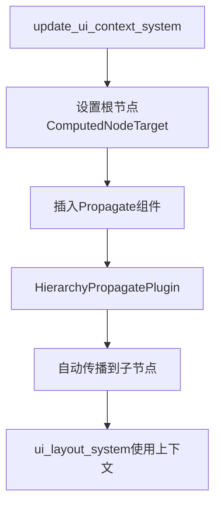

+++
title = "#20432 Use the hierarchy plugin to propagate `ComputedNodeContext"
date = "2025-08-06T00:00:00"
draft = false
template = "pull_request_page.html"
in_search_index = false

[extra]
current_language = "zh-cn"
available_languages = {"en" = { name = "English", url = "/pull_request/bevy/2025-08/pr-20432-en-20250806" }, "zh-cn" = { name = "中文", url = "/pull_request/bevy/2025-08/pr-20432-zh-cn-20250806" }}
+++

# 分析报告：PR #20432 - 使用层级插件传播 ComputedNodeContext

## 基础信息
- **标题**: Use the hierarchy plugin to propagate `ComputedNodeContext`
- **PR链接**: https://github.com/bevyengine/bevy/pull/20432
- **作者**: ickshonpe
- **状态**: MERGED
- **标签**: C-Bug, A-Rendering, A-UI, S-Ready-For-Final-Review, D-Straightforward
- **创建时间**: 2025-08-05T21:01:53Z
- **合并时间**: 2025-08-06T17:40:09Z
- **合并者**: alice-i-cecile

## 问题描述与背景
在UI渲染流程中存在一个关键问题：当实体作为UI节点的子项生成时（初始不带`Node`组件），然后在后续帧添加`Node`组件，子节点不会正确渲染。问题重现代码如下：

```rust
use bevy::{diagnostic::FrameCount, prelude::*};

fn main() {
    App::new()
    .add_plugins(DefaultPlugins)
    .add_systems(Startup, setup)
    .add_systems(Update, insert_text.run_if(resource_equals(FrameCount(1))))
    .run();
}

fn setup(mut commands: Commands) {
    commands.spawn((Node::default(), children![Text::new("Gamer"), Marker]));
    commands.spawn(Camera3d::default());
}

fn insert_text(entity: Single<Entity, With<Marker>>, mut commands: Commands) {
    commands.entity(*entity).insert(Text::new("remaG"));
}

#[derive(Component)]
struct Marker;
```

根本原因是`ComputedNodeContext`（后更名为`ComputedNodeTarget`）未及时更新。UI提取系统依赖此上下文定位渲染目标，当组件延迟添加时，上下文传播失败导致渲染缺失。该问题影响所有需要继承渲染上下文的UI元素，包括文本和基础节点。

## 解决方案
### 技术实现
核心方案是用`HierarchyPropagatePlugin`替换手动递归传播逻辑：
1. **移除自定义传播系统**：删除原递归更新函数`update_contexts_recursively`
2. **利用现有插件**：通过`HierarchyPropagatePlugin<ComputedNodeTarget>`自动处理组件传播
3. **简化上下文更新**：只需在根节点设置`ComputedNodeTarget`，插件自动传播到子节点

### 关键代码变更
**crates/bevy_ui/src/update.rs**
```rust
// 更新前：手动递归传播
fn update_contexts_recursively(...) {
    // 复杂的手动遍历逻辑
}

// 更新后：利用插件自动传播
commands
    .entity(root_entity)
    .insert(Propagate(ComputedNodeTarget {
        camera,
        scale_factor,
        physical_size,
    }));
```

**crates/bevy_ui/src/lib.rs**
```rust
// 注册层级传播插件
.add_plugins(HierarchyPropagatePlugin::<ComputedNodeTarget>::new(PostUpdate))

// 添加传播系统集
.configure_sets(
    PostUpdate,
    PropagateSet::<ComputedNodeTarget>::default().in_set(UiSystems::Propagate),
)
```

## 技术洞察
### 层级传播机制优势
1. **数据一致性**：通过ECS关系自动维护父子组件同步
2. **性能优化**：避免每帧全树遍历，仅处理变更分支
3. **错误减少**：消除手动递归可能遗漏的边界情况

### 测试调整
所有UI测试重构成使用`App`测试框架：
```rust
// 更新前：直接操作World
let (mut world, mut ui_schedule) = setup_ui_test_world();
ui_schedule.run(&mut world);

// 更新后：通过App管理完整生命周期
let mut app = setup_ui_test_app();
app.update();
```

## 影响分析
1. **问题修复**：动态添加的UI组件现在能正确继承渲染上下文
2. **架构优化**：UI系统与ECS层级系统解耦，减少自定义逻辑
3. **性能提升**：传播过程现在受益于Bevy的变更检测优化

## 关键文件变更
### crates/bevy_ui/src/update.rs (+57/-77)
**变更原因**：用层级插件替代手动递归传播  
**关键修改**：
```rust
// 移除：
- fn update_contexts_recursively(...)
- reparented_nodes查询

// 添加：
+ mut commands: Commands
+ commands.entity(root_entity).insert(Propagate(...))
```

### crates/bevy_ui/src/lib.rs (+11/-1)
**变更原因**：集成层级传播插件到UI系统  
**关键修改**：
```rust
// 添加新系统集：
pub enum UiSystems {
    ...
    Propagate, // 新增传播阶段
}

// 注册插件：
.add_plugins(HierarchyPropagatePlugin::<ComputedNodeTarget>::new(PostUpdate))
```

### crates/bevy_ui/src/layout/mod.rs (+165/-105)
**变更原因**：重构测试适配新架构  
**关键修改**：
```rust
// 测试脚手架重构：
fn setup_ui_test_app() -> App {
    app.add_plugins(HierarchyPropagatePlugin::<ComputedNodeTarget>::new(PostUpdate))
    // ...其他初始化
}
```

## 组件关系图


## 延伸阅读
1. [Bevy层级系统文档](https://bevyengine.org/learn/book/next/features/hierarchy/)
2. [组件传播机制源码](https://github.com/bevyengine/bevy/blob/main/crates/bevy_hierarchy/src/propagate.rs)
3. [ECS变更检测原理](https://bevyengine.org/learn/book/next/advanced/change-detection/)