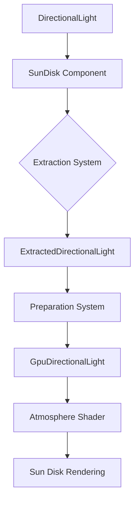

+++
title = "#20434 Add bevy_light::SunDisk"
date = "2025-08-16T00:00:00"
draft = false
template = "pull_request_page.html"
in_search_index = true

[taxonomies]
list_display = ["show"]

[extra]
current_language = "en"
available_languages = {"en" = { name = "English", url = "/pull_request/bevy/2025-08/pr-20434-en-20250816" }, "zh-cn" = { name = "中文", url = "/pull_request/bevy/2025-08/pr-20434-zh-cn-20250816" }}
labels = ["A-Rendering", "C-Usability", "D-Straightforward"]
+++

# Analysis of PR #20434: Add bevy_light::SunDisk

## Basic Information
- **Title**: Add bevy_light::SunDisk
- **PR Link**: https://github.com/bevyengine/bevy/pull/20434
- **Author**: defuz
- **Status**: MERGED
- **Labels**: A-Rendering, C-Usability, S-Ready-For-Final-Review, X-Uncontroversial, D-Straightforward
- **Created**: 2025-08-05T21:58:56Z
- **Merged**: 2025-08-16T22:31:18Z
- **Merged By**: alice-i-cecile

## Description Translation
# Objective

* Fixes **#20425** (GI probes capture the sun disk while a `DirectionalLight` also lights the scene, so we need a way to skip the disk during probe baking).
* ~~**Add `sun_disk_intensity: f32` to `AtmosphereSettings`** so you can smoothly hide, dim, or over‑brighten the sun disk without affecting the visible illumination of scene objects, while still allowing the sun’s radiance to scatter into the atmosphere even when the disk itself is hidden.~~
*  Add a bevy_light::SunDisk component that acts as an add‑on to DirectionalLight. https://github.com/bevyengine/bevy/pull/20434#issuecomment-3190804227

## Testing

* Ran the official `atmosphere` example on a MacBook M1 (see showcase below).
* Toggled bloom on/off and tried intensities 0, 0.01, 1, and 10 — the sky looks correct and no warnings appear.
* Noticed a small dark “hole” in the center of the sun disk under some settings; this artifact was present before these changes (often hidden by bloom) and probably deserves further investigation. (FIXED IN THIS PR)

I’m new to WGSL/shader code — please point out anything silly! 🙂

---

## Showcase

* Scene brightness changes with intensity only because bloom amplifies the bright disk; sky illumination stays unchanged.
* With bloom disabled, the disk is the only thing that changes — the rest of the scene looks identical.
* Raising intensity above 1.0 doesn’t affect the scene without bloom (the disk is already 100 % white) but boosts the bloom halo when bloom is enabled.
* Lowering intensity reduces the bloom halo; drop it far enough and the disk blends into the sky, which is physically plausible for very dim suns.

<details>
  <summary><strong>1.0</strong> (bloom on) — normal</summary>
  
</details>

<details>
  <summary><strong>0.0</strong> (bloom on) — no disk</summary>
  
</details>

<details>
  <summary><strong>0.01</strong> (bloom on) — low brightness, tiny bloom effect</summary>
  
</details>

<details>
  <summary><strong>0.00001</strong> (bloom on) — disk blends into the sky</summary>
   
</details>

<details>
  <summary><strong>10.0</strong> (bloom on) — blinding glare</summary>
  
</details>

<details>
  <summary><strong>1.0</strong> (bloom off) — normal sun with no bloom</summary>
  
</details>

<details>
  <summary><strong>10.0</strong> (bloom off) — indistinguishable from 1.0 when bloom is off</summary>
  
</details>

Quick question for reviewers: (not part of this PR) I’ve already experimented with parameterizing the **sun angular size** and it works well. It could serve as a cool artistic control or let you match skies for planets that aren’t Earth. Would folks be interested in a follow‑up PR?

<details>
  <summary>4× sun size</summary>
  
</details>

## The Story of This Pull Request

This PR addresses issue #20425 where Global Illumination (GI) probes were capturing the sun disk while a DirectionalLight simultaneously illuminated the scene. This double contribution caused incorrect lighting. The solution required decoupling the sun disk's visual representation from its lighting contribution, enabling selective exclusion during probe baking.

The original approach considered adding a `sun_disk_intensity` field to `AtmosphereSettings`. However, based on feedback, the implementation shifted to a more flexible component-based design. The final solution introduces a new `SunDisk` component that attaches to `DirectionalLight` entities. This separation allows independent control of the sun disk's appearance without affecting the light's illuminance.

The implementation centers on three key changes:

1. **New SunDisk Component**: Added to the `bevy_light` crate, this component contains `angular_size` and `intensity` parameters. It defaults to Earth-like values but can be disabled completely using `SunDisk::OFF`. This solves the GI probe issue by allowing the disk to be hidden while preserving atmospheric scattering.

```rust
// crates/bevy_light/src/directional_light.rs
#[derive(Component, Clone)]
#[require(DirectionalLight)]
pub struct SunDisk {
    pub angular_size: f32,
    pub intensity: f32,
}

impl SunDisk {
    pub const EARTH: SunDisk = SunDisk {
        angular_size: 0.00930842,  // ~32 arcminutes
        intensity: 1.0,
    };

    pub const OFF: SunDisk = SunDisk {
        angular_size: 0.0,
        intensity: 0.0,
    };
}
```

2. **Shader Modifications**: The atmosphere shader in `functions.wgsl` was refactored to use the new component's data. The previous hardcoded sun size was replaced with dynamic values from the directional light. The shader now:
   - Uses smoothstep with derivative-based anti-aliasing for cleaner edges
   - Properly clamps the dot product to avoid NaN values
   - Calculates solid angle using physically based formulas
   - Conditionally skips rendering when intensity is zero

```wgsl
// crates/bevy_pbr/src/atmosphere/functions.wgsl
fn sample_sun_radiance(ray_dir_ws: vec3<f32>) -> vec3<f32> {
    // ...
    let sun_angular_size = (*light).sun_disk_angular_size;
    let sun_intensity = (*light).sun_disk_intensity;
    if sun_angular_size > 0.0 && sun_intensity > 0.0 {
        let factor = 1 - smoothstep(sun_angular_size * 0.5 - w, 
                                   sun_angular_size * 0.5 + w, 
                                   angle_to_sun);
        let sun_solid_angle = (sun_angular_size * sun_angular_size) * 0.25 * PI;
        sun_radiance += ((*light).color.rgb / sun_solid_angle) * sun_intensity * factor * shadow_factor;
    }
    // ...
}
```

3. **Rendering Pipeline Integration**: The directional light extraction and preparation systems were extended to include the sun disk parameters. The `ExtractedDirectionalLight` and `GpuDirectionalLight` structs gained new fields to transport the data to the GPU:

```rust
// crates/bevy_pbr/src/render/light.rs
pub struct ExtractedDirectionalLight {
    // ...
    pub sun_disk_angular_size: f32,
    pub sun_disk_intensity: f32,
}

pub struct GpuDirectionalLight {
    // ...
    pub sun_disk_angular_size: f32,
    pub sun_disk_intensity: f32,
}
```

The shader struct in `mesh_view_types.wgsl` was updated to match:

```wgsl
struct DirectionalLight {
    // ...
    sun_disk_angular_size: f32,
    sun_disk_intensity: f32,
};
```

These changes fixed a pre-existing rendering artifact (a dark center in the sun disk) by clamping the dot product and using proper smoothstep boundaries. The solution maintains backward compatibility through default Earth-like values when the component is absent.

The PR demonstrates good practice in maintaining separation between visual representation and physical lighting properties. It also shows how to extend Bevy's lighting system with artist-controllable parameters without breaking existing functionality. The component-based approach offers flexibility for future extensions, like the proposed sun size parameterization.

## Visual Representation



## Key Files Changed

### `crates/bevy_light/src/directional_light.rs`
Added the `SunDisk` component with Earth-like defaults and OFF preset. This provides the user-facing API for sun disk control.

```rust
/// Add to a [`DirectionalLight`] to control rendering of the visible solar disk...
#[derive(Component, Clone)]
#[require(DirectionalLight)]
pub struct SunDisk {
    pub angular_size: f32,
    pub intensity: f32,
}

impl SunDisk {
    pub const EARTH: SunDisk = SunDisk { ... };
    pub const OFF: SunDisk = SunDisk { ... };
}
```

### `crates/bevy_pbr/src/atmosphere/functions.wgsl`
Refactored sun disk rendering to use component-driven parameters instead of hardcoded values. Added anti-aliasing and NaN protection.

```wgsl
// Before:
const SUN_ANGULAR_SIZE: f32 = 0.0174533;
let angle_to_sun = fast_acos(neg_LdotV);
// ...

// After:
let angle_to_sun = fast_acos(clamp(neg_LdotV, -1.0, 1.0));
let w = max(0.5 * fwidth(angle_to_sun), 1e-6);
let sun_angular_size = (*light).sun_disk_angular_size;
let sun_intensity = (*light).sun_disk_intensity;
if sun_angular_size > 0.0 && sun_intensity > 0.0 {
    // ...
}
```

### `crates/bevy_pbr/src/render/light.rs`
Extended light extraction and preparation to handle sun disk parameters.

```rust
// Added to ExtractedDirectionalLight
pub sun_disk_angular_size: f32,
pub sun_disk_intensity: f32,

// In extraction system:
sun_disk_angular_size: sun_disk.unwrap_or_default().angular_size,
sun_disk_intensity: sun_disk.unwrap_or_default().intensity,

// Added to GpuDirectionalLight
sun_disk_angular_size: light.sun_disk_angular_size,
sun_disk_intensity: light.sun_disk_intensity,
```

### `crates/bevy_solari/src/scene/binder.rs`
Updated to use component-driven sun size instead of hardcoded constant.

```rust
// Before:
const SUN_ANGULAR_DIAMETER_RADIANS: f32 = 0.00930842;
let cos_theta_max = cos(SUN_ANGULAR_DIAMETER_RADIANS / 2.0);

// After:
let cos_theta_max = cos(directional_light.sun_disk_angular_size / 2.0);
```

### `crates/bevy_light/src/lib.rs`
Exported the new component for public use.

```rust
pub use directional_light::{ ..., SunDisk };
```

## Further Reading
1. [Angular Diameter Concept](https://en.wikipedia.org/wiki/Angular_diameter) - Background on sun size calculation
2. [Bevy Lighting Documentation](https://bevyengine.org/learn/book/features/pbr) - Bevy's physical-based rendering
3. [WGSL Smoothstep](https://gpuweb.github.io/gpuweb/wgsl/#smoothstep-builtin) - Shader interpolation function
4. [GI Probe Baking](https://developer.nvidia.com/rtx/gi) - Global illumination fundamentals