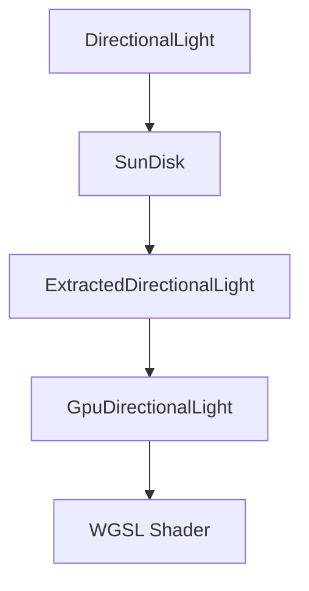

+++
title = "#20434 Add bevy_light::SunDisk"
date = "2025-08-16T00:00:00"
draft = false
template = "pull_request_page.html"
in_search_index = false

[extra]
current_language = "zh-cn"
available_languages = {"en" = { name = "English", url = "/pull_request/bevy/2025-08/pr-20434-en-20250816" }, "zh-cn" = { name = "中文", url = "/pull_request/bevy/2025-08/pr-20434-zh-cn-20250816" }}
+++

## 技术分析报告：PR #20434 - Add bevy_light::SunDisk

### 基本信息
- **标题**: Add bevy_light::SunDisk
- **PR链接**: https://github.com/bevyengine/bevy/pull/20434
- **作者**: defuz
- **状态**: 已合并
- **标签**: A-Rendering, C-Usability, S-Ready-For-Final-Review, X-Uncontroversial, D-Straightforward
- **创建时间**: 2025-08-05T21:58:56Z
- **合并时间**: 2025-08-16T22:31:18Z
- **合并者**: alice-i-cecile

### 描述翻译
**目标**
* 修复 **#20425**（GI探针在烘焙时会捕获太阳圆盘，而`DirectionalLight`同时照亮场景，需要一种在烘焙时跳过圆盘的机制）
* 添加`bevy_light::SunDisk`组件作为`DirectionalLight`的扩展
* 修复了某些设置下太阳圆盘中心出现暗斑的问题

**测试**
* 在MacBook M1上运行官方`atmosphere`示例
* 测试不同强度值（0, 0.01, 1, 10）和Bloom开关状态
* 所有展示图片均保留原始链接：

<details>
  <summary><strong>1.0</strong> (bloom on)</summary>
  
</details>

<details>
  <summary><strong>0.0</strong> (bloom on)</summary>
  
</details>

<details>
  <summary><strong>0.01</strong> (bloom on)</summary>
  
</details>

<details>
  <summary><strong>0.00001</strong> (bloom on)</summary>
   
</details>

<details>
  <summary><strong>10.0</strong> (bloom on)</summary>
  
</details>

<details>
  <summary><strong>1.0</strong> (bloom off)</summary>
  
</details>

<details>
  <summary><strong>10.0</strong> (bloom off)</summary>
  
</details>

---

### PR技术分析

#### 问题背景
GI探针烘焙过程中意外捕获方向光的太阳圆盘（#20425）。太阳圆盘作为视觉特效，不应影响场景光照计算。现有实现硬编码太阳参数，导致：
1. 无法在探针烘焙时禁用圆盘
2. 缺乏对太阳大小/亮度的艺术控制
3. 存在中心暗斑的渲染瑕疵

#### 解决方案
引入`SunDisk`组件作为`DirectionalLight`的可选扩展：
```rust
#[derive(Component, Clone)]
#[require(DirectionalLight)]
pub struct SunDisk {
    pub angular_size: f32,  // 太阳角直径（弧度）
    pub intensity: f32,     // 亮度乘数
}
```
提供预设值：
```rust
impl SunDisk {
    pub const EARTH: SunDisk = SunDisk { // 地球视角参数
        angular_size: 0.00930842, // ~32角分
        intensity: 1.0,
    };
    
    pub const OFF: SunDisk = SunDisk { // 完全禁用
        angular_size: 0.0,
        intensity: 0.0,
    };
}
```

#### 核心实现
1. **WGSL着色器重构**  
   移除硬编码常量，使用动态参数：
   ```wgsl
   let sun_angular_size = (*light).sun_disk_angular_size;
   let sun_intensity = (*light).sun_disk_intensity;
   if sun_angular_size > 0.0 && sun_intensity > 0.0 {
       let factor = 1 - smoothstep(
           sun_angular_size * 0.5 - w, 
           sun_angular_size * 0.5 + w, 
           angle_to_sun
       );
       let sun_solid_angle = (sun_angular_size * sun_angular_size) * 0.25 * PI;
       sun_radiance += ((*light).color.rgb / sun_solid_angle) 
                     * sun_intensity * factor * shadow_factor;
   }
   ```
   关键改进：
   - 使用`smoothstep`替代阈值检测，消除中心暗斑
   - 增加`w`变量控制抗锯齿范围
   - 条件判断跳过不可见太阳的计算

2. **渲染管线集成**  
   在灯光提取阶段注入太阳参数：
   ```rust
   pub struct ExtractedDirectionalLight {
       // ...
       pub sun_disk_angular_size: f32,
       pub sun_disk_intensity: f32,
   }
   
   // 提取循环中
   let sun_disk = sun_disk.unwrap_or_default();
   extracted_light.sun_disk_angular_size = sun_disk.angular_size;
   extracted_light.sun_disk_intensity = sun_disk.intensity;
   ```
   GPU结构体同步更新：
   ```wgsl
   struct DirectionalLight {
       // ...
       sun_disk_angular_size: f32,
       sun_disk_intensity: f32,
   }
   ```

3. **向后兼容处理**  
   未附加`SunDisk`组件时使用默认值：
   ```rust
   impl Default for &SunDisk {
       fn default() -> Self {
           &SunDisk::EARTH
       }
   }
   ```

#### 技术要点
1. **物理正确性**  
   根据立体角公式计算太阳辐射度：
   ```wgsl
   sun_solid_angle = (angular_size²) * 0.25 * PI
   radiance = light_color / solid_angle * intensity
   ```
   确保能量守恒

2. **性能优化**  
   通过早期条件判断跳过不可见太阳的计算：
   ```wgsl
   if sun_angular_size > 0.0 && sun_intensity > 0.0 { ... }
   ```

3. **抗锯齿处理**  
   使用导数计算动态抗锯齿范围：
   ```wgsl
   let w = max(0.5 * fwidth(angle_to_sun), 1e-6);
   ```

#### 影响评估
1. **问题解决**  
   通过设置`SunDisk::OFF`可完全禁用太阳圆盘，修复GI探针问题
   
2. **新能力**  
   - 独立控制太阳外观（大小/亮度）
   - 物理正确的太阳辐射计算
   - 消除渲染瑕疵

3. **兼容性**  
   保持向后兼容，未附加组件时使用地球参数

---

### 关键文件变更

#### crates/bevy_light/src/directional_light.rs (+50)
新增`SunDisk`组件实现：
```rust
#[derive(Component, Clone)]
#[require(DirectionalLight)]
pub struct SunDisk {
    pub angular_size: f32,
    pub intensity: f32,
}

impl SunDisk {
    pub const EARTH: SunDisk = SunDisk { ... };
    pub const OFF: SunDisk = SunDisk { ... };
}

impl Default for SunDisk { ... }
impl Default for &SunDisk { ... }
```

#### crates/bevy_pbr/src/atmosphere/functions.wgsl (+9,-8)
重构太阳渲染逻辑：
```wgsl
// 替换前
const SUN_ANGULAR_SIZE: f32 = 0.0174533;
let factor = smoothstep(...);

// 替换后
let sun_angular_size = (*light).sun_disk_angular_size;
let sun_intensity = (*light).sun_disk_intensity;
if sun_angular_size > 0.0 && sun_intensity > 0.0 {
    // 新实现
}
```

#### crates/bevy_pbr/src/render/light.rs (+11)
扩展提取数据结构：
```rust
pub struct ExtractedDirectionalLight {
    // ...
    pub sun_disk_angular_size: f32,
    pub sun_disk_intensity: f32,
}

// 在提取循环中
sun_disk_angular_size: sun_disk.unwrap_or_default().angular_size,
sun_disk_intensity: sun_disk.unwrap_or_default().intensity,
```

#### crates/bevy_solari/src/scene/binder.rs (+1,-5)
移除硬编码参数：
```rust
// 替换前
const SUN_ANGULAR_DIAMETER_RADIANS: f32 = 0.00930842;
let cos_theta_max = cos(SUN_ANGULAR_DIAMETER_RADIANS / 2.0);

// 替换后
let cos_theta_max = cos(directional_light.sun_disk_angular_size / 2.0);
```

#### crates/bevy_light/src/lib.rs (+1,-1)
导出新组件：
```rust
pub use directional_light::{ ..., SunDisk };
```

---

### 组件关系图


### 总结
该PR通过引入模块化的`SunDisk`组件：
1. 解决了GI探针错误捕获太阳圆盘的问题
2. 提供物理正确的太阳外观控制
3. 消除渲染瑕疵
4. 保持向后兼容性
实现方案包含完整的渲染管线集成，从ECS组件到WGSL着色器，各层改动协调一致。参数化设计为未来扩展（如动态太阳尺寸）奠定基础。