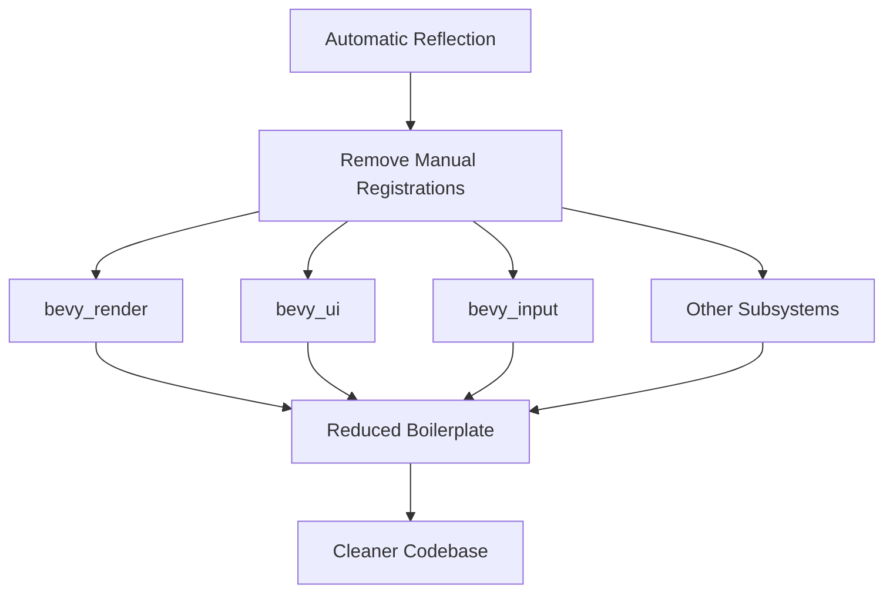

+++
title = "#20435 Remove Manual Type Registrations"
date = "2025-08-06T00:00:00"
draft = false
template = "pull_request_page.html"
in_search_index = true

[taxonomies]
list_display = ["show"]

[extra]
current_language = "en"
available_languages = {"en" = { name = "English", url = "/pull_request/bevy/2025-08/pr-20435-en-20250806" }, "zh-cn" = { name = "中文", url = "/pull_request/bevy/2025-08/pr-20435-zh-cn-20250806" }}
labels = ["C-Code-Quality", "A-Reflection", "D-Straightforward"]
+++

# Technical Report: Removal of Manual Type Registrations in Bevy

## Basic Information
- **Title**: Remove Manual Type Registrations
- **PR Link**: https://github.com/bevyengine/bevy/pull/20435
- **Author**: cart
- **Status**: MERGED
- **Labels**: C-Code-Quality, S-Ready-For-Final-Review, A-Reflection, M-Needs-Migration-Guide, M-Needs-Release-Note, X-Uncontroversial, D-Straightforward
- **Created**: 2025-08-06T01:16:12Z
- **Merged**: 2025-08-06T20:32:10Z
- **Merged By**: cart

## Description Translation
# Objective

Thanks to #15030, we no longer need manual type registrations. This should only be merged after #15030.

## Solution

Remove all manual (non generic) type registrations.

## The Story of This Pull Request

### The Problem and Context
Before this PR, Bevy required explicit type registration calls (`app.register_type::<T>()`) throughout the codebase to enable reflection capabilities. This manual registration was error-prone and created significant maintenance overhead. Developers had to remember to register every type that needed reflection support, leading to boilerplate code scattered across multiple modules. As the codebase grew, this approach became increasingly unsustainable.

### The Solution Approach
PR #15030 introduced automatic type registration for reflected types, making manual registrations redundant. This PR systematically removes all remaining manual type registration calls. The solution is straightforward: locate and remove every instance of `app.register_type` and related registration calls that are no longer needed.

### The Implementation
The changes are wide-ranging but mechanically consistent. Each removal follows the same pattern: deletion of explicit type registration calls while preserving core functionality. For example:

In `crates/bevy_render/src/lib.rs`:
```rust
// Before:
app.register_type::<alpha::AlphaMode>()
    .register_type::<bevy_color::Color>()
    .register_type::<RenderEntity>()
    .register_type::<TemporaryRenderEntity>()
    .register_type::<MainEntity>()
    .register_type::<SyncToRenderWorld>();

// After:
// (All register_type calls removed)
```

In `crates/bevy_ui/src/lib.rs`:
```rust
// Before:
app.register_type::<BackgroundColor>()
    .register_type::<CalculatedClip>()
    .register_type::<ComputedNode>()
    ... // 40+ more type registrations

// After:
// (All register_type calls removed)
```

The PR touches 71 files across the codebase, with the most significant changes in:
1. Rendering subsystems (`bevy_render`, `bevy_pbr`)
2. UI framework (`bevy_ui`)
3. Core systems (`bevy_app`, `bevy_ecs`)
4. Input handling (`bevy_input`)

### Technical Insights
The removal was possible due to Bevy's new automatic reflection registration system, which uses Rust's type system and procedural macros to register types at compile time. Key technical points:
1. **Reflection Infrastructure**: The automatic system leverages `#[derive(Reflect)]` to generate registration code
2. **Reduced Boilerplate**: Eliminating manual registrations removes approximately 1,500 lines of code
3. **Maintainability**: New reflected types will automatically register without explicit calls
4. **Error Reduction**: Eliminates a class of errors where types were accidentally omitted from registration

### The Impact
This change significantly cleans up Bevy's codebase:
- **Code Quality**: Reduces boilerplate and focuses code on core functionality
- **Maintenance**: Simplifies future development by removing manual registration requirements
- **Performance**: Slight reduction in binary size due to removed function calls
- **Consistency**: Ensures uniform reflection handling across all systems

The changes are fully backward compatible since they only remove redundant operations. Systems that relied on reflected types will continue working as before, but now benefit from automatic registration.

## Visual Representation



## Key Files Changed

1. `crates/bevy_render/src/lib.rs` (+19/-30)
```rust
// Before:
app.register_type::<alpha::AlphaMode>()
    .register_type::<bevy_color::Color>()
    .register_type::<RenderEntity>()
    .register_type::<TemporaryRenderEntity>()
    .register_type::<MainEntity>()
    .register_type::<SyncToRenderWorld>();

// After:
// (Registration calls removed)
```

2. `crates/bevy_ui/src/lib.rs` (+2/-42)
```rust
// Before:
app.register_type::<BackgroundColor>()
    .register_type::<CalculatedClip>()
    .register_type::<ComputedNode>()
    ... // 40+ type registrations

// After:
// (Registration calls removed)
```

3. `crates/bevy_input/src/lib.rs` (+0/-32)
```rust
// Before:
app.register_type::<ButtonState>()
    .register_type::<KeyboardInput>()
    .register_type::<MouseButtonInput>()
    ... // 20+ input-related types

// After:
// (Registration calls removed)
```

4. `crates/bevy_sprite/src/lib.rs` (+16/-21)
```rust
// Before:
app.register_type::<Sprite>()
    .register_type::<SpriteImageMode>()
    .register_type::<TextureSlicer>()
    ... // Sprite-related types

// After:
// (Registration calls removed while preserving core systems)
```

## Further Reading
1. [PR #15030: Automatic Type Registration](https://github.com/bevyengine/bevy/pull/15030)
2. [Bevy Reflection Documentation](https://docs.rs/bevy_reflect/latest/bevy_reflect/)
3. [Rust Procedural Macros Guide](https://doc.rust-lang.org/reference/procedural-macros.html)

## Full Code Diff
<details>
<summary>Expand full diff (71 files modified)</summary>

```diff
diff --git a/crates/bevy_animation/src/lib.rs b/crates/bevy_animation/src/lib.rs
index 0c667417b5ae3..67e5cde0466a9 100644
--- a/crates/bevy_animation/src/lib.rs
+++ b/crates/bevy_animation/src/lib.rs
@@ -40,7 +40,6 @@ use bevy_reflect::{prelude::ReflectDefault, Reflect, TypePath};
 use bevy_time::Time;
 use bevy_transform::TransformSystems;
 use bevy_utils::{PreHashMap, PreHashMapExt, TypeIdMap};
-use petgraph::graph::NodeIndex;
 use serde::{Deserialize, Serialize};
 use thread_local::ThreadLocal;
 use tracing::{trace, warn};
@@ -60,7 +59,7 @@ pub mod prelude {
 use crate::{
     animation_curves::AnimationCurve,
     graph::{AnimationGraph, AnimationGraphAssetLoader, AnimationNodeIndex},
-    transition::{advance_transitions, expire_completed_transitions, AnimationTransitions},
+    transition::{advance_transitions, expire_completed_transitions},
 };
 use alloc::sync::Arc;
 
@@ -1234,12 +1233,6 @@ impl Plugin for AnimationPlugin {
             .init_asset_loader::<AnimationGraphAssetLoader>()
             .register_asset_reflect::<AnimationClip>()
             .register_asset_reflect::<AnimationGraph>()
-            .register_type::<AnimationPlayer>()
-            .register_type::<AnimationTarget>()
-            .register_type::<AnimationTransitions>()
-            .register_type::<AnimationGraphHandle>()
-            .register_type::<NodeIndex>()
-            .register_type::<ThreadedAnimationGraphs>()
             .init_resource::<ThreadedAnimationGraphs>()
             .add_systems(
                 PostUpdate,
diff --git a/crates/bevy_anti_aliasing/src/contrast_adaptive_sharpening/mod.rs b/crates/bevy_anti_aliasing/src/contrast_adaptive_sharpening/mod.rs
index 872175dbc741b..845f4c98dd462 100644
--- a/crates/bevy_anti_aliasing/src/contrast_adaptive_sharpening/mod.rs
+++ b/crates/bevy_anti_aliasing/src/contrast_adaptive_sharpening/mod.rs
@@ -103,7 +103,6 @@ impl Plugin for CasPlugin {
     fn build(&self, app: &mut App) {
         embedded_asset!(app, "robust_contrast_adaptive_sharpening.wgsl");
 
-        app.register_type::<ContrastAdaptiveSharpening>();
         app.add_plugins((
             ExtractComponentPlugin::<ContrastAdaptiveSharpening>::default(),
             UniformComponentPlugin::<CasUniform>::default(),
diff --git a/crates/bevy_anti_aliasing/src/fxaa/mod.rs b/crates/bevy_anti_aliasing/src/fxaa/mod.rs
index bba559626379b..6b67770230684 100644
--- a/crates/bevy_anti_aliasing/src/fxaa/mod.rs
+++ b/crates/bevy_anti_aliasing/src/fxaa/mod.rs
@@ -86,7 +86,6 @@ impl Plugin for FxaaPlugin {
     fn build(&self, app: &mut App) {
         embedded_asset!(app, "fxaa.wgsl");
 
-        app.register_type::<Fxaa>();
         app.add_plugins(ExtractComponentPlugin::<Fxaa>::default());
 
         let Some(render_app) = app.get_sub_app_mut(RenderApp) else {
diff --git a/crates/bevy_anti_aliasing/src/smaa/mod.rs b/crates/bevy_anti_aliasing/src/smaa/mod.rs
index d54dff8e9ce5d..3d3913ccce4ca 100644
--- a/crates/bevy_anti_aliasing/src/smaa/mod.rs
+++ b/crates/bevy_anti_aliasing/src/smaa/mod.rs
@@ -313,8 +313,7 @@ impl Plugin for SmaaPlugin {
             }
         };
 
-        app.add_plugins(ExtractComponentPlugin::<Smaa>::default())
-            .register_type::<Smaa>();
+        app.add_plugins(ExtractComponentPlugin::<Smaa>::default());
 
         let Some(render_app) = app.get_sub_app_mut(RenderApp) else {
             return;
diff --git a/crates/bevy_anti_aliasing/src/taa/mod.rs b/crates/bevy_anti_aliasing/src/taa/mod.rs
index 263ebd00436ff..3055160a820c9 100644
--- a/crates/bevy_anti_aliasing/src/taa/mod.rs
+++ b/crates/bevy_anti_aliasing/src/taa/mod.rs
@@ -51,8 +51,6 @@ impl Plugin for TemporalAntiAliasPlugin {
     fn build(&self, app: &mut App) {
         embedded_asset!(app, "taa.wgsl");
 
-        app.register_type::<TemporalAntiAliasing>();
-
         app.add_plugins(SyncComponentPlugin::<TemporalAntiAliasing>::default());
 
         let Some(render_app) = app.get_sub_app_mut(RenderApp) else {
diff --git a/crates/bevy_app/src/app.rs b/crates/bevy_app/src/app.rs
index 9ff4792960679..c6c16cb5bed86 100644
--- a/crates/bevy_app/src/app.rs
+++ b/crates/bevy_app/src/app.rs
@@ -106,18 +106,11 @@ impl Default for App {
 
         #[cfg(feature = "bevy_reflect")]
         {
-            use bevy_ecs::observer::ObservedBy;
-
             #[cfg(not(feature = "reflect_auto_register")]
             app.init_resource::<AppTypeRegistry>();
 
             #[cfg(feature = "reflect_auto_register")]
             app.insert_resource(AppTypeRegistry::new_with_derived_types());
-
-            app.register_type::<Name>();
-            app.register_type::<ChildOf>();
-            app.register_type::<Children>();
-            app.register_type::<ObservedBy>();
         }
 
         #[cfg(feature = "reflect_functions")]
diff --git a/crates/bevy_asset/src/lib.rs b/crates/bevy_asset/src/lib.rs
index 8186b6315d5b4..3c939b07cf8b0 100644
--- a/crates/bevy_asset/src/lib.rs
+++ b/crates/bevy_asset/src/lib.rs
@@ -422,8 +422,7 @@ impl Plugin for AssetPlugin {
             // and as a result has ambiguous system ordering with all other systems in `PreUpdate`.
             // This is virtually never a real problem: asset loading is async and so anything that interacts directly with it
             // needs to be robust to stochastic delays anyways.
-            .add_systems(PreUpdate, handle_internal_asset_events.ambiguous_with_all())
-            .register_type::<AssetPath>();
+            .add_systems(PreUpdate, handle_internal_asset_events.ambiguous_with_all());
     }
 }
 
diff --git a/crates/bevy_audio/src/lib.rs b/crates/bevy_audio/src/lib.rs
index e3b5e02569fd2..43e7cbe05c0e0 100644
--- a/crates/bevy_audio/src/lib.rs
+++ b/crates/bevy_audio/src/lib.rs
@@ -80,13 +80,7 @@ pub struct AudioPlugin {
 
 impl Plugin for AudioPlugin {
     fn build(&self, app: &mut App) {
-        app.register_type::<Volume>()
-            .register_type::<GlobalVolume>()
-            .register_type::<SpatialListener>()
-            .register_type::<DefaultSpatialScale>()
-            .register_type::<PlaybackMode>()
-            .register_type::<PlaybackSettings>()
-            .insert_resource(self.global_volume)
+        app.insert_resource(self.global_volume)
             .insert_resource(DefaultSpatialScale(self.default_spatial_scale))
             .configure_sets(
                 PostUpdate,
diff --git a/crates/bevy_camera/src/lib.rs b/crates/bevy_camera/src/lib.rs
index bf0ededae8314..1ae5c8107860e 100644
--- a/crates/bevy_camera/src/lib.rs
+++ b/crates/bevy_camera/src/lib.rs
@@ -18,20 +18,10 @@ pub struct CameraPlugin;
 
 impl Plugin for CameraPlugin {
     fn build(&self, app: &mut App) {
-        app.register_type::<Camera>()
-            .register_type::<ClearColor>()
-            .register_type::<CameraMainTextureUsages>()
-            .register_type::<Exposure>()
-            .register_type::<MainPassResolutionOverride>()
-            .register_type::<primitives::Aabb>()
-            .register_type::<primitives::CascadesFrusta>()
-            .register_type::<primitives::CubemapFrusta>()
-            .register_type::<primitives::Frustum>()
-            .init_resource::<ClearColor>()
-            .add_plugins((
-                CameraProjectionPlugin,
-                visibility::VisibilityPlugin,
-                visibility::VisibilityRangePlugin,
-            ));
+        app.init_resource::<ClearColor>().add_plugins((
+            CameraProjectionPlugin,
+            visibility::VisibilityPlugin,
+            visibility::VisibilityRangePlugin,
+        ));
     }
 }
diff --git a/crates/bevy_camera/src/projection.rs b/crates/bevy_camera/src/projection.rs
index 847714208d12a..1d2bfdab27561 100644
--- a/crates/bevy_camera/src/projection.rs
+++ b/crates/bevy_camera/src/projection.rs
@@ -18,16 +18,12 @@ pub struct CameraProjectionPlugin;
 
 impl Plugin for CameraProjectionPlugin {
     fn build(&self, app: &mut App) {
-        app.register_type::<Projection>()
-            .register_type::<PerspectiveProjection>()
-            .register_type::<OrthographicProjection>()
-            .register_type::<CustomProjection>()
-            .add_systems(
-                PostUpdate,
-                crate::visibility::update_frusta
-                    .in_set(VisibilitySystems::UpdateFrusta)
-                    .after(TransformSystems::Propagate),
-            );
+        app.add_systems(
+            PostUpdate,
+            crate::visibility::update_frusta
+                .in_set(VisibilitySystems::UpdateFrusta)
+                .after(TransformSystems::Propagate),
+        );
     }
 }
 
diff --git a/crates/bevy_camera/src/visibility/mod.rs b/crates/bevy_camera/src/visibility/mod.rs
index 478db336e32a3..275715cb26b33 100644
--- a/crates/bevy_camera/src/visibility/mod.rs
+++ b/crates/bevy_camera/src/visibility/mod.rs
@@ -340,17 +340,7 @@ impl Plugin for VisibilityPlugin {
     fn build(&self, app: &mut bevy_app::App) {
         use VisibilitySystems::*;
 
-        app.register_type::<VisibilityClass>()
-            .register_type::<InheritedVisibility>()
-            .register_type::<ViewVisibility>()
-            .register_type::<NoFrustumCulling>()
-            .register_type::<RenderLayers>()
-            .register_type::<Visibility>()
-            .register_type::<VisibleEntities>()
-            .register_type::<CascadesVisibleEntities>()
-            .register_type::<VisibleMeshEntities>()
-            .register_type::<CubemapVisibleEntities>()
-            .register_required_components::<Mesh3d, Visibility>()
+        app.register_required_components::<Mesh3d, Visibility>()
             .register_required_components::<Mesh3d, VisibilityClass>()
             .register_required_components::<Mesh2d, Visibility>()
             .register_required_components::<Mesh2d, VisibilityClass>()
diff --git a/crates/bevy_camera/src/visibility/range.rs b/crates/bevy_camera/src/visibility/range.rs
index b85631c9d5c75..b827dedbbf10c 100644
--- a/crates/bevy_camera/src/visibility/range.rs
+++ b/crates/bevy_camera/src/visibility/range.rs
@@ -30,14 +30,12 @@ pub struct VisibilityRangePlugin;
 
 impl Plugin for VisibilityRangePlugin {
     fn build(&self, app: &mut App) {
-        app.register_type::<VisibilityRange>()
-            .init_resource::<VisibleEntityRanges>()
-            .add_systems(
-                PostUpdate,
-                check_visibility_ranges
-                    .in_set(VisibilitySystems::CheckVisibility)
-                    .before(check_visibility),
-            );
+        app.init_resource::<VisibleEntityRanges>().add_systems(
+            PostUpdate,
+            check_visibility_ranges
+                .in_set(VisibilitySystems::CheckVisibility)
+                .before(check_visibility),
+        );
     }
 }
 
diff --git a/crates/bevy_core_pipeline/src/auto_exposure/mod.rs b/crates/bevy_core_pipeline/src/auto_exposure/mod.rs
index 805e67ec97c6e..773ab8b12f646 100644
--- a/crates/bevy_core_pipeline/src/auto_exposure/mod.rs
+++ b/crates/bevy_core_pipeline/src/auto_exposure/mod.rs
@@ -46,14 +46,12 @@ impl Plugin for AutoExposurePlugin {
         embedded_asset!(app, "auto_exposure.wgsl");
 
         app.add_plugins(RenderAssetPlugin::<GpuAutoExposureCompensationCurve>::default())
-            .register_type::<AutoExposureCompensationCurve>()
             .init_asset::<AutoExposureCompensationCurve>()
             .register_asset_reflect::<AutoExposureCompensationCurve>();
         app.world_mut()
             .resource_mut::<Assets<AutoExposureCompensationCurve>>()
             .insert(&Handle::default(), AutoExposureCompensationCurve::default());
 
-        app.register_type::<AutoExposure>();
         app.add_plugins(ExtractComponentPlugin::<AutoExposure>::default());
 
         let Some(render_app) = app.get_sub_app_mut(RenderApp) else {
diff --git a/crates/bevy_core_pipeline/src/bloom/mod.rs b/crates/bevy_core_pipeline/src/bloom/mod.rs
index 09112794026ba..f07675fad36c7 100644
--- a/crates/bevy_core_pipeline/src/bloom/mod.rs
+++ b/crates/bevy_core_pipeline/src/bloom/mod.rs
@@ -49,9 +49,6 @@ impl Plugin for BloomPlugin {
     fn build(&self, app: &mut App) {
         embedded_asset!(app, "bloom.wgsl");
 
-        app.register_type::<Bloom>();
-        app.register_type::<BloomPrefilter>();
-        app.register_type::<BloomCompositeMode>();
         app.add_plugins((
             ExtractComponentPlugin::<Bloom>::default(),
             UniformComponentPlugin::<BloomUniforms>::default(),
diff --git a/crates/bevy_core_pipeline/src/core_2d/mod.rs b/crates/bevy_core_pipeline/src/core_2d/mod.rs
index f051c1164cc8a..70146efd7a253 100644
--- a/crates/bevy_core_pipeline/src/core_2d/mod.rs
+++ b/crates/bevy_core_pipeline/src/core_2d/mod.rs
@@ -80,8 +80,7 @@ pub struct Core2dPlugin;
 
 impl Plugin for Core2dPlugin {
     fn build(&self, app: &mut App) {
-        app.register_type::<Camera2d>()
-            .register_required_components::<Camera2d, DebandDither>()
+        app.register_required_components::<Camera2d, DebandDither>()
             .register_required_components_with::<Camera2d, CameraRenderGraph>(|| {
                 CameraRenderGraph::new(Core2d)
             })
diff --git a/crates/bevy_core_pipeline/src/core_3d/mod.rs b/crates/bevy_core_pipeline/src/core_3d/mod.rs
index 9fd7880869546..ad058f8579072 100644
--- a/crates/bevy_core_pipeline/src/core_3d/mod.rs
+++ b/crates/bevy_core_pipeline/src/core_3d/mod.rs
@@ -139,9 +139,7 @@ pub struct Core3dPlugin;
 
 impl Plugin for Core3dPlugin {
     fn build(&self, app: &mut App) {
-        app.register_type::<Camera3d>()
-            .register_type::<ScreenSpaceTransmissionQuality>()
-            .register_required_components_with::<Camera3d, DebandDither>(|| DebandDither::Enabled)
+        app.register_required_components_with::<Camera3d, DebandDither>(|| DebandDither::Enabled)
             .register_required_components_with::<Camera3d, CameraRenderGraph>(|| {
                 CameraRenderGraph::new(Core3d)
             })
diff --git a/crates/bevy_core_pipeline/src/dof/mod.rs b/crates/bevy_core_pipeline/src/dof/mod.rs
index 51ec0b97af61d..10ca30c8fc2c8 100644
--- a/crates/bevy_core_pipeline/src/dof/mod.rs
+++ b/crates/bevy_core_pipeline/src/dof/mod.rs
@@ -207,8 +207,6 @@ impl Plugin for DepthOfFieldPlugin {
     fn build(&self, app: &mut App) {
         embedded_asset!(app, "dof.wgsl");
 
-        app.register_type::<DepthOfField>();
-        app.register_type::<DepthOfFieldMode>();
         app.add_plugins(UniformComponentPlugin::<DepthOfFieldUniform>::default());
 
         app.add_plugins(SyncComponentPlugin::<DepthOfField>::default());
diff --git a/crates/bevy_core_pipeline/src/lib.rs b/crates/bevy_core_pipeline/src/lib.rs
index bc3159de18712..1b5f022428a3c 100644
--- a/crates/bevy_core_pipeline/src/lib.rs
+++ b/crates/bevy_core_pipeline/src/lib.rs
@@ -37,19 +37,11 @@ pub mod prelude {
 }
 
 use crate::{
-    blit::BlitPlugin,
-    bloom::BloomPlugin,
-    core_2d::Core2dPlugin,
-    core_3d::Core3dPlugin,
-    deferred::copy_lighting_id::CopyDeferredLightingIdPlugin,
-    dof::DepthOfFieldPlugin,
-    experimental::mip_generation::MipGenerationPlugin,
-    motion_blur::MotionBlurPlugin,
-    msaa_writeback::MsaaWritebackPlugin,
-    post_process::PostProcessingPlugin,
-    prepass::{DeferredPrepass, DepthPrepass, MotionVectorPrepass, NormalPrepass},
-    tonemapping::TonemappingPlugin,
-    upscaling::UpscalingPlugin,
+    blit::BlitPlugin, bloom::BloomPlugin, core_2d::Core2dPlugin, core_3d::Core3dPlugin,
+    deferred::copy_lighting_id::CopyDeferredLightingIdPlugin, dof::DepthOfFieldPlugin,
+    experimental::mip_generation::MipGenerationPlugin, motion_blur::MotionBlurPlugin,
+    msaa_writeback::MsaaWritebackPlugin, post_process::PostProcessingPlugin,
+    tonemapping::TonemappingPlugin, upscaling::UpscalingPlugin,
 };
 use bevy_app::{App, Plugin};
 use bevy_asset::embedded_asset;
@@ -63,12 +55,7 @@ impl Plugin for CorePipelinePlugin {
     fn build(&self, app: &mut App) {
         embedded_asset!(app, "fullscreen_vertex_shader/fullscreen.wgsl");
 
-        app.register_type::<DepthPrepass>()
-            .register_type::<NormalPrepass>()
-            .register_type::<MotionVectorPrepass>()
-            .register_type::<DeferredPrepass>()
-            .init_resource::<FullscreenShader>()
-            .add_plugins((Core2dPlugin, Core3dPlugin, CopyDeferredLightingIdPlugin))
+        app.add_plugins((Core2dPlugin, Core3dPlugin, CopyDeferredLightingIdPlugin))
             .add_plugins((
                 BlitPlugin,
                 MsaaWritebackPlugin,
diff --git a/crates/bevy_core_pipeline/src/oit/mod.rs b/crates/bevy_core_pipeline/src/oit/mod.rs
index 9c20f4739d752..774d18efe55bf 100644
--- a/crates/bevy_core_pipeline/src/oit/mod.rs
+++ b/crates/bevy_core_pipeline/src/oit/mod.rs
@@ -106,8 +106,7 @@ impl Plugin for OrderIndependentTransparencyPlugin {
             OitResolvePlugin,
         ))
         .add_systems(Update, check_msaa)
-        .add_systems(Last, configure_depth_texture_usages)
-        .register_type::<OrderIndependentTransparencySettings>();
+        .add_systems(Last, configure_depth_texture_usages);
 
         let Some(render_app) = app.get_sub_app_mut(RenderApp) else {
             return;
diff --git a/crates/bevy_core_pipeline/src/post_process/mod.rs b/crates/bevy_core_pipeline/src/post_process/mod.rs
index 229d4e32c3aa6..551caf28f1f64 100644
--- a/crates/bevy_core_pipeline/src/post_process/mod.rs
+++ b/crates/bevy_core_pipeline/src/post_process/mod.rs
@@ -201,7 +201,6 @@ impl Plugin for PostProcessingPlugin {
             RenderAssetUsages::RENDER_WORLD,
         ));
 
-        app.register_type::<ChromaticAberration>();
         app.add_plugins(ExtractComponentPlugin::<ChromaticAberration>::default());
 
         let Some(render_app) = app.get_sub_app_mut(RenderApp) else {
diff --git a/crates/bevy_core_pipeline/src/skybox/mod.rs b/crates/bevy_core_pipeline/src/skybox/mod.rs
index f80bbbf770c22..205aad66a817e 100644
--- a/crates/bevy_core_pipeline/src/skybox/mod.rs
+++ b/crates/bevy_core_pipeline/src/skybox/mod.rs
@@ -45,7 +45,7 @@ impl Plugin for SkyboxPlugin {
         embedded_asset!(app, "skybox.wgsl");
         embedded_asset!(app, "skybox_prepass.wgsl");
 
-        app.register_type::<Skybox>().add_plugins((
+        app.add_plugins((
             ExtractComponentPlugin::<Skybox>::default(),
             UniformComponentPlugin::<SkyboxUniforms>::default(),
         ));
diff --git a/crates/bevy_core_pipeline/src/tonemapping/mod.rs b/crates/bevy_core_pipeline/src/tonemapping/mod.rs
index 2eb3d267e34c5..90b7de086f318 100644
--- a/crates/bevy_core_pipeline/src/tonemapping/mod.rs
+++ b/crates/bevy_core_pipeline/src/tonemapping/mod.rs
@@ -82,9 +82,6 @@ impl Plugin for TonemappingPlugin {
 
         app.add_plugins(ExtractResourcePlugin::<TonemappingLuts>::default());
 
-        app.register_type::<Tonemapping>();
-        app.register_type::<DebandDither>();
-
         app.add_plugins((
             ExtractComponentPlugin::<Tonemapping>::default(),
             ExtractComponentPlugin::<DebandDither>::default(),
diff --git a/crates/bevy_gizmos/src/aabb.rs b/crates/bevy_gizmos/src/aabb.rs
index 4ac9e5f2ac456..97b4f3e9ebd4c 100644
--- a/crates/bevy_gizmos/src/aabb.rs
+++ b/crates/bevy_gizmos/src/aabb.rs
@@ -28,19 +28,17 @@ pub struct AabbGizmoPlugin;
 
 impl Plugin for AabbGizmoPlugin {
     fn build(&self, app: &mut bevy_app::App) {
-        app.register_type::<AabbGizmoConfigGroup>()
-            .init_gizmo_group::<AabbGizmoConfigGroup>()
-            .add_systems(
-                PostUpdate,
-                (
-                    draw_aabbs,
-                    draw_all_aabbs.run_if(|config: Res<GizmoConfigStore>| {
-                        config.config::<AabbGizmoConfigGroup>().1.draw_all
-                    }),
-                )
-                    .after(bevy_render::view::VisibilitySystems::CalculateBounds)
-                    .after(TransformSystems::Propagate),
-            );
+        app.init_gizmo_group::<AabbGizmoConfigGroup>().add_systems(
+            PostUpdate,
+            (
+                draw_aabbs,
+                draw_all_aabbs.run_if(|config: Res<GizmoConfigStore>| {
+                    config.config::<AabbGizmoConfigGroup>().1.draw_all
+                }),
+            )
+                .after(bevy_render::view::VisibilitySystems::CalculateBounds)
+                .after(TransformSystems::Propagate),
+        );
     }
 }
 /// The [`GizmoConfigGroup`] used for debug visualizations of [`Aabb`] components on entities
diff --git a/crates/bevy_gizmos/src/lib.rs b/crates/bevy_gizmos/src/lib.rs
index 4eeeea508d048..ca3aba088b9a4 100755
--- a/crates/bevy_gizmos/src/lib.rs
+++ b/crates/