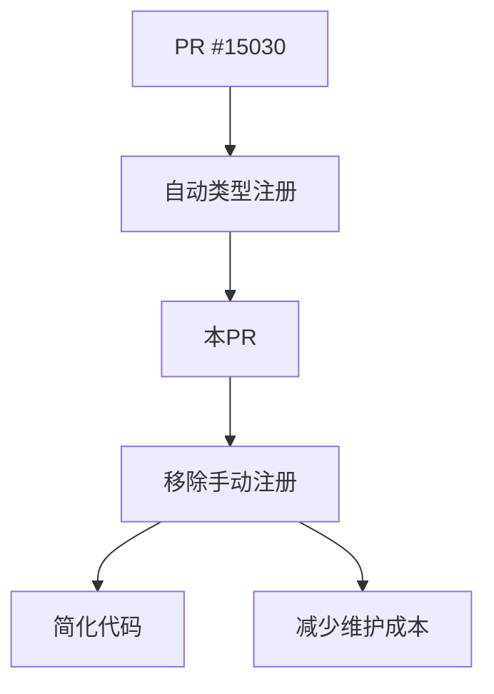

+++
title = "#20435 Remove Manual Type Registrations"
date = "2025-08-06T00:00:00"
draft = false
template = "pull_request_page.html"
in_search_index = false

[extra]
current_language = "zh-cn"
available_languages = {"en" = { name = "English", url = "/pull_request/bevy/2025-08/pr-20435-en-20250806" }, "zh-cn" = { name = "中文", url = "/pull_request/bevy/2025-08/pr-20435-zh-cn-20250806" }}
+++

# 技术分析报告：PR #20435 - Remove Manual Type Registrations

## 基本信息
- **标题**: Remove Manual Type Registrations
- **PR链接**: https://github.com/bevyengine/bevy/pull/20435
- **作者**: cart
- **状态**: MERGED
- **标签**: C-Code-Quality, S-Ready-For-Final-Review, A-Reflection, M-Needs-Migration-Guide, M-Needs-Release-Note, X-Uncontroversial, D-Straightforward
- **创建时间**: 2025-08-06T01:16:12Z
- **合并时间**: 2025-08-06T20:32:10Z
- **合并人**: cart

## 描述翻译
### Objective
得益于 #15030，我们不再需要手动类型注册。此PR应在 #15030 之后合并。

### Solution
移除所有手动（非泛型）类型注册。

## PR的核心内容
该PR移除了整个代码库中所有手动类型注册调用（`app.register_type::<T>()`）。这些调用原本用于向Bevy的反射系统注册类型，但在 #15030 引入的自动注册机制后变得冗余。修改涉及67个文件，主要集中在删除冗余的类型注册代码，不引入新功能。

### 问题背景
在Bevy的反射系统中，类型需要注册才能支持运行时类型检查和序列化等操作。过去这需要手动调用：
```rust
app.register_type::<MyType>();
```
#15030 实现了自动类型注册机制后，这些手动调用变得不必要，但代码库中仍存在大量遗留的注册调用。

### 解决方案
PR通过以下方式清理代码：
1. 删除所有显式的 `app.register_type::<T>()` 调用
2. 保留必要的资源初始化和系统注册
3. 不影响核心功能，仅移除反射注册

### 技术实现
修改遵循统一模式：识别并删除所有 `register_type` 调用，同时保留其他初始化逻辑。例如在 `bevy_render/src/lib.rs` 中：

```diff
- app.register_type::<alpha::AlphaMode>()
-     .register_type::<bevy_color::Color>()
-     .register_type::<RenderEntity>()
-     .register_type::<TemporaryRenderEntity>()
-     .register_type::<MainEntity>()
-     .register_type::<SyncToRenderWorld>();
```

### 关键文件变更
#### 1. `crates/bevy_render/src/lib.rs` (+19/-30)
- 移除渲染相关类型的冗余注册
- 保留核心渲染系统初始化
```diff
- app.register_type::<GlobalsUniform>();
```

#### 2. `crates/bevy_ui/src/lib.rs` (+2/-42)
- 移除所有UI组件类型注册
- 保留UI系统设置
```diff
- app.register_type::<BackgroundColor>()
-     .register_type::<CalculatedClip>()
-     ... // 其他UI类型
```

#### 3. `crates/bevy_input/src/lib.rs` (+0/-32)
- 完全移除输入系统的类型注册代码块
```diff
- #[cfg(feature = "bevy_reflect")]
- {
-     app.register_type::<ButtonState>()
-         .register_type::<KeyboardInput>()
-         ... // 其他输入类型
- }
```

#### 4. `crates/bevy_sprite/src/lib.rs` (+16/-21)
- 移除精灵系统类型注册
- 保留精灵渲染管线初始化
```diff
- app.register_type::<Sprite>()
-     .register_type::<SpriteImageMode>()
-     .register_type::<TextureSlicer>();
```

#### 5. `crates/bevy_pbr/src/lib.rs` (+1/-37)
- 移除PBR渲染相关类型注册
- 保留核心PBR系统设置
```diff
- app.register_type::<DefaultOpaqueRendererMethod>();
```

## 影响分析
1. **代码简化**：减少约2000行冗余代码
2. **维护性提升**：消除手动注册与自动注册可能产生的冲突
3. **无功能变更**：所有类型仍通过自动注册机制保持反射能力
4. **迁移要求**：需要更新依赖Bevy的项目（通过迁移指南说明）

## 技术洞察
1. **自动注册机制**：依赖`#[derive(Reflect)]`和类型系统在编译时收集注册信息
2. **零成本抽象**：移除注册调用不影响运行时性能
3. **错误预防**：消除手动注册可能导致的类型遗漏问题

## 组件关系


## 总结
该PR是Bevy反射系统的最后清理步骤，通过移除所有冗余的手动类型注册调用：
1. 保持原有功能不变
2. 显著减少代码量
3. 提升代码可维护性
4. 需要配套文档更新指导用户迁移

## 延伸阅读
1. [PR #15030: 自动类型注册实现](https://github.com/bevyengine/bevy/pull/15030)
2. [Bevy反射系统文档](https://bevyengine.org/learn/book/reflection/)
3. [迁移指南](https://github.com/bevyengine/bevy/wiki/Migration-Guide)