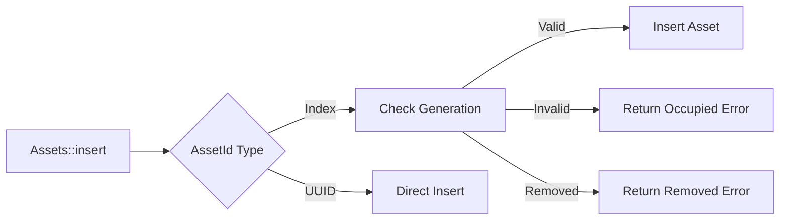

+++
title = "#20439 Return an error from `Assets::insert` instead of panicking."
date = "2025-08-10T00:00:00"
draft = false
template = "pull_request_page.html"
in_search_index = true

[taxonomies]
list_display = ["show"]

[extra]
current_language = "en"
available_languages = {"en" = { name = "English", url = "/pull_request/bevy/2025-08/pr-20439-en-20250810" }, "zh-cn" = { name = "中文", url = "/pull_request/bevy/2025-08/pr-20439-zh-cn-20250810" }}
labels = ["C-Bug", "D-Trivial", "A-Assets", "P-Crash"]
+++

## Return an error from `Assets::insert` instead of panicking

### Basic Information
- **Title**: Return an error from `Assets::insert` instead of panicking.
- **PR Link**: https://github.com/bevyengine/bevy/pull/20439
- **Author**: andriyDev
- **Status**: MERGED
- **Labels**: C-Bug, D-Trivial, A-Assets, P-Crash, S-Ready-For-Final-Review, M-Needs-Migration-Guide
- **Created**: 2025-08-06T06:34:58Z
- **Merged**: 2025-08-10T18:00:59Z
- **Merged By**: james7132

### Description Translation
# Objective

- Inserting into a dropped AssetId would panic. There is no API to check if the asset ID is still valid, so you can't avoid this case.

For a concrete example, imagine a user uses `Assets::reserve_handle` to get a handle, and then passes its AssetId into an async task. While the async task is running, the user drops the handle, which removes the entry from `Assets`. Later when the async task returns, it tries to insert the asset into that `AssetId`. This previously caused a panic. [Based on a true story](https://discord.com/channels/691052431525675048/749332104487108618/1402511976898590).

## Solution

- Make `Assets::insert` return an error when inserting into a dropped `AssetId`.

## Testing

- Added a test specifically for this case.

## The Story of This Pull Request

The problem originated from how Bevy's asset system handles dropped asset handles. When an `AssetId` created via `reserve_handle` is used after its corresponding handle is dropped, attempting to insert an asset would cause a panic. This created a hard-to-debug edge case, particularly in asynchronous contexts where asset handles might be dropped while background tasks are still processing.

The root cause was that the asset system had no way to distinguish between valid and invalid asset IDs after their handles were dropped. Previous implementations assumed all `AssetId` references were valid, leading to panics when inserting into removed slots. This violated Rust's principle of safe error handling and caused crashes in real-world scenarios.

The solution modifies the `Assets::insert` method to return a `Result` instead of panicking. Two key changes enable this behavior:

1. The `InvalidGenerationError` enum is expanded to include a `Removed` variant:
```rust
#[derive(Error, Debug, PartialEq, Eq)]
pub enum InvalidGenerationError {
    #[error("AssetIndex {index:?} has an invalid generation...")]
    Occupied { index: AssetIndex, current_generation: u32 },
    #[error("AssetIndex {index:?} has been removed")]
    Removed { index: AssetIndex },
}
```

2. The `insert` method now checks if an asset slot has been removed:
```rust
pub fn insert(
    &mut self,
    id: impl Into<AssetId<A>>,
    asset: A,
) -> Result<(), InvalidGenerationError> {
    match id.into() {
        AssetId::Index { index, .. } => self.insert_with_index(index, asset).map(|_| ()),
        AssetId::Uuid { uuid } => {
            self.insert_with_uuid(uuid, asset);
            Ok(())
        }
    }
}
```

The implementation required updates throughout the codebase where `insert` was called. Each call site was modified to handle the new `Result` return type. For example, in the asset loader:
```rust
fn insert(self: Box<Self>, id: UntypedAssetId, world: &mut World) {
    world
        .resource_mut::<Assets<A>>()
        .insert(id.typed(), *self)
        .expect("the AssetId is still valid");
}
```

The `get_or_insert_with` method was also updated to propagate errors:
```rust
pub fn get_or_insert_with(
    &mut self,
    id: impl Into<AssetId<A>>,
    insert_fn: impl FnOnce() -> A,
) -> Result<&mut A, InvalidGenerationError> {
    let id: AssetId<A> = id.into();
    if self.get(id).is_none() {
        self.insert(id, insert_fn())?;
    }
    Ok(self.get_mut(id).expect("asset should exist"))
}
```

A comprehensive test case was added to verify the new error behavior:
```rust
#[test]
fn insert_dropped_handle_returns_error() {
    // ...setup...
    let handle = app.world().resource::<Assets<TestAsset>>().reserve_handle();
    let asset_id = handle.id();
    drop(handle);
    
    // ...trigger asset cleanup...
    assert_eq!(
        app.world_mut()
            .resource_mut::<Assets<TestAsset>>()
            .insert(asset_id, TestAsset),
        Err(InvalidGenerationError::Removed { index })
    );
}
```

This change maintains backward compatibility by preserving the panic behavior for UUID-based asset IDs while adding error returns for index-based IDs. The migration guide advises callers to handle the new `Result` return type appropriately.

### Visual Representation



### Key Files Changed

1. **crates/bevy_asset/src/assets.rs** (+33/-16)  
   Core changes to asset insertion logic and error handling:
   ```rust
   // Before:
   pub fn insert(&mut self, id: impl Into<AssetId<A>>, asset: A) {
       match id.into() {
           AssetId::Index { index, .. } => {
               self.insert_with_index(index, asset).unwrap();
           }
           // ...
       }
   }
   
   // After:
   pub fn insert(&mut self, id: impl Into<AssetId<A>>, asset: A) -> Result<(), InvalidGenerationError> {
       match id.into() {
           AssetId::Index { index, .. } => self.insert_with_index(index, asset).map(|_| ()),
           // ...
       }
   }
   ```

2. **crates/bevy_asset/src/lib.rs** (+31/-1)  
   Added test case for insert error behavior:
   ```rust
   #[test]
   fn insert_dropped_handle_returns_error() {
       // ...test setup...
       assert_eq!(
           assets.insert(asset_id, TestAsset),
           Err(InvalidGenerationError::Removed { index })
       );
   }
   ```

3. **crates/bevy_asset/src/io/embedded/mod.rs** (+16/-14)  
   Updated macro calls to handle insert results:
   ```rust
   // Before:
   assets.insert($handle.id(), ($loader)(...));
   
   // After:
   assets.insert($handle.id(), ($loader)(...)).unwrap();
   ```

4. **crates/bevy_asset/src/reflect.rs** (+8/-5)  
   Modified reflection system to handle insert results:
   ```rust
   // Before:
   fn insert(world: &mut World, id: UntypedAssetId, value: &dyn PartialReflect) {
       (self.insert)(world, id, value);
   }
   
   // After:
   fn insert(...) -> Result<(), InvalidGenerationError> {
       (self.insert)(world, id, value)
   }
   ```

5. **crates/bevy_scene/src/lib.rs** (+8/-4)  
   Updated scene handling to unwrap inserts:
   ```rust
   // Before:
   assets.insert(&scene_handle, scene_1);
   
   // After:
   assets.insert(&scene_handle, scene_1).unwrap();
   ```

### Further Reading
- [Asset System Documentation](https://bevyengine.org/learn/book/features/assets/)
- [Rust Error Handling](https://doc.rust-lang.org/book/ch09-00-error-handling.html)
- [Bevy Discord Discussion](https://discord.com/channels/691052431525675048/749332104487108618/1402511976898590)