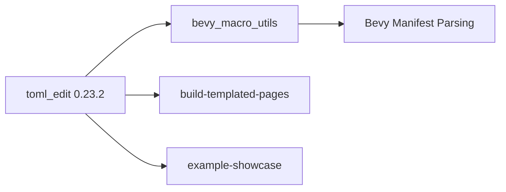

+++
title = "#20441 Update toml_edit requirement from 0.22.7 to 0.23.2"
date = "2025-08-09T00:00:00"
draft = false
template = "pull_request_page.html"
in_search_index = true

[taxonomies]
list_display = ["show"]

[extra]
current_language = "en"
available_languages = {"en" = { name = "English", url = "/pull_request/bevy/2025-08/pr-20441-en-20250809" }, "zh-cn" = { name = "中文", url = "/pull_request/bevy/2025-08/pr-20441-zh-cn-20250809" }}
labels = ["C-Dependencies", "D-Straightforward"]
+++

## Pull Request Analysis: Update toml_edit requirement from 0.22.7 to 0.23.2

### Basic Information
- **Title**: Update toml_edit requirement from 0.22.7 to 0.23.2
- **PR Link**: https://github.com/bevyengine/bevy/pull/20441
- **Author**: mnmaita
- **Status**: MERGED
- **Labels**: C-Dependencies, S-Ready-For-Final-Review, D-Straightforward
- **Created**: 2025-08-06T09:19:01Z
- **Merged**: 2025-08-09T01:41:08Z
- **Merged By**: james7132

### Description Translation
The original description is in English and requires no translation:

**Objective**
- Closes #20410

**Solution**
- Updated a deprecated type alias name (`ImDocument` -> `Document`).

**Testing**
- CI checks

---

### The Story of This Pull Request

This dependency update addresses a breaking change introduced in the toml_edit crate. The core issue was straightforward: toml_edit 0.23 renamed its `ImDocument` type to `Document`, causing compilation errors in Bevy when upgrading. The PR solves this through coordinated dependency version bumps and type alias updates across multiple crates.

The problem surfaced because Bevy's `bevy_macro_utils` crate and several tools depended on toml_edit 0.22.7, which used `ImDocument` for its parsed TOML representation. When the dependency was updated to 0.23.2, the renamed type became immediately incompatible with existing code. This type is central to Bevy's manifest parsing operations, used for reading and processing Cargo.toml files during build procedures.

The solution approach was systematic: First update the dependency version in all relevant Cargo.toml files, then replace every occurrence of `ImDocument` with `Document` in the source code. This required changes in both library code (bevy_macro_utils) and build tools (build-templated-pages and example-showcase). The modifications are minimal but essential for maintaining compatibility with the updated dependency.

Implementation-wise, the changes are confined to three areas: dependency declarations, type annotations, and parser method calls. The most significant change occurs in `bevy_manifest.rs`, where both the type declaration and parsing logic needed updating. The solution preserves all existing functionality while adapting to the dependency's new API.

This update demonstrates a common maintenance pattern in Rust ecosystems: tracking dependency changes and adapting to API evolutions. The impact is primarily maintenance-oriented - it prevents build failures and keeps Bevy compatible with the latest library versions. The changes also eliminate deprecation warnings, resulting in cleaner build outputs.

---

### Visual Representation



---

### Key Files Changed

1. **crates/bevy_macro_utils/Cargo.toml**  
   Updated dependency version:
   ```toml
   # Before:
   toml_edit = { version = "0.22.7", default-features = false, features = ["parse"] }
   
   # After:
   toml_edit = { version = "0.23.2", default-features = false, features = ["parse"] }
   ```

2. **crates/bevy_macro_utils/src/bevy_manifest.rs**  
   Core type and parser updates:
   ```rust
   // Before:
   use toml_edit::{ImDocument, Item};
   pub struct BevyManifest {
       manifest: ImDocument<Box<str>>,
   }
   fn read_manifest(path: &Path) -> ImDocument<Box<str>> {
       ImDocument::parse(manifest)
   }
   
   // After:
   use toml_edit::{Document, Item};
   pub struct BevyManifest {
       manifest: Document<Box<str>>,
   }
   fn read_manifest(path: &Path) -> Document<Box<str>> {
       Document::parse(manifest)
   }
   ```

3. **tools/build-templated-pages/Cargo.toml**  
   Dependency version bump:
   ```toml
   # Before:
   toml_edit = { version = "0.22.7", ... }
   
   # After:
   toml_edit = { version = "0.23.2", ... }
   ```

4. **tools/example-showcase/Cargo.toml**  
   Consistent dependency update:
   ```toml
   # Before:
   toml_edit = { version = "0.22.7", ... }
   
   # After:
   toml_edit = { version = "0.23.2", ... }
   ```

---

### Further Reading
1. [toml_edit 0.23 release notes](https://github.com/toml-rs/toml/blob/main/toml_edit/CHANGELOG.md#0230-2025-07-14) - Details breaking changes
2. [Rust dependency management](https://doc.rust-lang.org/cargo/reference/specifying-dependencies.html) - Official Cargo documentation
3. [Semantic Versioning in Rust](https://doc.rust-lang.org/cargo/reference/semver.html) - How Rust handles breaking changes

---

### Full Code Diff
```diff
diff --git a/crates/bevy_macro_utils/Cargo.toml b/crates/bevy_macro_utils/Cargo.toml
index b998ae4fd4553..4353ad2136475 100644
--- a/crates/bevy_macro_utils/Cargo.toml
+++ b/crates/bevy_macro_utils/Cargo.toml
@@ -12,7 +12,7 @@ keywords = ["bevy"]
 syn = "2.0"
 quote = "1.0"
 proc-macro2 = "1.0"
-toml_edit = { version = "0.22.7", default-features = false, features = [
+toml_edit = { version = "0.23.2", default-features = false, features = [
   "parse",
 ] }
 parking_lot = { version = "0.12" }
diff --git a/crates/bevy_macro_utils/src/bevy_manifest.rs b/crates/bevy_macro_utils/src/bevy_manifest.rs
index 0b8a496812376..378e04a44869c 100644
--- a/crates/bevy_macro_utils/src/bevy_manifest.rs
+++ b/crates/bevy_macro_utils/src/bevy_manifest.rs
@@ -8,12 +8,12 @@ use std::{
     path::{Path, PathBuf},
     time::SystemTime,
 };
-use toml_edit::{ImDocument, Item};
+use toml_edit::{Document, Item};
 
 /// The path to the `Cargo.toml` file for the Bevy project.
 #[derive(Debug)]
 pub struct BevyManifest {
-    manifest: ImDocument<Box<str>>,
+    manifest: Document<Box<str>>,
     modified_time: SystemTime,
 }
 
@@ -69,11 +69,11 @@ impl BevyManifest {
         std::fs::metadata(cargo_manifest_path).and_then(|metadata| metadata.modified())
     }
 
-    fn read_manifest(path: &Path) -> ImDocument<Box<str>> {
+    fn read_manifest(path: &Path) -> Document<Box<str>> {
         let manifest = std::fs::read_to_string(path)
             .unwrap_or_else(|_| panic!("Unable to read cargo manifest: {}", path.display()))
             .into_boxed_str();
-        ImDocument::parse(manifest)
+        Document::parse(manifest)
             .unwrap_or_else(|_| panic!("Failed to parse cargo manifest: {}", path.display()))
     }
 
diff --git a/tools/build-templated-pages/Cargo.toml b/tools/build-templated-pages/Cargo.toml
index 70e5d827a2de2..6fa774af63fc9 100644
--- a/tools/build-templated-pages/Cargo.toml
+++ b/tools/build-templated-pages/Cargo.toml
@@ -6,7 +6,7 @@ publish = false
 license = "MIT OR Apache-2.0"
 
 [dependencies]
-toml_edit = { version = "0.22.7", default-features = false, features = [
+toml_edit = { version = "0.23.2", default-features = false, features = [
   "parse",
 ] }
 tera = "1.15"
diff --git a/tools/example-showcase/Cargo.toml b/tools/example-showcase/Cargo.toml
index c17477de73522..f2fe0bb55bc38 100644
--- a/tools/example-showcase/Cargo.toml
+++ b/tools/example-showcase/Cargo.toml
@@ -8,7 +8,7 @@ license = "MIT OR Apache-2.0"
 [dependencies]
 xshell = "0.2"
 clap = { version = "4.0", features = ["derive"] }
-toml_edit = { version = "0.22.7", default-features = false, features = [
+toml_edit = { version = "0.23.2", default-features = false, features = [
   "parse",
 ] }
 pbr = "1.1"
```