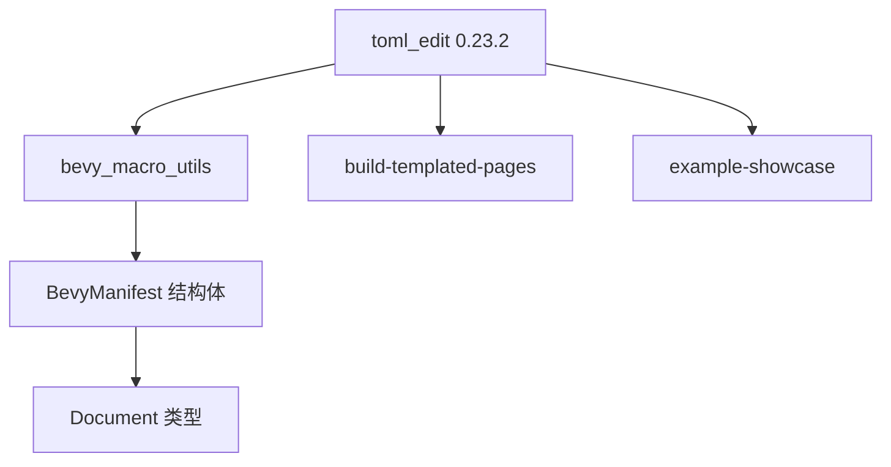

+++
title = "#20441 Update toml_edit requirement from 0.22.7 to 0.23.2"
date = "2025-08-09T00:00:00"
draft = false
template = "pull_request_page.html"
in_search_index = false

[extra]
current_language = "zh-cn"
available_languages = {"en" = { name = "English", url = "/pull_request/bevy/2025-08/pr-20441-en-20250809" }, "zh-cn" = { name = "中文", url = "/pull_request/bevy/2025-08/pr-20441-zh-cn-20250809" }}
+++

# 更新 toml_edit 依赖版本及处理 API 变更

## 基本信息
- **标题**: Update toml_edit requirement from 0.22.7 to 0.23.2
- **PR 链接**: https://github.com/bevyengine/bevy/pull/20441
- **作者**: mnmaita
- **状态**: 已合并
- **标签**: C-Dependencies, S-Ready-For-Final-Review, D-Straightforward
- **创建时间**: 2025-08-06T09:19:01Z
- **合并时间**: 2025-08-09T01:41:08Z
- **合并人**: james7132

## 描述翻译
### 目标
- 关闭 #20410

### 解决方案
- 更新了已弃用的类型别名名称（`ImDocument` -> `Document`）。

### 测试
- CI 检查

## PR 的技术故事

这个 PR 的核心任务是更新项目依赖的 toml_edit 库版本，从 0.22.7 升级到 0.23.2。升级的主要驱动力是解决 #20410 问题，该问题源于 toml_edit 库在其新版本中移除了 `ImDocument` 类型别名，取而代之的是更直接的 `Document` 类型。

在 toml_edit 0.23 版本中，开发者将 `ImDocument` 类型重命名为 `Document`，这属于公共 API 的破坏性变更。这种变更常见于库的演进过程中，当维护者决定简化 API 或使其更符合行业惯例时发生。对于使用该库的项目来说，需要相应更新代码中的类型引用。

实现方案相当直接：
1. 在四个 Cargo.toml 文件中更新 toml_edit 的版本声明
2. 在 bevy_manifest.rs 文件中将所有 `ImDocument` 引用替换为 `Document`
3. 确保相关类型的使用保持一致

在 `bevy_macro_utils/src/bevy_manifest.rs` 文件中，`BevyManifest` 结构体原先使用 `ImDocument<Box<str>>` 类型来存储解析后的 TOML 文档。升级后，这个字段类型被更新为 `Document<Box<str>>`。同样地，读取 manifest 的 `read_manifest` 函数返回值类型也从 `ImDocument<Box<str>>` 改为 `Document<Box<str>>`。

这种变更属于典型的依赖库升级维护工作。虽然修改点不多，但确保了项目与依赖库的兼容性，避免了因使用已弃用 API 导致的编译错误。测试方面，依赖 CI 的标准检查流程来验证变更没有破坏现有功能。

## 可视化表示



## 关键文件更改

### crates/bevy_macro_utils/Cargo.toml
**变更原因**：更新 toml_edit 依赖版本  
**关键修改**：
```diff
- toml_edit = { version = "0.22.7", default-features = false, features = [
+ toml_edit = { version = "0.23.2", default-features = false, features = [
   "parse",
 ] }
```

### crates/bevy_macro_utils/src/bevy_manifest.rs
**变更原因**：适应 toml_edit 0.23.2 的 API 变更  
**关键修改**：
```diff
- use toml_edit::{ImDocument, Item};
+ use toml_edit::{Document, Item};

- manifest: ImDocument<Box<str>>,
+ manifest: Document<Box<str>>,

- fn read_manifest(path: &Path) -> ImDocument<Box<str>> {
+ fn read_manifest(path: &Path) -> Document<Box<str>> {

- ImDocument::parse(manifest)
+ Document::parse(manifest)
```

### tools/build-templated-pages/Cargo.toml
**变更原因**：更新 toml_edit 依赖版本  
**关键修改**：
```diff
- toml_edit = { version = "0.22.7", default-features = false, features = [
+ toml_edit = { version = "0.23.2", default-features = false, features = [
   "parse",
 ] }
```

### tools/example-showcase/Cargo.toml
**变更原因**：更新 toml_edit 依赖版本  
**关键修改**：
```diff
- toml_edit = { version = "0.22.7", default-features = false, features = [
+ toml_edit = { version = "0.23.2", default-features = false, features = [
   "parse",
 ] }
```

## 完整代码变更
```diff
diff --git a/crates/bevy_macro_utils/Cargo.toml b/crates/bevy_macro_utils/Cargo.toml
index b998ae4fd4553..4353ad2136475 100644
--- a/crates/bevy_macro_utils/Cargo.toml
+++ b/crates/bevy_macro_utils/Cargo.toml
@@ -12,7 +12,7 @@ keywords = ["bevy"]
 syn = "2.0"
 quote = "1.0"
 proc-macro2 = "1.0"
-toml_edit = { version = "0.22.7", default-features = false, features = [
+toml_edit = { version = "0.23.2", default-features = false, features = [
   "parse",
 ] }
 parking_lot = { version = "0.12" }
diff --git a/crates/bevy_macro_utils/src/bevy_manifest.rs b/crates/bevy_macro_utils/src/bevy_manifest.rs
index 0b8a496812376..378e04a44869c 100644
--- a/crates/bevy_macro_utils/src/bevy_manifest.rs
+++ b/crates/bevy_macro_utils/src/bevy_manifest.rs
@@ -8,12 +8,12 @@ use std::{
     path::{Path, PathBuf},
     time::SystemTime,
 };
-use toml_edit::{ImDocument, Item};
+use toml_edit::{Document, Item};
 
 /// The path to the `Cargo.toml` file for the Bevy project.
 #[derive(Debug)]
 pub struct BevyManifest {
-    manifest: ImDocument<Box<str>>,
+    manifest: Document<Box<str>>,
     modified_time: SystemTime,
 }
 
@@ -69,11 +69,11 @@ impl BevyManifest {
         std::fs::metadata(cargo_manifest_path).and_then(|metadata| metadata.modified())
     }
 
-    fn read_manifest(path: &Path) -> ImDocument<Box<str>> {
+    fn read_manifest(path: &Path) -> Document<Box<str>> {
         let manifest = std::fs::read_to_string(path)
             .unwrap_or_else(|_| panic!("Unable to read cargo manifest: {}", path.display()))
             .into_boxed_str();
-        ImDocument::parse(manifest)
+        Document::parse(manifest)
             .unwrap_or_else(|_| panic!("Failed to parse cargo manifest: {}", path.display()))
     }
 
diff --git a/tools/build-templated-pages/Cargo.toml b/tools/build-templated-pages/Cargo.toml
index 70e5d827a2de2..6fa774af63fc9 100644
--- a/tools/build-templated-pages/Cargo.toml
+++ b/tools/build-templated-pages/Cargo.toml
@@ -6,7 +6,7 @@ publish = false
 license = "MIT OR Apache-2.0"
 
 [dependencies]
-toml_edit = { version = "0.22.7", default-features = false, features = [
+toml_edit = { version = "0.23.2", default-features = false, features = [
   "parse",
 ] }
 tera = "1.15"
diff --git a/tools/example-showcase/Cargo.toml b/tools/example-showcase/Cargo.toml
index c17477de73522..f2fe0bb55bc38 100644
--- a/tools/example-showcase/Cargo.toml
+++ b/tools/example-showcase/Cargo.toml
@@ -8,7 +8,7 @@ license = "MIT OR Apache-2.0"
 [dependencies]
 xshell = "0.2"
 clap = { version = "4.0", features = ["derive"] }
-toml_edit = { version = "0.22.7", default-features = false, features = [
+toml_edit = { version = "0.23.2", default-features = false, features = [
   "parse",
 ] }
 pbr = "1.1"
```

## 延伸阅读
1. [toml_edit 0.23 发布说明](https://github.com/toml-rs/toml/blob/main/toml_edit/CHANGELOG.md#0230-2025-07-15)：了解 API 变更详情
2. [Rust 依赖管理最佳实践](https://doc.rust-lang.org/cargo/reference/specifying-dependencies.html)：学习如何管理 Cargo 依赖
3. [语义化版本控制](https://semver.org/)：理解版本号变更的含义
4. [Bevy 引擎官方文档](https://bevyengine.org/)：探索 Bevy 游戏引擎的更多内容