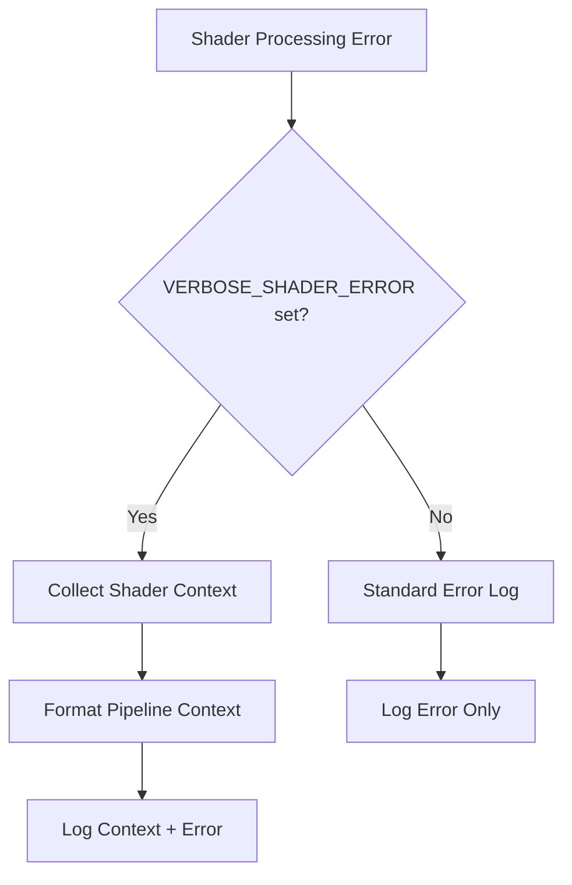

+++
title = "#20448 Add VERBOSE_SHADER_ERROR"
date = "2025-08-09T00:00:00"
draft = false
template = "pull_request_page.html"
in_search_index = true

[taxonomies]
list_display = ["show"]

[extra]
current_language = "en"
available_languages = {"en" = { name = "English", url = "/pull_request/bevy/2025-08/pr-20448-en-20250809" }, "zh-cn" = { name = "中文", url = "/pull_request/bevy/2025-08/pr-20448-zh-cn-20250809" }}
labels = ["D-Trivial", "A-Rendering", "A-Diagnostics"]
+++

# PR Analysis: Add VERBOSE_SHADER_ERROR

## Basic Information
- **Title**: Add VERBOSE_SHADER_ERROR
- **PR Link**: https://github.com/bevyengine/bevy/pull/20448
- **Author**: atlv24
- **Status**: MERGED
- **Labels**: D-Trivial, A-Rendering, S-Ready-For-Final-Review, A-Diagnostics
- **Created**: 2025-08-07T02:11:38Z
- **Merged**: 2025-08-09T06:43:31Z
- **Merged By**: james7132

## Description Translation
# Objective

- Make it easier to debug shader def problems in shader libraries

## Solution

- print context of where the shader module's entry point is and what the shader defs are

## Testing

- intentionally broke a shader and ran 3d_scene, logs are added when env var is set.


## The Story of This Pull Request

### The Problem and Context
Debugging shader compilation errors in Bevy can be challenging when working with complex shader libraries. When shader processing fails, the error messages lacked sufficient context about which specific shader module and shader definitions were involved. This made it difficult to pinpoint the root cause of failures, especially in projects with multiple shaders and conditional compilation via shader defs. The existing error logging provided the technical error details but didn't surface the critical context needed to map errors back to specific shader assets and their configurations.

### The Solution Approach
The solution introduces an opt-in verbose error reporting mechanism controlled by an environment variable. When `VERBOSE_SHADER_ERROR` is enabled, the system will log additional contextual information about the shader module when processing errors occur. The implementation needed to:
1. Add environment variable checking with flexible truthy values
2. Collect relevant shader context data (source path, entry point, shader defs)
3. Format this information for both render and compute pipelines
4. Integrate this context logging into the existing error handling flow

The approach maintains zero overhead for normal operation since the context collection only executes when the environment variable is set and a shader error occurs.

### The Implementation
The core changes are in the pipeline error handling logic and the new context formatting function:

```rust
// In process_pipeline_queue_system error handling:
if std::env::var("VERBOSE_SHADER_ERROR")
    .is_ok_and(|v| !(v.is_empty() || v == "0" || v == "false"))
{
    error!("{}", pipeline_error_context(cached_pipeline));
}
error!("failed to process shader error:\n{}", error_detail);
```

The new `pipeline_error_context` function handles the contextual data formatting:

```rust
fn pipeline_error_context(cached_pipeline: &CachedPipeline) -> String {
    fn format(
        shader: &Handle<Shader>,
        entry: &Option<Cow<'static, str>>,
        shader_defs: &[ShaderDefVal],
    ) -> String {
        let source = match shader.path() {
            Some(path) => path.path().to_string_lossy().to_string(),
            None => String::new(),
        };
        let entry = match entry {
            Some(entry) => entry.to_string(),
            None => String::new(),
        };
        let shader_defs = shader_defs
            .iter()
            .flat_map(|def| match def {
                ShaderDefVal::Bool(k, v) if *v => Some(k.to_string()),
                ShaderDefVal::Int(k, v) => Some(format!("{k} = {v}")),
                ShaderDefVal::UInt(k, v) => Some(format!("{k} = {v}")),
                _ => None,
            })
            .collect::<Vec<_>>()
            .join(", ");
        format!("{source}:{entry}\nshader defs: {shader_defs}")
    }
    match &cached_pipeline.descriptor {
        PipelineDescriptor::RenderPipelineDescriptor(desc) => {
            let vert = &desc.vertex;
            let vert_str = format(&vert.shader, &vert.entry_point, &vert.shader_defs);
            let Some(frag) = desc.fragment.as_ref() else {
                return vert_str;
            };
            let frag_str = format(&frag.shader, &frag.entry_point, &frag.shader_defs);
            format!("vertex {vert_str}\nfragment {frag_str}")
        }
        PipelineDescriptor::ComputePipelineDescriptor(desc) => {
            format(&desc.shader, &desc.entry_point, &desc.shader_defs)
        }
    }
}
```

The implementation handles both render pipelines (vertex/fragment shaders) and compute pipelines. For shader definitions, it:
- Includes boolean definitions only when true
- Formats numeric definitions as key-value pairs
- Omits unused definition variants

### Technical Insights
Key technical aspects include:
1. **Environment Variable Handling**: The condition `! (v.is_empty() || v == "0" || v == "false")` follows common truthy-check patterns, supporting values like "1", "true", or any non-empty string.
2. **Shader Definition Filtering**: By omitting false boolean flags and unused definition types, the output remains focused on relevant configuration.
3. **Pipeline Type Handling**: The match statement cleanly separates rendering and compute pipeline contexts.
4. **Path Extraction**: Using `shader.path()` provides asset source information when available.
5. **Error Message Clarity**: The log message was updated to "failed to process shader error" for better accuracy.

### The Impact
This change significantly improves shader debugging workflow:
- Developers can immediately see which shader asset and entry point caused the failure
- Active shader definitions are clearly listed, helping identify missing or incorrect feature flags
- The opt-in nature ensures no performance impact for normal operation
- Debugging time for shader issues is reduced by providing immediate context

The solution addresses a specific pain point in the shader development workflow with minimal code changes and no runtime overhead when not enabled.

## Visual Representation



## Key Files Changed

### `crates/bevy_render/src/render_resource/pipeline_cache.rs`
This file handles pipeline compilation and caching. The changes enhance error reporting when shader processing fails.

**Key modifications:**
```rust
// Before error handling:
error!("failed to process shader:\n{}", error_detail);

// After error handling:
if std::env::var("VERBOSE_SHADER_ERROR")
    .is_ok_and(|v| !(v.is_empty() || v == "0" || v == "false"))
{
    error!("{}", pipeline_error_context(cached_pipeline));
}
error!("failed to process shader error:\n{}", error_detail);
```

```rust
// New context formatting function:
fn pipeline_error_context(cached_pipeline: &CachedPipeline) -> String {
    // Inner formatting function
    fn format(shader: &Handle<Shader>, ...) -> String {
        // Extracts source path, entry point, and shader defs
    }
    
    // Handles different pipeline types
    match &cached_pipeline.descriptor {
        PipelineDescriptor::RenderPipelineDescriptor(desc) => {
            // Formats vertex and fragment shaders
        }
        PipelineDescriptor::ComputePipelineDescriptor(desc) => {
            // Formats compute shader
        }
    }
}
```

These changes directly support the PR's objective by adding contextual shader information to error logs when the environment variable is enabled.

## Further Reading
- [Bevy Shader System Documentation](https://bevyengine.org/learn/book/getting-started/shaders/)
- [WGSL Shader Language Specification](https://gpuweb.github.io/gpuweb/wgsl/)
- [Rust Environment Variable Handling](https://doc.rust-lang.org/std/env/fn.var.html)
- [Conditional Compilation with Shader Defs](https://github.com/bevyengine/bevy/blob/main/examples/shader/shader_defs.wgsl)