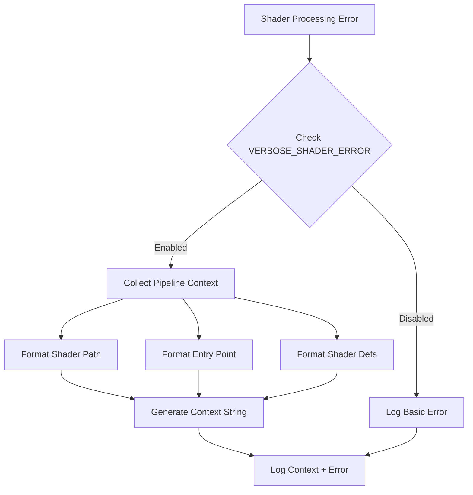

+++
title = "#20448 Add VERBOSE_SHADER_ERROR"
date = "2025-08-09T00:00:00"
draft = false
template = "pull_request_page.html"
in_search_index = false

[extra]
current_language = "zh-cn"
available_languages = {"en" = { name = "English", url = "/pull_request/bevy/2025-08/pr-20448-en-20250809" }, "zh-cn" = { name = "中文", url = "/pull_request/bevy/2025-08/pr-20448-zh-cn-20250809" }}
labels = ["D-Trivial", "A-Rendering", "A-Diagnostics"]
+++

# Add VERBOSE_SHADER_ERROR 分析报告

## Basic Information
- **Title**: Add VERBOSE_SHADER_ERROR
- **PR Link**: https://github.com/bevyengine/bevy/pull/20448
- **Author**: atlv24
- **Status**: MERGED
- **Labels**: D-Trivial, A-Rendering, S-Ready-For-Final-Review, A-Diagnostics
- **Created**: 2025-08-07T02:11:38Z
- **Merged**: 2025-08-09T06:43:31Z
- **Merged By**: james7132

## Description Translation
### 目标 (Objective)
- 简化 shader libraries 中 shader def 问题的调试过程

### 解决方案 (Solution)
- 打印 shader module 入口点的上下文及其 shader defs

### 测试 (Testing)
- 故意破坏一个 shader 并运行 3d_scene，当设置环境变量时会添加日志


## The Story of This Pull Request

### 问题背景
在 Bevy 引擎中调试 shader 错误时，开发者面临一个常见痛点：当 shader 处理失败时，错误日志只显示底层错误细节，缺乏关键上下文信息。具体来说：
- 当 `PipelineCacheError::ProcessShaderError` 发生时，日志只输出错误详情
- 缺少 shader 的入口点位置和当前启用的 shader defs 信息
- 这使得在复杂 shader libraries 中定位 shader def 配置问题变得困难

这个问题在大型项目中尤为突出，因为开发者需要手动追踪 shader 配置状态，显著增加了调试时间。

### 解决方案设计
为解决这个问题，PR 引入了条件化详细日志机制：
1. 新增环境变量 `VERBOSE_SHADER_ERROR` 作为详细日志开关
2. 当变量设置为非空值、非"0"、非"false"时激活详细日志
3. 添加 `pipeline_error_context()` 函数收集关键上下文信息

核心设计决策：
- 使用环境变量控制日志输出，避免生产环境性能损耗
- 保持默认日志简洁，仅当需要调试时激活详细输出
- 上下文信息包含 shader 路径、入口点和有效 shader defs

### 实现细节
主要修改集中在错误处理流程：
```rust
// 修改前
PipelineCacheError::ProcessShaderError(err) => {
    let error_detail = err.emit_to_string(...);
    error!("failed to process shader:\n{}", error_detail);
    return;
}

// 修改后
PipelineCacheError::ProcessShaderError(err) => {
    let error_detail = err.emit_to_string(...);
    if std::env::var("VERBOSE_SHADER_ERROR")
        .is_ok_and(|v| !(v.is_empty() || v == "0" || v == "false"))
    {
        error!("{}", pipeline_error_context(cached_pipeline));
    }
    error!("failed to process shader error:\n{}", error_detail);
    return;
}
```

新增的 `pipeline_error_context()` 函数负责收集关键调试信息：
```rust
fn pipeline_error_context(cached_pipeline: &CachedPipeline) -> String {
    fn format(
        shader: &Handle<Shader>,
        entry: &Option<Cow<'static, str>>,
        shader_defs: &[ShaderDefVal],
    ) -> String {
        // 提取shader路径(如果存在)
        let source = match shader.path() {
            Some(path) => path.path().to_string_lossy().to_string(),
            None => String::new(),
        };
        
        // 获取入口点名称
        let entry = entry.as_ref().map_or(String::new(), |e| e.to_string());
        
        // 格式化shader defs
        let shader_defs = shader_defs
            .iter()
            .flat_map(|def| match def {
                ShaderDefVal::Bool(k, v) if *v => Some(k.to_string()),
                ShaderDefVal::Int(k, v) => Some(format!("{k} = {v}")),
                ShaderDefVal::UInt(k, v) => Some(format!("{k} = {v}")),
                _ => None,
            })
            .collect::<Vec<_>>()
            .join(", ");
        
        format!("{source}:{entry}\nshader defs: {shader_defs}")
    }
    
    // 区分渲染管线与计算管线
    match &cached_pipeline.descriptor {
        PipelineDescriptor::RenderPipelineDescriptor(desc) => {
            let vert_str = format(&desc.vertex.shader, &desc.vertex.entry_point, &desc.vertex.shader_defs);
            let frag_str = desc.fragment.as_ref().map_or(String::new(), |frag| 
                format(&frag.shader, &frag.entry_point, &frag.shader_defs));
            
            if frag_str.is_empty() {
                vert_str
            } else {
                format!("vertex {vert_str}\nfragment {frag_str}")
            }
        }
        PipelineDescriptor::ComputePipelineDescriptor(desc) => {
            format(&desc.shader, &desc.entry_point, &desc.shader_defs)
        }
    }
}
```

### 技术考量
1. **条件日志激活**：使用 `std::env::var` 检查环境变量，避免不必要的字符串处理开销
2. **shader def 过滤**：只输出激活的布尔def和数值def，忽略未启用的布尔def
3. **路径安全处理**：使用 `to_string_lossy` 处理可能无效的UTF-8路径
4. **管线类型区分**：分别处理渲染管线(vertex/fragment)和计算管线
5. **空值处理**：对缺失的入口点和片段shader进行安全处理

### 实际影响
- 调试效率提升：开发者可通过设置环境变量快速获取关键上下文
- 错误诊断简化：直接关联错误与具体shader配置
- 零运行时开销：默认情况下不产生额外性能损耗
- 日志输出示例：
  ```
  vertex shaders/custom_material.wgsl:vertex
  shader defs: TONEMAP_METHOD_AGX, MSAA_1
  fragment shaders/custom_material.wgsl:fragment
  shader defs: TONEMAP_METHOD_AGX, MSAA_1
  ```

### 潜在改进方向
1. 未来可扩展为分层日志级别控制
2. 可考虑集成到 Bevy 的现有诊断系统
3. 添加更多上下文如管线名称或关联资源ID

## Visual Representation



## Key Files Changed

### `crates/bevy_render/src/render_resource/pipeline_cache.rs`
**修改目的**：增强shader处理错误的日志输出，提供更多调试上下文

**核心修改点**：
```rust
// 修改前
PipelineCacheError::ProcessShaderError(err) => {
    let error_detail = ...;
    error!("failed to process shader:\n{}", error_detail);
}

// 修改后
PipelineCacheError::ProcessShaderError(err) => {
    let error_detail = ...;
    if std::env::var("VERBOSE_SHADER_ERROR").is_ok_and(|v| ...) {
        error!("{}", pipeline_error_context(cached_pipeline));
    }
    error!("failed to process shader error:\n{}", error_detail);
}

// 新增函数
fn pipeline_error_context(cached_pipeline: &CachedPipeline) -> String {
    // 实现细节见上文
}
```

**变更分析**：
1. 引入条件检查控制详细日志输出
2. 新增上下文生成函数处理不同管线类型
3. 保持原有错误日志，仅增加前缀信息
4. 日志消息微调：从"failed to process shader"改为"failed to process shader error"

## Further Reading
1. [Bevy Shader System Documentation](https://bevyengine.org/learn/book/getting-started/shaders/)
2. [WGSL Shader Language Specification](https://www.w3.org/TR/WGSL/)
3. [Rust Environment Variables Handling](https://doc.rust-lang.org/std/env/fn.var.html)
4. [Conditional Compilation with Shader Defs](https://bevyengine.org/examples/Shaders/shader-defs/)