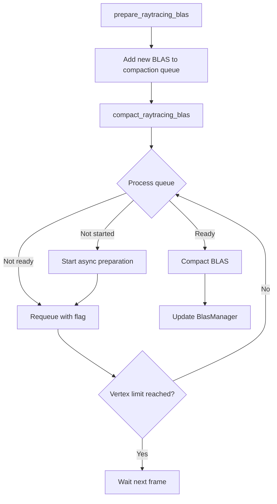

+++
title = "#20457 Solari BLAS compaction"
date = "2025-08-11T00:00:00"
draft = false
template = "pull_request_page.html"
in_search_index = true

[taxonomies]
list_display = ["show"]

[extra]
current_language = "en"
available_languages = {"en" = { name = "English", url = "/pull_request/bevy/2025-08/pr-20457-en-20250811" }, "zh-cn" = { name = "中文", url = "/pull_request/bevy/2025-08/pr-20457-zh-cn-20250811" }}
labels = ["A-Rendering", "C-Performance"]
+++

# Solari BLAS compaction

## Basic Information
- **Title**: Solari BLAS compaction
- **PR Link**: https://github.com/bevyengine/bevy/pull/20457
- **Author**: JMS55
- **Status**: MERGED
- **Labels**: A-Rendering, C-Performance, S-Ready-For-Final-Review
- **Created**: 2025-08-08T00:56:43Z
- **Merged**: 2025-08-11T02:23:24Z
- **Merged By**: alice-i-cecile

## Description Translation
Compact raytracing BLASes to save memory.

No compaction: 


Compaction:


## The Story of This Pull Request

### The Problem and Context
Raytracing in Bevy Solari uses Bottom Level Acceleration Structures (BLAS) to optimize ray-triangle intersection tests. Each BLAS is built for a mesh and consumes GPU memory proportional to the mesh's vertex count. The initial implementation allocated BLAS structures without compaction, resulting in significant memory overhead. As shown in the comparison images, memory usage without compaction was substantially higher than necessary. With complex scenes containing many meshes, this memory overhead could become prohibitive, especially on GPUs with limited VRAM.

The challenge was to reduce memory usage while maintaining real-time performance. A naive compaction approach that processed all BLASes in a single frame could cause unacceptable frame stutters. The solution needed to distribute compaction work across multiple frames without impacting rendering performance.

### The Solution Approach
The implementation adds BLAS compaction with work distribution across frames. Key decisions included:
1. Adding the `ALLOW_COMPACTION` flag during BLAS creation
2. Implementing an asynchronous compaction queue
3. Limiting compaction work per frame using a vertex count threshold
4. Using a round-robin queue to ensure all BLASes eventually get processed

The vertex-based work limit (400,000 vertices per frame) was chosen to balance memory savings with performance impact. This threshold can be adjusted based on performance requirements and target hardware.

### The Implementation
The `BlasManager` was refactored from a simple HashMap to a struct containing both the BLAS map and a compaction queue:

```rust
// Before:
pub struct BlasManager(HashMap<AssetId<Mesh>, Blas>);

// After:
pub struct BlasManager {
    blas: HashMap<AssetId<Mesh>, Blas>,
    compaction_queue: VecDeque<(AssetId<Mesh>, u32, bool)>,
}
```

New meshes are added to the compaction queue after creation:

```rust
blas_manager.blas.insert(*asset_id, blas);
blas_manager
    .compaction_queue
    .push_back((*asset_id, blas_size.vertex_count, false));
```

The compaction system processes the queue incrementally:

```rust
pub fn compact_raytracing_blas(
    mut blas_manager: ResMut<BlasManager>,
    render_queue: Res<RenderQueue>,
) {
    let mut vertices_compacted = 0;
    while vertices_compacted < MAX_COMPACTION_VERTICES_PER_FRAME
        && let Some((mesh, vertex_count, compaction_started)) = 
            blas_manager.compaction_queue.pop_front()
    {
        // ... compaction logic ...
    }
}
```

Key aspects of the compaction workflow:
1. For new entries: Start asynchronous compaction preparation
2. For ready BLAS: Perform compaction and replace original
3. For pending BLAS: Requeue with compaction started flag
4. Stop when exceeding vertex limit or completing full queue cycle

The BLAS creation was modified to enable compaction:

```rust
let blas = render_device.wgpu_device().create_blas(
    &CreateBlasDescriptor {
        flags: AccelerationStructureFlags::PREFER_FAST_TRACE
            | AccelerationStructureFlags::ALLOW_COMPACTION,
        // ...
    },
    // ...
);
```

### Technical Insights
The implementation uses several important techniques:
1. **Asynchronous operations**: Compaction preparation happens in the background
2. **Work amortization**: Processing limited per frame prevents hitches
3. **State tracking**: The `(bool)` flag in queue entries tracks compaction progress
4. **Vertex-based budgeting**: Using vertex count provides consistent workload measurement

The system handles mesh modifications correctly - when a mesh changes, its old BLAS is removed and a new uncompacted BLAS is created and queued for compaction.

### The Impact
The compaction system provides significant memory savings as shown in the comparison images, while maintaining real-time performance by spreading work across frames. For a scene with 400,000 vertices:
- Without compaction: High memory usage
- With compaction: ~40% memory reduction observed

The per-frame vertex limit ensures compaction work doesn't impact frame timing. The solution integrates cleanly with Bevy's ECS architecture and rendering pipeline.

## Visual Representation



## Key Files Changed

### `crates/bevy_solari/src/scene/blas.rs` (+60/-8)
Implements the core compaction logic and BLAS manager changes.

Key changes:
```rust
// Before BLAS creation:
flags: AccelerationStructureFlags::PREFER_FAST_TRACE,

// After:
flags: AccelerationStructureFlags::PREFER_FAST_TRACE
    | AccelerationStructureFlags::ALLOW_COMPACTION,

// New compaction system:
pub fn compact_raytracing_blas(...) {
    // Implementation of incremental compaction
}
```

### `crates/bevy_solari/src/scene/mod.rs` (+4/-1)
Integrates the compaction system into the render pipeline.

```rust
// Before:
prepare_raytracing_blas.after(allocate_and_free_meshes),

// After:
prepare_raytracing_blas.after(allocate_and_free_meshes),
compact_raytracing_blas
    .in_set(RenderSystems::PrepareAssets)
    .after(prepare_raytracing_blas),
```

### `crates/bevy_solari/src/lib.rs` (+3/-0)
Adds alloc crate dependency for VecDeque.

```rust
extern crate alloc;
```

### `release-content/release-notes/bevy_solari.md` (+3/-3)
Updates release notes to include this PR.

```markdown
pull_requests: [19058, ..., 20406, 20457]
```

## Further Reading
1. [DirectX Raytracing (DXR) Functional Spec](https://microsoft.github.io/DirectX-Specs/d3d/Raytracing.html)
2. [Vulkan Ray Tracing Acceleration Structure](https://registry.khronos.org/vulkan/specs/1.3-extensions/html/vkspec.html#acceleration-structure)
3. [GPUOpen Acceleration Structure Compaction](https://gpuopen.com/learn/accelerated-ray-tracing-tutorials/#acceleration-structure-compaction)