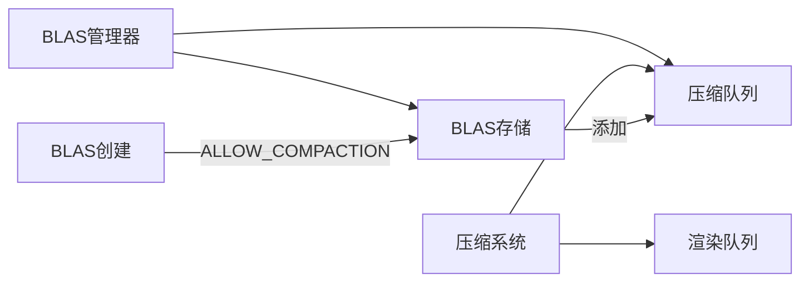

+++
title = "#20457 Solari BLAS compaction"
date = "2025-08-11T00:00:00"
draft = false
template = "pull_request_page.html"
in_search_index = false

[extra]
current_language = "zh-cn"
available_languages = {"en" = { name = "English", url = "/pull_request/bevy/2025-08/pr-20457-en-20250811" }, "zh-cn" = { name = "中文", url = "/pull_request/bevy/2025-08/pr-20457-zh-cn-20250811" }}
+++

# Solari BLAS 内存压缩优化分析

## 基本信息
- **标题**: Solari BLAS compaction
- **PR链接**: https://github.com/bevyengine/bevy/pull/20457
- **作者**: JMS55
- **状态**: 已合并
- **标签**: A-Rendering, C-Performance, S-Ready-For-Final-Review
- **创建时间**: 2025-08-08T00:56:43Z
- **合并时间**: 2025-08-11T02:23:24Z
- **合并者**: alice-i-cecile

## 描述翻译
压缩光线追踪 BLAS 以节省内存。

压缩前: 


压缩后:


## 该PR的技术实现过程

### 问题背景与优化目标
在Bevy Solari的光线追踪实现中，底层加速结构(BLAS)是核心组件，用于加速光线与场景几何体的求交计算。每个网格(Mesh)资产都需要创建对应的BLAS对象，随着场景复杂度增加，这些结构会占用大量显存。原始实现中，BLAS创建后保持原样，没有压缩机制，导致内存使用效率低下。从PR描述中的内存对比截图可以明显看出，未压缩的BLAS结构占用了大量显存空间，成为系统扩展的瓶颈。

技术约束方面，压缩操作本身有计算开销，需要避免在单帧内执行所有压缩导致帧时间尖峰。同时，压缩需要底层图形API支持(WGPU的compaction功能)，并保持与现有渲染管线的兼容性。

### 解决方案架构
核心方案是引入渐进式BLAS压缩机制：
1. **压缩标志启用**：创建BLAS时添加`ALLOW_COMPACTION`标志，为后续压缩提供基础
2. **压缩队列管理**：使用FIFO队列管理待压缩的BLAS，每帧处理固定数量的顶点
3. **异步压缩流程**：分离压缩准备和执行阶段，利用GPU异步特性
4. **帧负载控制**：通过`MAX_COMPACTION_VERTICES_PER_FRAME`限制每帧压缩工作量

这种设计确保：
- 内存节省：压缩后的BLAS显著减少内存占用
- 性能稳定：压缩负载分摊到多帧，避免卡顿
- 兼容性：保持现有渲染管线不变，仅扩展功能

### 关键技术实现
**1. BLAS管理器重构**
BLASManager从简单的HashMap扩展为包含压缩队列的状态机：

```rust
// 修改前:
pub struct BlasManager(HashMap<AssetId<Mesh>, Blas>);

// 修改后:
pub struct BlasManager {
    blas: HashMap<AssetId<Mesh>, Blas>,
    compaction_queue: VecDeque<(AssetId<Mesh>, u32, bool)>,
}
```
新增的压缩队列存储三元组：(网格ID, 顶点数, 压缩状态)。顶点数用于负载控制，bool标志跟踪压缩进度。

**2. 压缩工作流**
新增`compact_raytracing_blas`系统实现核心逻辑：
```rust
pub fn compact_raytracing_blas(
    mut blas_manager: ResMut<BlasManager>,
    render_queue: Res<RenderQueue>,
) {
    let mut vertices_compacted = 0;
    while vertices_compacted < MAX_COMPACTION_VERTICES_PER_FRAME
        && let Some((mesh, vertex_count, compaction_started)) = 
            blas_manager.compaction_queue.pop_front()
    {
        // ... 循环控制逻辑 ...
        
        if !compaction_started {
            blas.prepare_compaction_async(|_| {});
        }

        if blas.ready_for_compaction() {
            let compacted_blas = render_queue.compact_blas(blas);
            blas_manager.blas.insert(mesh, compacted_blas);
            vertices_compacted += vertex_count;
            continue;
        }

        // 未完成压缩则重新入队
        blas_manager.compaction_queue.push_back((mesh, vertex_count, true));
    }
}
```
关键操作：
- `prepare_compaction_async`: 启动异步压缩准备
- `ready_for_compaction`: 检查压缩准备是否完成
- `compact_blas`: 执行实际压缩操作
- 顶点计数确保每帧工作量可控（MAX_COMPACTION_VERTICES_PER_FRAME = 400,000顶点）

**3. BLAS创建启用压缩**
在BLAS创建时启用压缩支持：
```rust
let blas = render_device.wgpu_device().create_blas(
    &CreateBlasDescriptor {
        flags: AccelerationStructureFlags::PREFER_FAST_TRACE
            | AccelerationStructureFlags::ALLOW_COMPACTION, // 新增标志
        // ...其他参数...
    },
    // ...几何描述...
);
```
`ALLOW_COMPACTION`标志允许后续对该BLAS执行压缩操作。

**4. 管线集成**
在场景处理模块中注册压缩系统：
```rust
// scene/mod.rs
app.add_systems(ExtractSchedule, extract_raytracing_scene);
app.add_systems(
    Render,
    (
        prepare_raytracing_blas
            .in_set(RenderSystems::PrepareAssets)
            .before(prepare_assets::<RenderMesh>)
            .after(allocate_and_free_meshes),
        compact_raytracing_blas // 新增压缩系统
            .in_set(RenderSystems::PrepareAssets)
            .after(prepare_raytracing_blas),
        prepare_raytracing_scene_bindings.in_set(RenderSystems::PrepareBindGroups),
    ),
);
```
压缩系统在BLAS准备后执行，属于资产准备阶段。

### 性能优化考量
1. **渐进式压缩**：通过顶点计数限制（MAX_COMPACTION_VERTICES_PER_FRAME），确保压缩负载均匀分布到多帧
2. **异步操作**：压缩准备使用异步API，避免阻塞渲染线程
3. **队列公平性**：FIFO队列设计确保所有BLAS都有压缩机会
4. **状态跟踪**：(mesh, count, started)元组精确控制每个BLAS的压缩状态

### 实际效果
1. **显著内存节省**：PR截图对比显示压缩后内存占用大幅降低
2. **无感知压缩**：分帧处理机制避免性能尖峰
3. **系统可扩展**：为处理大规模场景奠定基础
4. **维护性**：新增约60行代码实现核心功能，保持代码清晰

## 组件关系图



## 关键文件变更

### 1. `crates/bevy_solari/src/scene/blas.rs` (+60/-8)
**变更原因**: 实现BLAS压缩核心逻辑  
**关键代码**:
```rust
// 新增压缩队列定义
pub struct BlasManager {
    blas: HashMap<AssetId<Mesh>, Blas>,
    compaction_queue: VecDeque<(AssetId<Mesh>, u32, bool)>,
}

// 新增压缩系统
pub fn compact_raytracing_blas(...) {
    // 压缩实现逻辑
}

// BLAS创建启用压缩标志
let blas = render_device.wgpu_device().create_blas(
    &CreateBlasDescriptor {
        flags: AccelerationStructureFlags::PREFER_FAST_TRACE
            | AccelerationStructureFlags::ALLOW_COMPACTION, // 新增标志
        // ...
    },
    // ...
);
```

### 2. `crates/bevy_solari/src/scene/mod.rs` (+4/-1)
**变更原因**: 将压缩系统集成到渲染管线  
**关键代码**:
```rust
app.add_systems(
    Render,
    (
        prepare_raytracing_blas
            .in_set(RenderSystems::PrepareAssets)
            .after(allocate_and_free_meshes),
        compact_raytracing_blas // 新增系统注册
            .in_set(RenderSystems::PrepareAssets)
            .after(prepare_raytracing_blas),
        // ...
    ),
);
```

### 3. `crates/bevy_solari/src/lib.rs` (+3/-0)
**变更原因**: 引入alloc crate支持VecDeque  
**关键代码**:
```rust
extern crate alloc; // 新增引入
```

### 4. `release-content/release-notes/bevy_solari.md` (+3/-3)
**变更原因**: 更新发布说明包含本PR  
**关键修改**:
```markdown
- pull_requests: [..., 20457] // 添加PR号
- 文本优化：明确间接光照(Indirect lighting)定义
```

## 扩展阅读
1. [DirectX Raytracing (DXR) 指南](https://microsoft.github.io/DirectX-Specs/d3d/Raytracing.html) - 底层加速结构原理
2. [WGSL 加速结构规范](https://gpuweb.github.io/gpuweb/acceleration-structures/) - WGPU实现基础
3. [Bevy 引擎架构](https://github.com/bevyengine/bevy/tree/main/docs) - 系统调度与ECS模式
4. [GPU驱动压缩技术](https://developer.nvidia.com/blog/accelerated-ray-tracing-cuda/) - NVIDIA优化实践
5. [渐进式资源处理模式](https://gameprogrammingpatterns.com/object-pool.html) - 游戏开发常用优化模式