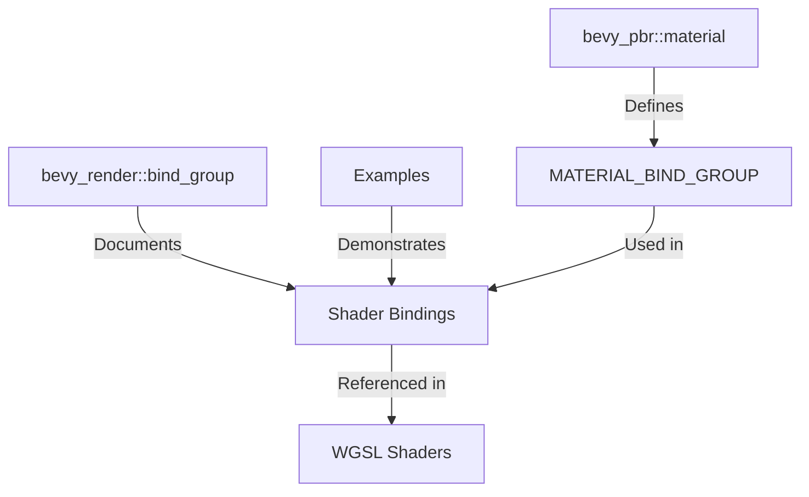

+++
title = "#20458 Update docs to use MATERIAL_BIND_GROUP"
date = "2025-08-09T00:00:00"
draft = false
template = "pull_request_page.html"
in_search_index = true

[taxonomies]
list_display = ["show"]

[extra]
current_language = "en"
available_languages = {"en" = { name = "English", url = "/pull_request/bevy/2025-08/pr-20458-en-20250809" }, "zh-cn" = { name = "中文", url = "/pull_request/bevy/2025-08/pr-20458-zh-cn-20250809" }}
labels = ["A-Rendering"]
+++

# Technical Report: PR #20458 - Update docs to use MATERIAL_BIND_GROUP

## Basic Information
- **Title**: Update docs to use MATERIAL_BIND_GROUP
- **PR Link**: https://github.com/bevyengine/bevy/pull/20458
- **Author**: atlv24
- **Status**: MERGED
- **Labels**: A-Rendering, S-Ready-For-Final-Review
- **Created**: 2025-08-08T01:42:19Z
- **Merged**: 2025-08-09T01:35:08Z
- **Merged By**: james7132

## Description Translation
# Objective

- Make the docs consistent with the shaders

## Solution

- Fix them

## Testing

- its docs

## The Story of This Pull Request

### The Problem and Context
The Bevy engine uses WGSL shaders that reference material bind groups through the constant `MATERIAL_BIND_GROUP`. However, documentation examples throughout the codebase were using hard-coded group indices (`@group(3)`) instead of referencing this constant. This inconsistency created potential confusion for developers who might copy these examples, as it suggested that the bind group index was a fixed value rather than a configurable constant.

The core issue was documentation accuracy - the examples didn't reflect actual usage patterns in the shaders. This became more important as the engine evolves, since hard-coded values could become outdated if the bind group index changes. The problem affected multiple crates (`bevy_pbr`, `bevy_render`) and examples, indicating a systemic documentation inconsistency.

### The Solution Approach
The solution was straightforward but required careful application: replace all hard-coded `@group(3)` references in documentation comments with `@group(#{MATERIAL_BIND_GROUP})` to match how shaders actually reference the bind group. This approach:
1. Maintained actual code functionality (since only comments were modified)
2. Improved documentation accuracy by showing the correct constant usage
3. Provided better context for developers writing custom materials
4. Required no API changes or performance considerations

The author systematically identified all relevant documentation examples across the codebase and updated them to reference the constant rather than hard-coded values.

### The Implementation
The changes were implemented through consistent replacements in documentation comments across three files:

1. In `material.rs`, WGSL examples for material bindings were updated to use the constant:
```rust
// Before:
/// @group(3) @binding(0) var<uniform> color: vec4<f32>;
/// @group(3) @binding(1) var color_texture: texture_2d<f32>;
/// @group(3) @binding(2) var color_sampler: sampler;

// After:
/// @group(#{MATERIAL_BIND_GROUP}) @binding(0) var<uniform> color: vec4<f32>;
/// @group(#{MATERIAL_BIND_GROUP}) @binding(1) var color_texture: texture_2d<f32>;
/// @group(#{MATERIAL_BIND_GROUP}) @binding(2) var color_sampler: sampler;
```

2. In `bind_group.rs`, multiple documentation examples were updated to reference the constant:
```rust
// Before:
/// @group(3) @binding(0) var<uniform> color: vec4<f32>;

// After:
/// @group(#{MATERIAL_BIND_GROUP}) @binding(0) var<uniform> color: vec4<f32>;
```

3. In the texture binding array example, comments were updated to show correct constant usage:
```rust
// Before:
// @group(3) @binding(0) var textures: binding_array<texture_2d<f32>>;

// After:
// @group(#{MATERIAL_BIND_GROUP}) @binding(0) var textures: binding_array<texture_2d<f32>>;
```

The pattern `#{MATERIAL_BIND_GROUP}` was consistently used to represent the constant in WGSL examples, matching the actual shader syntax where this constant is defined.

### Technical Insights
The key insight was recognizing that documentation should reflect actual constant usage rather than hard-coded values. In Bevy's rendering system:
- `MATERIAL_BIND_GROUP` is a constant defined in Rust code
- Shaders reference this constant for bind group indices
- Documentation should show this constant usage to avoid misleading developers

The `#{...}` syntax in the examples indicates a constant that would be replaced during shader processing, similar to how Bevy's shader preprocessing works. This maintains accuracy while keeping examples readable.

### The Impact
These changes improve codebase consistency and documentation quality by:
1. Aligning examples with actual shader practices
2. Reducing potential confusion for developers using these examples
3. Making documentation more resilient to future changes in bind group indices
4. Providing better examples for custom material development

No functional changes were made - only documentation comments were updated. The PR demonstrates the importance of keeping documentation synchronized with code conventions, especially for rendering systems where shader bindings are critical.

## Visual Representation



## Key Files Changed

1. `crates/bevy_pbr/src/material.rs`
   - Updated documentation for Material trait to use MATERIAL_BIND_GROUP constant
   - Changes ensure examples match actual shader usage patterns

```rust
// Before:
/// @group(3) @binding(0) var<uniform> color: vec4<f32>;

// After:
/// @group(#{MATERIAL_BIND_GROUP}) @binding(0) var<uniform> color: vec4<f32>;
```

2. `crates/bevy_render/src/render_resource/bind_group.rs`
   - Updated multiple documentation examples for AsBindGroup trait
   - Changes provide accurate examples for buffer/texture bindings

```rust
// Before:
/// @group(3) @binding(5) var storage_texture: texture_storage_2d<rgba8unorm, read_write>;

// After:
/// @group(#{MATERIAL_BIND_GROUP}) @binding(5) var storage_texture: texture_storage_2d<rgba8unorm, read_write>;
```

3. `examples/shader_advanced/texture_binding_array.rs`
   - Updated example comments to demonstrate constant usage
   - Changes ensure advanced examples match core patterns

```rust
// Before:
// @group(3) @binding(0) var textures: binding_array<texture_2d<f32>>;

// After:
// @group(#{MATERIAL_BIND_GROUP}) @binding(0) var textures: binding_array<texture_2d<f32>>;
```

## Further Reading
1. [WGSL Binding Model](https://gpuweb.github.io/gpuweb/wgsl/#resource-interface)
2. [Bevy Render Pipeline Documentation](https://github.com/bevyengine/bevy/blob/main/docs/plugins_guidelines.md#rendering-plugins)
3. [AsBindGroup Trait Reference](https://docs.rs/bevy/latest/bevy/render/render_resource/trait.AsBindGroup.html)