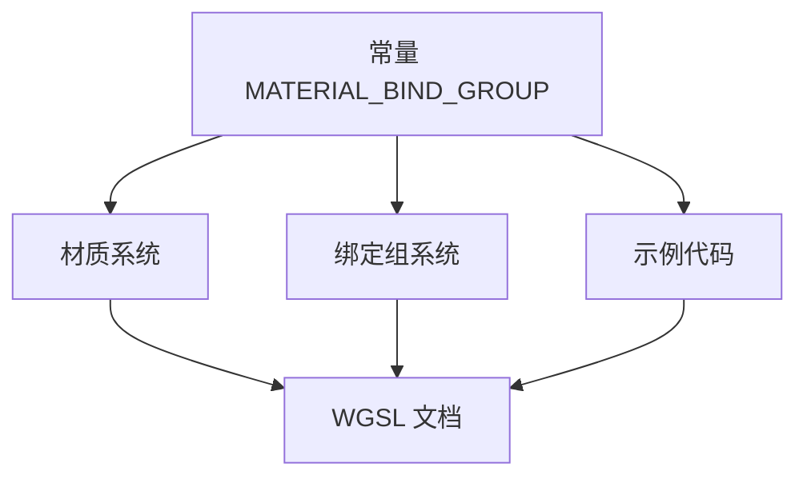

+++
title = "#20458 Update docs to use MATERIAL_BIND_GROUP"
date = "2025-08-09T00:00:00"
draft = false
template = "pull_request_page.html"
in_search_index = false

[extra]
current_language = "zh-cn"
available_languages = {"en" = { name = "English", url = "/pull_request/bevy/2025-08/pr-20458-en-20250809" }, "zh-cn" = { name = "中文", url = "/pull_request/bevy/2025-08/pr-20458-zh-cn-20250809" }}
+++

### PR 分析：文档与着色器常量一致性更新

## 基本信息
- **标题**: Update docs to use MATERIAL_BIND_GROUP
- **PR 链接**: https://github.com/bevyengine/bevy/pull/20458
- **作者**: atlv24
- **状态**: 已合并
- **标签**: A-Rendering, S-Ready-For-Final-Review
- **创建时间**: 2025-08-08T01:42:19Z
- **合并时间**: 2025-08-09T01:35:08Z
- **合并者**: james7132

## 描述翻译
**目标**
- 使文档与着色器保持一致

**解决方案**
- 修复文档

**测试**
- 文档更新（无需代码测试）

## PR 的技术分析

### 问题背景
在 Bevy 渲染系统中，材质绑定组使用常量 `MATERIAL_BIND_GROUP`（值为 3）作为 WGSL 着色器中的绑定组索引。但文档中的 WGSL 代码示例直接使用了硬编码的 `3` 而非常量引用。这种不一致会导致：
1. 文档与真实着色器代码存在差异
2. 常量值变更时文档不会自动更新
3. 开发者可能错误使用硬编码值而非官方常量

### 解决方案
PR 采用直接替换策略：
1. 全局替换文档中的 `@group(3)` 为 `@group(#{MATERIAL_BIND_GROUP})`
2. 保留原有注释结构不变
3. 更新位置包括：
   - 材质系统文档
   - 绑定组系统文档
   - 高级着色器示例

### 实现细节
修改集中在三处文档注释：

**1. 材质系统文档 (`bevy_pbr/src/material.rs`)**
```rust
// 修改前：
/// @group(3) @binding(0) var<uniform> color: vec4<f32>;
/// @group(3) @binding(1) var color_texture: texture_2d<f32>;
/// @group(3) @binding(2) var color_sampler: sampler;

// 修改后：
/// @group(#{MATERIAL_BIND_GROUP}) @binding(0) var<uniform> color: vec4<f32>;
/// @group(#{MATERIAL_BIND_GROUP}) @binding(1) var color_texture: texture_2d<f32>;
/// @group(#{MATERIAL_BIND_GROUP}) @binding(2) var color_sampler: sampler;
```
*变更原因*：确保材质文档引用官方常量而非魔数

**2. 绑定组文档 (`bevy_render/src/render_resource/bind_group.rs`)**
```rust
// 修改前（多处类似）：
/// @group(3) @binding(0) var<uniform> color: vec4<f32>;

// 修改后：
/// @group(#{MATERIAL_BIND_GROUP}) @binding(0) var<uniform> color: vec4<f32>;
```
同时更新了：
- 存储缓冲区示例
- 原始缓冲区示例
- 存储纹理示例
- 绑定数组示例
*变更原因*：绑定组文档需要与材质系统保持一致

**3. 高级着色器示例 (`examples/shader_advanced/texture_binding_array.rs`)**
```rust
// 修改前：
// @group(3) @binding(0) var textures: binding_array<texture_2d<f32>>;

// 修改后：
// @group(#{MATERIAL_BIND_GROUP}) @binding(0) var textures: binding_array<texture_2d<f32>>;
```
*变更原因*：示例代码需要展示最佳实践

### 技术决策分析
1. **`#{CONSTANT}` 语法选择**  
   使用 `#{MATERIAL_BIND_GROUP}` 而非 `${...}` 或 `!{...}`，这符合 Rust 文档注释中表示"此处应替换为常量"的惯例

2. **作用域控制**  
   修改仅限文档注释（`///`），不触及实际代码逻辑，零运行时影响

3. **变更范围**  
   所有提及 `@group(3)` 的 WGSL 示例均被更新，确保全局一致性

### 影响与最佳实践
**积极影响**：
- 消除文档与代码的认知偏差
- 降低未来常量变更时的维护成本
- 引导开发者使用常量而非硬编码值

**启示**：


## 关键文件变更

### 1. `crates/bevy_pbr/src/material.rs`
**变更原因**：修正材质 trait 文档中的绑定组引用  
**代码片段**：
```rust
// 修改前：
/// @group(3) @binding(0) var<uniform> color: vec4<f32>;
/// @group(3) @binding(1) var color_texture: texture_2d<f32>;
/// @group(3) @binding(2) var color_sampler: sampler;

// 修改后：
/// @group(#{MATERIAL_BIND_GROUP}) @binding(0) var<uniform> color: vec4<f32>;
/// @group(#{MATERIAL_BIND_GROUP}) @binding(1) var color_texture: texture_2d<f32>;
/// @group(#{MATERIAL_BIND_GROUP}) @binding(2) var color_sampler: sampler;
```

### 2. `crates/bevy_render/src/render_resource/bind_group.rs`
**变更原因**：统一绑定组文档中的常量引用  
**代码片段**：
```rust
// 修改前（典型示例）：
/// @group(3) @binding(0) var<uniform> material: CoolMaterial;

// 修改后：
/// @group(#{MATERIAL_BIND_GROUP}) @binding(0) var<uniform> material: CoolMaterial;
```

### 3. `examples/shader_advanced/texture_binding_array.rs`
**变更原因**：示例代码需展示最佳实践  
**代码片段**：
```rust
// 修改前：
// @group(3) @binding(0) var textures: binding_array<texture_2d<f32>>;

// 修改后：
// @group(#{MATERIAL_BIND_GROUP}) @binding(0) var textures: binding_array<texture_2d<f32>>;
```

## 延伸阅读
1. [WGSL 绑定组规范](https://www.w3.org/TR/WGSL/#resource-interface)
2. [Bevy 材质系统指南](https://bevyengine.org/learn/book/getting-started/materials/)
3. [Rust 文档注释最佳实践](https://doc.rust-lang.org/rustdoc/how-to-write-documentation.html)

> 完整代码差异见原始 PR：https://github.com/bevyengine/bevy/pull/20458/files