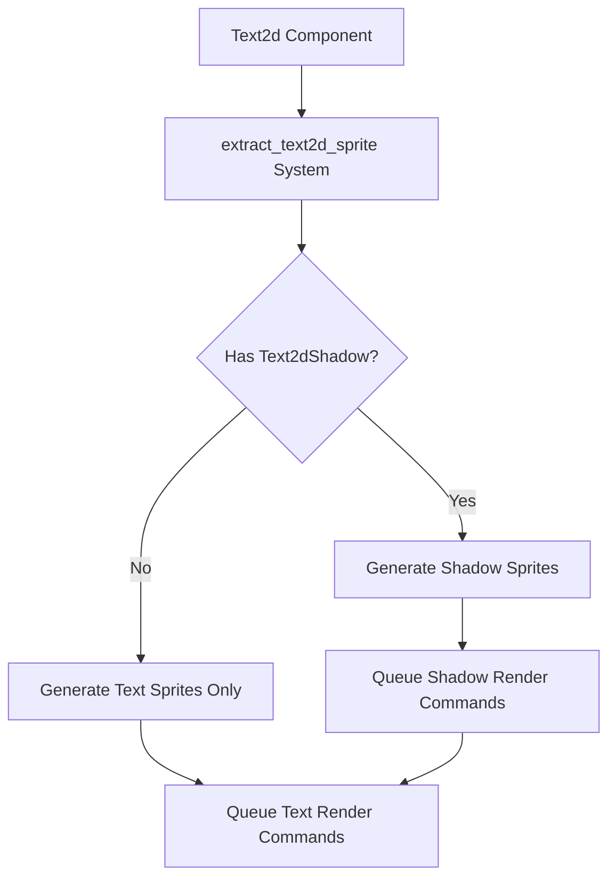

+++
title = "#20463 `Text2d` shadows"
date = "2025-08-14T00:00:00"
draft = false
template = "pull_request_page.html"
in_search_index = true

[taxonomies]
list_display = ["show"]

[extra]
current_language = "en"
available_languages = {"en" = { name = "English", url = "/pull_request/bevy/2025-08/pr-20463-en-20250814" }, "zh-cn" = { name = "中文", url = "/pull_request/bevy/2025-08/pr-20463-zh-cn-20250814" }}
labels = ["C-Feature", "A-Rendering", "A-Text", "D-Straightforward", "M-Deliberate-Rendering-Change"]
+++

# Title  
`Text2d` Shadows Implementation  

## Basic Information  
- **Title**: `Text2d` shadows  
- **PR Link**: https://github.com/bevyengine/bevy/pull/20463  
- **Author**: ickshonpe  
- **Status**: MERGED  
- **Labels**: C-Feature, A-Rendering, S-Ready-For-Final-Review, A-Text, M-Needs-Release-Note, D-Straightforward, S-Needs-Review, M-Deliberate-Rendering-Change  
- **Created**: 2025-08-08T10:18:14Z  
- **Merged**: 2025-08-14T18:14:31Z  
- **Merged By**: alice-i-cecile  

## Description Translation  
# Objective  

Add support for shadows to `Text2d`.  

Fixes #19529  

## Solution  
* New `Text2dShadow` component.   
   `Text2dShadow` has identical fields to `bevy_ui`'s `TextShadow`. Only the `Default` impl is different; since the y-axis is inverted for `Text2d`, the default y-offset needs to be negative.  

* `extract_text2d_sprite` now also draws shadow sprites when the `Text2dShadow` component is present. Unlike in the `bevy_ui` implementation, the shadows are extracted in the same system as the glyph sprites to ensure correct ordering.  

## Testing  

Updated the `text2d` example to add some shadows to the text boxes:  
```  
cargo run --example text2d  
```  

## Showcase  

  

## The Story of This Pull Request  

### The Problem and Context  
Text rendering in Bevy's 2D system (`Text2d`) lacked shadow support, unlike its UI counterpart (`bevy_ui::TextShadow`). This limited visual styling options for game developers using text in 2D scenes. Issue #19529 explicitly requested this feature to enhance text readability and visual appeal, particularly against varying background colors.  

The main technical challenge was implementing shadows without disrupting the existing text rendering pipeline. The solution needed to:  
1. Maintain rendering performance  
2. Ensure correct draw order between text and shadows  
3. Provide a consistent API similar to the existing UI text shadows  

### The Solution Approach  
The implementation introduced a new `Text2dShadow` component mirroring `bevy_ui`'s `TextShadow` fields but with inverted Y-offset in its default implementation to account for coordinate system differences. The core modification occurred in the sprite extraction system (`extract_text2d_sprite`), where shadow rendering was integrated directly alongside glyph processing to guarantee proper layering.  

Key engineering decisions:  
1. **Single-pass extraction**: Shadows are processed in the same system as text glyphs to maintain correct z-ordering  
2. **Coordinate adjustment**: Default Y-offset inverted (-4 instead of +4) for 2D coordinate system consistency  
3. **Resource efficiency**: Reuses existing texture atlas infrastructure for shadow rendering  

### The Implementation  
The `Text2dShadow` component provides configurable offset and color properties:  

```rust
#[derive(Component, Copy, Clone, Debug, PartialEq, Reflect)]
#[reflect(Component, Default, Debug, Clone, PartialEq)]
pub struct Text2dShadow {
    pub offset: Vec2,
    pub color: Color,
}

impl Default for Text2dShadow {
    fn default() -> Self {
        Self {
            offset: Vec2::new(4., -4.),  // Inverted Y-offset for 2D
            color: Color::BLACK,
        }
    }
}
```

The extraction system was modified to handle shadows when present:  

```rust
// Modified query includes optional Text2dShadow
text2d_query.iter<(
    Entity,
    &Text,
    &TextLayoutInfo,
    &TextBounds,
    &Anchor,
    Option<&Text2dShadow>,  // New component check
    &GlobalTransform,
)>

// Shadow rendering logic
if let Some(shadow) = maybe_shadow {
    let shadow_transform = *global_transform
        * GlobalTransform::from_translation((top_left + shadow.offset).extend(0.))
        * scaling;
    let color = shadow.color.into();

    // Process glyphs for shadow sprites
    for positioned_glyph in text_layout_info.glyphs.iter() {
        // ... atlas rect calculations ...
        extracted_slices.slices.push(ExtractedSlice { ... });
    }

    // Queue shadow render entities
    extracted_sprites.sprites.push(ExtractedSprite {
        kind: bevy_sprite::ExtractedSpriteKind::Slices { ... },
        // ... other properties ...
    });
}
```

This approach generates shadow sprites using the same glyph data but with modified position and color, rendered before the main text.  

### Technical Insights  
The implementation demonstrates several important patterns:  
1. **Component-driven rendering**: Added functionality through a new optional component  
2. **Render phase integration**: Extended existing extraction system without major refactor  
3. **Coordinate system awareness**: Default values adjusted for 2D context  
4. **DRY principle**: Reused `TextShadow` structure with context-specific defaults  

Performance considerations:  
- Minimal overhead when shadows are disabled  
- Additional draw calls proportional to text complexity when enabled  
- Glyph processing optimized through reuse of existing layout data  

### The Impact  
The changes:  
1. Enable visual enhancements for 2D text  
2. Improve text readability against complex backgrounds  
3. Maintain API consistency with Bevy's UI system  
4. Require no changes to existing text rendering workflows  
5. Add approximately 75 lines of focused, maintainable code  

The solution demonstrates how to extend rendering systems through targeted modifications while preserving existing architecture. The explicit documentation in `bevy_ui::TextShadow` now references the new `Text2dShadow` component to prevent user confusion.  

## Visual Representation  



## Key Files Changed  

### crates/bevy_text/src/text2d.rs (+77/-2)  
Added `Text2dShadow` component and modified extraction system to handle shadows:  

```rust
// Before: No shadow support
text2d_query.iter<(
    Entity,
    &Text,
    &TextLayoutInfo,
    &TextBounds,
    &Anchor,
    &GlobalTransform,
)>

// After: Added Text2dShadow component
text2d_query.iter<(
    Entity,
    &Text,
    &TextLayoutInfo,
    &TextBounds,
    &Anchor,
    Option<&Text2dShadow>,  // New component
    &GlobalTransform,
)>

// New shadow rendering logic
if let Some(shadow) = maybe_shadow {
    // Shadow sprite generation code
}
```

### examples/2d/text2d.rs (+18/-1)  
Updated example to demonstrate shadow usage:  

```rust
// Before: No shadows
commands.spawn((
    Text2d::new("translation"),
    text_font.clone(),
    TextLayout::new_with_justify(text_justification),
    AnimateTranslation,
));

// After: Added Text2dShadow component
commands.spawn((
    Text2d::new("translation"),
    text_font.clone(),
    TextLayout::new_with_justify(text_justification),
    Text2dShadow::default(),  // New component
    AnimateTranslation,
));
```

### release-content/release-notes/text2d_shadows.md (+7/-0)  
Added release note documentation:  

```markdown
---
title: Text2d Shadows
authors: ["@Ickshonpe"]
pull_requests: [20463]
---

`Text2d` now supports shadows. Add the `Text2dShadow` component to a `Text2d` entity to draw a shadow beneath its text.
```

### crates/bevy_ui/src/widget/text.rs (+1/-1)  
Updated documentation reference:  

```rust
// Before: Incorrect statement about Text2d support
/// Not supported by `Text2d`

// After: Added reference to new component
/// Use the `Text2dShadow` component for `Text2d` shadows
```

## Further Reading  
1. [Bevy Text Rendering Architecture](https://bevyengine.org/learn/book/getting-started/text/)  
2. [Coordinate Systems in Bevy](https://bevyengine.org/learn/book/getting-started/coordinate-system/)  
3. [Component-Based Rendering Patterns](https://github.com/bevyengine/bevy/blob/main/docs/plugins_guidelines.md)  
4. [Original TextShadow Implementation](https://github.com/bevyengine/bevy/blob/main/crates/bevy_ui/src/widget/text.rs#L133-L151)