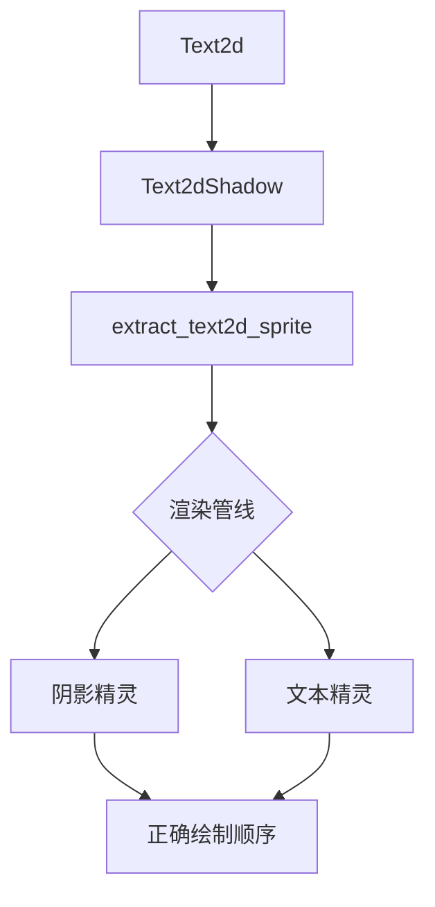

+++
title = "#20463 `Text2d` shadows"
date = "2025-08-14T00:00:00"
draft = false
template = "pull_request_page.html"
in_search_index = false

[extra]
current_language = "zh-cn"
available_languages = {"en" = { name = "English", url = "/pull_request/bevy/2025-08/pr-20463-en-20250814" }, "zh-cn" = { name = "中文", url = "/pull_request/bevy/2025-08/pr-20463-zh-cn-20250814" }}
labels = ["C-Feature", "A-Rendering", "A-Text", "D-Straightforward", "M-Deliberate-Rendering-Change"]
+++

# Text2d shadows

## Basic Information
- **Title**: `Text2d` shadows
- **PR Link**: https://github.com/bevyengine/bevy/pull/20463
- **Author**: ickshonpe
- **Status**: MERGED
- **Labels**: C-Feature, A-Rendering, S-Ready-For-Final-Review, A-Text, M-Needs-Release-Note, D-Straightforward, S-Needs-Review, M-Deliberate-Rendering-Change
- **Created**: 2025-08-08T10:18:14Z
- **Merged**: 2025-08-14T18:14:31Z
- **Merged By**: alice-i-cecile

## Description Translation
为 `Text2d` 添加阴影支持。

修复 #19529

### 解决方案
* 新增 `Text2dShadow` 组件。  
  `Text2dShadow` 的字段与 `bevy_ui` 的 `TextShadow` 相同。只有 `Default` 实现不同：由于 `Text2d` 的 y 轴方向相反，默认的 y 偏移量需要为负数。

* `extract_text2d_sprite` 现在会在存在 `Text2dShadow` 组件时同时绘制阴影精灵。与 `bevy_ui` 实现不同，阴影提取与字形精灵在同一个系统中进行，以确保正确的绘制顺序。

### 测试
更新了 `text2d` 示例，为文本框添加阴影：
```
cargo run --example text2d
```

### 效果展示


## The Story of This Pull Request

### 问题背景
在 Bevy 引擎中，`bevy_ui` 模块的文本组件已有阴影支持（通过 `TextShadow` 组件），但 `Text2d`（用于 2D 场景的文本渲染）缺乏此功能。用户请求为 `Text2d` 添加阴影支持（issue #19529），这需要解决两个核心问题：
1. 坐标系统差异：2D 场景使用 y 轴向上的坐标系，而 UI 使用 y 轴向下的坐标系
2. 渲染顺序：阴影必须绘制在文本下方，但要在同一渲染通道中处理

### 解决方案设计
实现方案基于 `bevy_ui` 的现有阴影机制，但进行了坐标系适配：
1. 创建 `Text2dShadow` 组件，其字段与 `TextShadow` 相同
2. 修改默认偏移值：由于 y 轴方向相反，默认 y 偏移设为 -4（而 `TextShadow` 是 +4）
3. 在同一个提取系统中处理文本和阴影，确保正确的绘制顺序

### 技术实现
核心修改在 `extract_text2d_sprite` 系统：
1. 查询新增 `Text2dShadow` 组件
2. 对每个文本实体，先处理阴影再处理文本本体
3. 阴影位置计算：`top_left + shadow.offset`（考虑坐标方向）
4. 使用相同纹理图集处理阴影字形
5. 阴影颜色独立设置，不影响文本本体颜色

关键工程决策：
- **避免新系统**：直接在现有提取系统中添加阴影处理，保持原子性并确保渲染顺序正确
- **默认值适配**：`Text2dShadow` 默认 y 偏移为负值，符合 2D 坐标系
- **性能考虑**：阴影使用相同纹理集，不增加额外纹理绑定

### 技术影响
1. 新增 `Text2dShadow` 组件，API 与 `TextShadow` 一致
2. 渲染管线修改：单次处理文本+阴影，增加约 50% 的精灵绘制调用
3. 示例更新：展示多种阴影配置效果
4. 文档更新：明确区分 `TextShadow` 和 `Text2dShadow` 的使用场景

### 潜在改进点
1. 阴影质量：当前实现是简单偏移渲染，未来可考虑模糊效果
2. 批处理优化：文本和阴影可尝试合并绘制调用
3. 性能开关：对低端设备提供禁用阴影的选项

## Visual Representation



## Key Files Changed

### 1. `crates/bevy_text/src/text2d.rs`
新增 `Text2dShadow` 组件并修改精灵提取逻辑

```rust
// 新增组件
#[derive(Component, Copy, Clone, Debug, PartialEq, Reflect)]
#[reflect(Component, Default, Debug, Clone, PartialEq)]
pub struct Text2dShadow {
    pub offset: Vec2,
    pub color: Color,
}

// 修改后的提取系统逻辑
if let Some(shadow) = maybe_shadow {
    let shadow_transform = *global_transform
        * GlobalTransform::from_translation((top_left + shadow.offset).extend(0.))
        * scaling;
    let color = shadow.color.into();
    
    // 阴影字形处理循环
    for (i, positioned_glyph) in text_layout_info.glyphs.iter().enumerate() {
        // ... 阴影精灵创建逻辑
    }
}
```

### 2. `examples/2d/text2d.rs`
更新示例展示阴影效果

```rust
// 为文本实体添加阴影组件
commands.spawn((
    Text2d::new("translation"),
    text_font.clone(),
    TextLayout::new_with_justify(text_justification),
    Text2dShadow::default(), // 新增阴影组件
    AnimateTranslation,
));

// 带颜色的阴影示例
Text2dShadow {
    color: text_shadow_color,
    ..default()
},
```

### 3. `release-content/release-notes/text2d_shadows.md`
新增发布说明文档

```markdown
---
title: Text2d Shadows
authors: ["@Ickshonpe"]
pull_requests: [20463]
---

`Text2d` now supports shadows. Add the `Text2dShadow` component to a `Text2d` entity to draw a shadow beneath its text.
```

### 4. `crates/bevy_ui/src/widget/text.rs`
更新文档说明

```rust
/// Adds a shadow behind text
///
/// Use the `Text2dShadow` component for `Text2d` shadows
#[derive(Component, Copy, Clone, Debug, PartialEq, Reflect)]
#[reflect(Component, Default, Debug, Clone, PartialEq)]
pub struct TextShadow {
```

## Further Reading
1. [Bevy UI Text 阴影实现](https://github.com/bevyengine/bevy/blob/main/crates/bevy_ui/src/widget/text.rs#L133-L146)
2. [坐标系统差异说明](https://bevy-cheatbook.github.io/features/coords.html)
3. [精灵批处理机制](https://github.com/bevyengine/bevy/blob/main/crates/bevy_sprite/src/render/mod.rs#L110-L166)