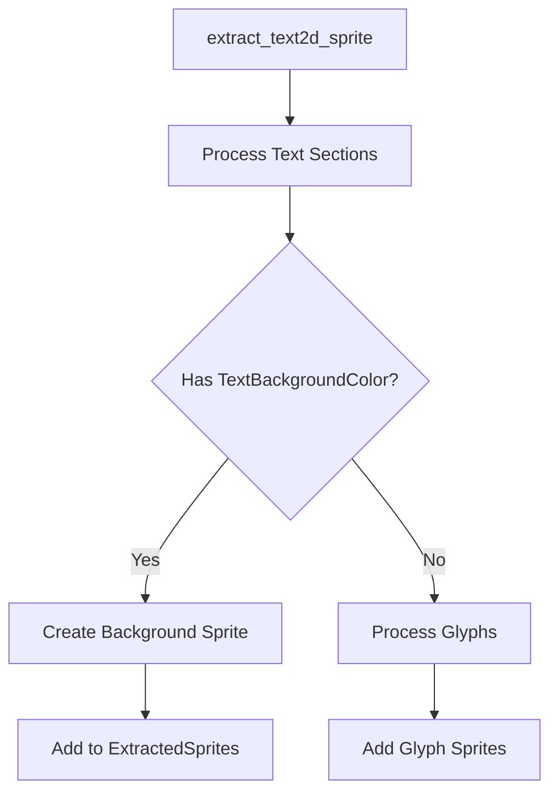

+++
title = "#20464"
date = "2025-08-16T00:00:00"
draft = false
template = "pull_request_page.html"
in_search_index = true

[taxonomies]
list_display = ["show"]

[extra]
current_language = "en"
available_languages = {"en" = { name = "English", url = "/pull_request/bevy/2025-08/pr-20464-en-20250816" }, "zh-cn" = { name = "中文", url = "/pull_request/bevy/2025-08/pr-20464-zh-cn-20250816" }}
+++

## `Text2d` `TextBackgroundColor` Support Analysis

### The Story of This Pull Request
#### The Problem and Context
Before this PR, Bevy's `Text2d` system lacked support for background colors on text sections. This limited developers' ability to improve text readability against complex backgrounds or create visually distinct text elements. The UI system already supported `TextBackgroundColor`, but this functionality wasn't available for 2D text rendering. This gap required workarounds like manually creating colored rectangles behind text entities.

#### The Solution Approach
The author implemented background color support by extending the text extraction system to:
1. Query for `TextBackgroundColor` components during rendering
2. Generate background sprites sized to each text section
3. Insert these sprites before text glyphs in the render queue

This approach reuses existing sprite rendering infrastructure and maintains compatibility with Bevy's ECS architecture. The solution specifically targets section-level backgrounds rather than whole text blocks, providing granular control.

#### The Implementation
The core changes occur in `extract_text2d_sprite` where the system now:
1. Processes each text section's bounding rectangle
2. Checks for associated `TextBackgroundColor` components
3. Creates background sprites using the section's dimensions and color

```rust
// In extract_text2d_sprite:
for &(section_entity, rect) in text_layout_info.section_rects.iter() {
    let Ok(text_background_color) = text_background_colors_query.get(section_entity) else {
        continue;
    };
    // ...calculate transform...
    extracted_sprites.sprites.push(ExtractedSprite {
        // ...
        color: text_background_color.0.into(),
        kind: ExtractedSpriteKind::Single {
            // ...
            custom_size: Some(rect.size()),
        },
    });
}
```

The example was updated to demonstrate the feature by adding semi-transparent backgrounds to text elements:

```rust
// In text2d example:
commands.spawn((
    Text2d::new(" translation "),
    TextBackgroundColor(Color::BLACK.with_alpha(0.5)),
    // ...
));
```

#### Technical Insights
Key implementation details:
1. **Sprite Positioning**: Background positions are calculated using text section rectangles and anchor points
2. **Rendering Order**: Backgrounds are queued before text glyphs, ensuring correct z-ordering
3. **Component Query**: The new `text_background_colors_query` efficiently filters relevant entities
4. **Resource Handling**: Uses `AssetId::default()` for solid-color sprites instead of texture handles

Performance considerations are minimal since only sections with explicit background colors generate additional sprites. The solution avoids new shaders or rendering passes by leveraging existing sprite rendering.

#### The Impact
This change:
1. Enables text background styling in 2D scenes
2. Maintains rendering performance characteristics
3. Provides visual consistency with UI text features
4. Requires minimal API changes (just adding components)

The implementation demonstrates how to cleanly extend Bevy's rendering systems by following existing patterns for component extraction and sprite generation.

### Visual Representation


### Key Files Changed

#### `crates/bevy_ui_render/src/text2d.rs` (+36/-5)
Added background sprite generation during text extraction. The key addition is the loop that processes each text section and creates background sprites.

**Relevant Code:**
```rust
text_background_colors_query: Extract<Query<&TextBackgroundColor>>,

// ...

for &(section_entity, rect) in text_layout_info.section_rects.iter() {
    let Ok(text_background_color) = text_background_colors_query.get(section_entity) else {
        continue;
    };
    let render_entity = commands.spawn(TemporaryRenderEntity).id();
    let offset = Vec2::new(rect.center().x, -rect.center().y);
    let transform = *global_transform
        * GlobalTransform::from_translation(top_left.extend(0.))
        * scaling
        * GlobalTransform::from_translation(offset.extend(0.));
    extracted_sprites.sprites.push(ExtractedSprite {
        main_entity,
        render_entity,
        transform,
        color: text_background_color.0.into(),
        image_handle_id: AssetId::default(),
        flip_x: false,
        flip_y: false,
        kind: ExtractedSpriteKind::Single {
            anchor: Vec2::ZERO,
            rect: None,
            scaling_mode: None,
            custom_size: Some(rect.size()),
        },
    });
}
```

#### `examples/2d/text2d.rs` (+10/-3)
Updated the example to demonstrate background colors on multiple text elements.

**Relevant Code:**
```rust
commands.spawn((
    Text2d::new(" translation "),
    text_font.clone(),
    TextLayout::new_with_justify(text_justification),
    TextBackgroundColor(Color::BLACK.with_alpha(0.5)), // Added
    Text2dShadow::default(),
    AnimateTranslation,
));

// ...

parent.spawn((
    Text2d::new(" Anchor".to_string()),
    slightly_smaller_text_font.clone(),
    text_anchor,
    TextBackgroundColor(Color::WHITE.darker(0.8)), // Added
    Transform::from_translation(-1. * Vec3::Z),
))
```

#### `release-content/release-notes/text2d_textbackgroundcolor.md` (+9/-0)
Added release notes documenting the new feature.

**Content:**
```markdown
---
title: `TextBackgroundColor` support for `Text2d`
authors: ["@ickshonpe"]
pull_requests: [20464]
---

`Text2d` now supports the `TextBackgroundColor` component.

Add a `TextBackgroundColor` to `Text2d` entity or its child `TextSection` entities to draw a background color for that section of text.
```

#### `crates/bevy_text/src/text2d.rs` (+1/-0)
Cosmetic change (added newline) with no functional impact.

### Further Reading
1. [Bevy Text Rendering Architecture](https://github.com/bevyengine/bevy/tree/main/crates/bevy_text)
2. [Sprite Rendering System](https://github.com/bevyengine/bevy/tree/main/crates/bevy_sprite)
3. [Component Extraction Patterns](https://github.com/bevyengine/bevy/blob/main/docs/plugins_guidelines.md#component-extraction)