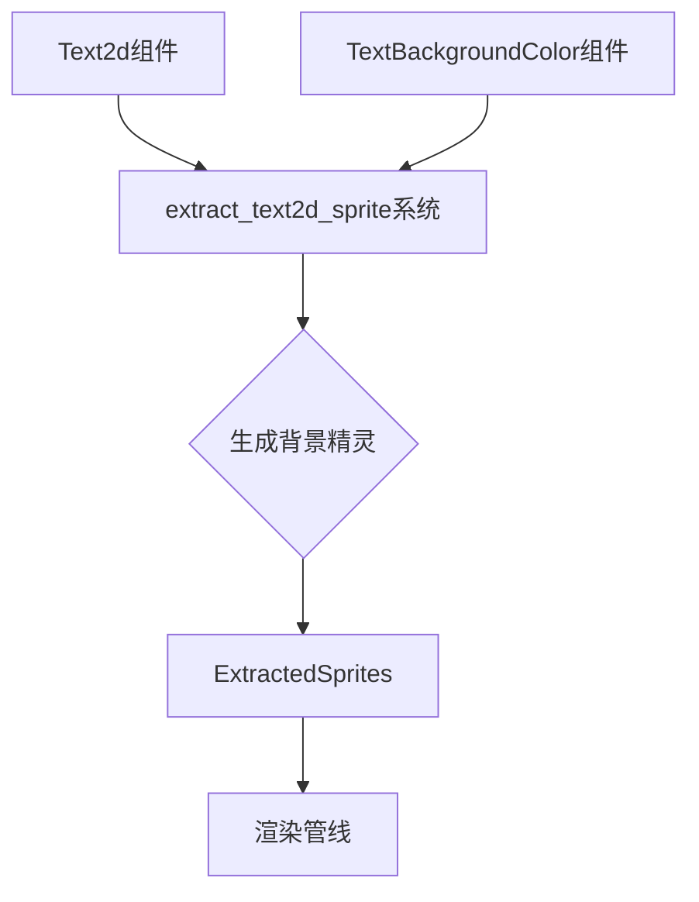

+++
title = "#20464 Text2d` `TextBackgroundColor` support"
date = "2025-08-16T00:00:00"
draft = false
template = "pull_request_page.html"
in_search_index = false

[extra]
current_language = "zh-cn"
available_languages = {"en" = { name = "English", url = "/pull_request/bevy/2025-08/pr-20464-en-20250816" }, "zh-cn" = { name = "中文", url = "/pull_request/bevy/2025-08/pr-20464-zh-cn-20250816" }}
+++

# `Text2d` `TextBackgroundColor` 支持

## 基本数据
- **标题**: `Text2d` `TextBackgroundColor` support
- **PR链接**: https://github.com/bevyengine/bevy/pull/20464
- **作者**: ickshonpe
- **状态**: 已合并
- **标签**: C-Feature, A-Rendering, S-Ready-For-Final-Review, A-Text, M-Needs-Release-Note, D-Straightforward, M-Deliberate-Rendering-Change
- **创建时间**: 2025-08-08T12:06:46Z
- **合并时间**: 2025-08-16T05:14:22Z
- **合并者**: alice-i-cecile

## 描述翻译

### 目标
为`Text2d`添加`TextBackgroundColor`支持

### 解决方案
在`extract_text2d_sprite`中添加`TextBackgroundColor`查询，并为每个带有`TextBackgroundColor`的文本部分(text section)排队一个背景精灵(background sprite)

### 测试
在`text2d`示例的部分文本中添加了`TextBackgroundColor`：
```cargo run --example text2d```

---

### 效果展示


## 技术实现解析

### 问题与背景
在Bevy引擎中，`Text2d`组件用于2D场景中的文本渲染。在本次PR之前，它支持文本颜色(`TextColor`)和阴影(`Text2dShadow`)，但不支持背景色。这限制了开发者创建带有背景高亮或文本框的文本效果的能力。该功能缺失是因为精灵提取系统(`extract_text2d_sprite`)没有处理背景色的逻辑。

### 解决方案选择
作者采用直接扩展现有提取系统的方案：
1. 在精灵提取系统中添加对`TextBackgroundColor`组件的查询
2. 为每个带有背景色的文本部分生成一个矩形背景精灵
3. 复用现有的精灵渲染管线，避免创建新的渲染路径

替代方案（如修改着色器或创建新组件类型）被排除，因为它们会增加不必要的复杂性且与现有架构不兼容。

### 具体实现
核心实现在`extract_text2d_sprite`系统中，增加了背景精灵的生成逻辑：

```rust
// crates/bevy_ui_render/src/text2d.rs
for &(section_entity, rect) in text_layout_info.section_rects.iter() {
    let Ok(text_background_color) = text_background_colors_query.get(section_entity) else {
        continue;
    };
    let render_entity = commands.spawn(TemporaryRenderEntity).id();
    let offset = Vec2::new(rect.center().x, -rect.center().y);
    let transform = *global_transform
        * GlobalTransform::from_translation(top_left.extend(0.))
        * scaling
        * GlobalTransform::from_translation(offset.extend(0.));
    extracted_sprites.sprites.push(ExtractedSprite {
        main_entity,
        render_entity,
        transform,
        color: text_background_color.0.into(),
        image_handle_id: AssetId::default(),
        flip_x: false,
        flip_y: false,
        kind: ExtractedSpriteKind::Single {
            anchor: Vec2::ZERO,
            rect: None,
            scaling_mode: None,
            custom_size: Some(rect.size()),
        },
    });
}
```
这段代码的关键点：
1. 遍历文本布局信息中的每个文本部分矩形(`section_rects`)
2. 通过`text_background_colors_query`检查该部分是否有背景色组件
3. 计算背景精灵的位置和变换，确保与文本对齐
4. 创建`ExtractedSprite`，使用`ExtractedSpriteKind::Single`类型并设置`custom_size`为文本部分的矩形大小
5. 背景色取自`TextBackgroundColor`组件并转换为渲染使用的颜色格式

### 技术洞察
1. **坐标转换处理**：  
   背景位置计算需要正确处理多个变换：
   - 全局变换(`global_transform`)
   - 文本锚点偏移(`top_left`)
   - 文本缩放(`scaling`)
   - 文本部分中心偏移(`offset`)

2. **渲染管线集成**：  
   背景精灵使用现有的`ExtractedSprite`系统，通过设置`kind: ExtractedSpriteKind::Single`和`custom_size`属性，复用现有的矩形渲染能力，无需修改底层渲染器。

3. **粒度控制**：  
   背景色可以添加到`Text2d`实体或其子`TextSection`实体，实现不同文本部分的独立背景色控制。

### 影响与验证
1. **功能扩展**：  
   开发者现在可以为2D文本添加背景色，创建更丰富的视觉效果
   
2. **示例验证**：  
   更新后的`text2d`示例展示了三种使用场景：
   ```rust
   // examples/2d/text2d.rs
   commands.spawn((
       Text2d::new(" translation "),
       TextBackgroundColor(Color::BLACK.with_alpha(0.5)),
   ));
   
   commands.spawn((
       TextSpan("::".to_string()),
       TextBackgroundColor(DARK_BLUE.into()),
   ));
   ```
   这些修改在文本周围添加了半透明黑色背景和深蓝色背景

3. **性能考虑**：  
   每个背景色都会生成一个额外的精灵，但对典型文本元素影响有限。背景精灵使用简单矩形渲染，开销可控。

## 组件关系图


## 关键文件变更

### 1. `crates/bevy_ui_render/src/text2d.rs` (+36/-5)
**目的**：实现背景色的提取和精灵生成  
**关键变更**：
```rust
// 新增查询
text_background_colors_query: Extract<Query<&TextBackgroundColor>>,

// 背景精灵生成逻辑
for &(section_entity, rect) in text_layout_info.section_rects.iter() {
    let Ok(text_background_color) = text_background_colors_query.get(section_entity) else {
        continue;
    };
    // ... 背景精灵创建代码 ...
}
```

### 2. `examples/2d/text2d.rs` (+10/-3)
**目的**：展示背景色使用示例  
**关键变更**：
```rust
// 为三个主要文本添加背景
commands.spawn((
    Text2d::new(" translation "),
    TextBackgroundColor(Color::BLACK.with_alpha(0.5)),
));

// 为文本部分添加不同背景
TextBackgroundColor(Color::WHITE.darker(0.8))
TextBackgroundColor(DARK_BLUE.into())
TextBackgroundColor(color.darker(0.3))
```

### 3. `release-content/release-notes/text2d_textbackgroundcolor.md` (+9/-0)
**目的**：添加发布说明文档  
**内容**：
```markdown
---
title: `TextBackgroundColor` support for `Text2d`
authors: ["@ickshonpe"]
pull_requests: [20464]
---

`Text2d` now supports the `TextBackgroundColor` component.

Add a `TextBackgroundColor` to `Text2d` entity or its child `TextSection` entities to draw a background color for that section of text.
```

### 4. `crates/bevy_text/src/text2d.rs` (+1/-0)
**目的**：微小格式调整  
**变更**：
```rust
// 仅添加了空行
use bevy_asset::Assets;
use bevy_camera::primitives::Aabb;
+
use bevy_camera::visibility::{self, NoFrustumCulling, Visibility, VisibilityClass};
```

## 延伸阅读
1. [Bevy文本渲染文档](https://bevyengine.org/learn/book/features/text/)
2. [精灵渲染管线源码](https://github.com/bevyengine/bevy/blob/main/crates/bevy_sprite/src/render/mod.rs)
3. [组件查询系统详解](https://bevyengine.org/learn/book/programming/queries/)