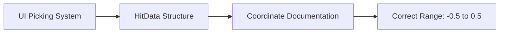

+++
title = "#20465 Update documentation of HitData coordinates range in ui::picking_backend"
date = "2025-08-09T00:00:00"
draft = false
template = "pull_request_page.html"
in_search_index = true

[taxonomies]
list_display = ["show"]

[extra]
current_language = "en"
available_languages = {"en" = { name = "English", url = "/pull_request/bevy/2025-08/pr-20465-en-20250809" }, "zh-cn" = { name = "中文", url = "/pull_request/bevy/2025-08/pr-20465-zh-cn-20250809" }}
labels = ["C-Docs", "D-Trivial", "A-UI", "A-Picking"]
+++

# Update documentation of HitData coordinates range in ui::picking_backend

## Basic Information
- **Title**: Update documentation of HitData coordinates range in ui::picking_backend
- **PR Link**: https://github.com/bevyengine/bevy/pull/20465
- **Author**: gwafotapa
- **Status**: MERGED
- **Labels**: C-Docs, D-Trivial, A-UI, S-Ready-For-Final-Review, A-Picking
- **Created**: 2025-08-08T15:16:55Z
- **Merged**: 2025-08-09T22:01:26Z
- **Merged By**: alice-i-cecile

## Description Translation
`HitData` coordinates now lie between `-0.5` and `0.5`. The documentation of the `ui::picking_backend` module still documents the old values of `0.0` and `1.0`.

## The Story of This Pull Request

### The Problem and Context
The documentation for Bevy's UI picking system contained outdated information about coordinate ranges. Specifically, the `ui::picking_backend` module documentation incorrectly stated that `HitData` coordinates were normalized between `(0.0, 0.0)` at the top-left and `(1.0, 1.0)` at the bottom-right of UI nodes. This was inconsistent with the actual implementation, which had been updated to use a coordinate system ranging from `(-0.5, -0.5)` to `(0.5, 0.5)`.

This discrepancy created several issues:
1. **Developer confusion**: Engineers working with UI picking might misinterpret hit positions
2. **Incorrect assumptions**: Code written based on documentation would produce unexpected results
3. **Maintenance challenges**: Outdated docs increase cognitive load during code reviews and debugging

The coordinate system change itself was a previous implementation detail, but the documentation hadn't been updated to reflect it. This is a common documentation maintenance challenge in fast-moving codebases.

### The Solution Approach
The solution was straightforward: update the documentation comments to match the current implementation. Since this was purely a documentation issue, no code changes were needed beyond modifying the comments. The approach focused on:

1. Identifying the specific lines with outdated coordinate information
2. Replacing the old coordinate ranges with the current `(-0.5, -0.5)` to `(0.5, 0.5)` ranges
3. Maintaining all other documentation details about coordinate behavior

No alternatives were considered since the solution directly addressed the documentation mismatch. The trivial nature of the change (3-line modification) made it a clear candidate for a quick documentation fix.

### The Implementation
The implementation consisted of a single focused change to the module-level documentation in `picking_backend.rs`. The key modification was updating the coordinate range description while preserving all other relevant information about how UI picking works:

```rust
// Before:
// The `position` reported in `HitData` is normalized relative to the node, with `(0.,0.,0.)` at
// the top left and `(1., 1., 0.)` in the bottom right. Coordinates are relative to the entire
// node, not just the visible region. This backend does not provide a `normal`.

// After:
// The `position` reported in `HitData` is normalized relative to the node, with
// `(-0.5, -0.5, 0.)` at the top left and `(0.5, 0.5, 0.)` in the bottom right. Coordinates are
// relative to the entire node, not just the visible region. This backend does not provide a `normal`.
```

This change:
1. Corrected the top-left coordinate from `(0., 0., 0.)` to `(-0.5, -0.5, 0.)`
2. Corrected the bottom-right coordinate from `(1., 1., 0.)` to `(0.5, 0.5, 0.)`
3. Maintained all other contextual information about coordinate behavior
4. Preserved the note about normal vectors not being provided

### Technical Insights
The coordinate system change reflects a common pattern in graphics programming: centering coordinates around (0,0) instead of using corner-based (0,0) to (1,1) ranges. This approach has several advantages:

1. **Symmetry**: Coordinates extend equally in positive and negative directions
2. **Simplified calculations**: Transformations often behave more predictably around origin
3. **Consistency**: Matches common graphics coordinate system conventions

The `-0.5` to `0.5` range means:
- Top-left corner: (-0.5, -0.5)
- Center: (0, 0)
- Bottom-right corner: (0.5, 0.5)

This differs from the old 0-1 system where:
- Top-left was (0,0)
- Center was (0.5,0.5)
- Bottom-right was (1,1)

### The Impact
This documentation update provides immediate practical benefits:
1. **Accuracy**: Documentation now correctly describes the coordinate system
2. **Reduced confusion**: Developers can correctly interpret hit positions
3. **Maintainability**: Eliminates a source of potential errors in UI code
4. **Onboarding**: New contributors encounter accurate information from the start

The change also reinforces an important lesson: documentation maintenance should be treated as an ongoing process tied to code changes. Even small documentation updates like this contribute significantly to codebase health and developer productivity.

## Visual Representation



## Key Files Changed

### crates/bevy_ui/src/picking_backend.rs
**Description**: Updated module-level documentation to reflect current coordinate ranges

**Code Change**:
```rust
// File: crates/bevy_ui/src/picking_backend.rs
// Before:
//! - The `position` reported in `HitData` is normalized relative to the node, with `(0.,0.,0.)` at
//!   the top left and `(1., 1., 0.)` in the bottom right. Coordinates are relative to the entire
//!   node, not just the visible region. This backend does not provide a `normal`.

// After:
//! - The `position` reported in `HitData` is normalized relative to the node, with
//!   `(-0.5, -0.5, 0.)` at the top left and `(0.5, 0.5, 0.)` in the bottom right. Coordinates are
//!   relative to the entire node, not just the visible region. This backend does not provide a `normal`.
```

**Relation to PR Purpose**: This is the sole change that implements the documentation update described in the PR

## Further Reading
1. [Bevy UI Documentation](https://bevyengine.org/learn/book/getting-started/ui/)
2. [Coordinate Systems in Computer Graphics](https://en.wikipedia.org/wiki/Coordinate_system#In_computer_graphics)
3. [Bevy Picking System Overview](https://github.com/bevyengine/bevy/tree/main/crates/bevy_picking)